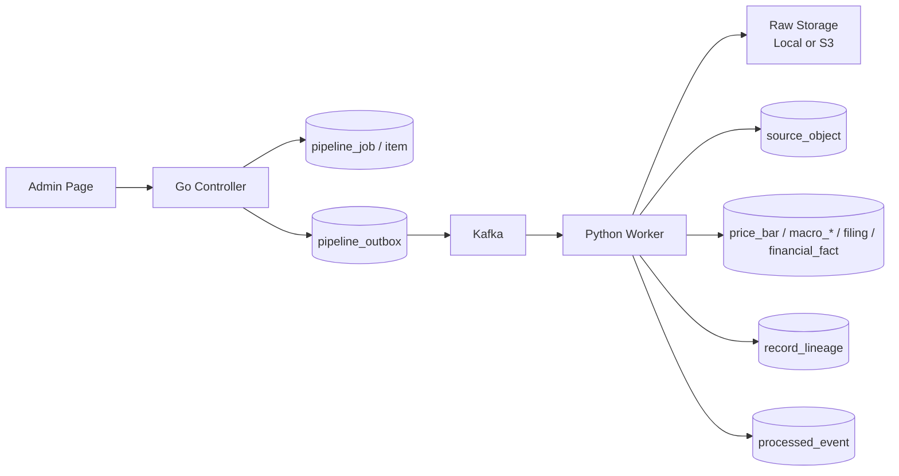

# Trader Data Platform 문서 인덱스

> SEC, BLS, KIS 데이터를 수집한 뒤 raw 원본 보존, Kafka outbox, ETL lineage, worker 제어까지 연결한 데이터 플랫폼의 설계와 검증 결과를 정리한다.

---

## 1. 요약

Trader Data Platform은 주가, 재무, 거시경제 데이터를 외부 API에서 수집하고, 원본과 정규화 결과를 함께 추적하는 데이터 운영 파이프라인이다.

핵심 문제는 데이터 수집 기능 자체보다 다음 운영 질문에 답할 수 있는 구조를 만드는 것이었다.

- 외부 API 실패와 데이터 누락을 어떻게 추적하는가
- raw 원본과 정규화 레코드를 어떻게 연결하는가
- Kafka 장애나 worker 종료 후 어디부터 다시 처리하는가
- 중복 전달과 DB commit, Kafka offset commit 사이의 불일치를 어떻게 방어하는가
- 운영자가 job, raw, Kafka, ETL, lineage 상태를 어디에서 확인하는가
- 처리량과 비용에 따라 worker 실행 자원을 어떻게 조절하는가

---

## 2. 문서 구성

| 문서 | 핵심 내용 | 다루는 설계 질문 |
| --- | --- | --- |
| [01_DATA_PIPELINE_ARCHITECTURE.md](./01_DATA_PIPELINE_ARCHITECTURE.md) | 전체 구조, 데이터 흐름, 주요 테이블, source별 처리 | Kafka, Go, Python의 책임을 왜 분리했는가 |
| [02_FAILURE_RECOVERY_SCENARIOS.md](./02_FAILURE_RECOVERY_SCENARIOS.md) | Kafka와 worker 장애, 중복 처리, 재처리 정책 | worker가 중단되면 어떤 상태가 남고 어떻게 복구하는가 |
| [03_AWS_DEPLOYMENT_COST_OPTIMIZATION.md](./03_AWS_DEPLOYMENT_COST_OPTIMIZATION.md) | AWS 배포 구성, On-Demand/Spot 경계, 비용 판단 | 어떤 컴포넌트를 가변 자원으로 운영할 수 있는가 |
| [04_AWS_WORKER_ASG_AUTO_SCALING_VALIDATION.md](./04_AWS_WORKER_ASG_AUTO_SCALING_VALIDATION.md) | Kafka lag와 heartbeat 기반 ASG 자동 확장 검증 | worker node가 실제로 자동 기동되고 회수되는가 |

각 문서는 독립적으로 읽을 수 있도록 설계 배경, 상태 모델, 검증 결과와 한계를 함께 기록한다. 스키마와 코드 수준의 세부 구현은 문서에 표시된 테이블명과 저장소 경로를 기준으로 추적할 수 있다.

---

## 3. 구현 범위

| 영역 | 상태 | 설명 |
| --- | --- | --- |
| BLS 수집/ETL | 구현 및 검증 | macro series, observation, vintage, status 적재 |
| KIS 주가 수집/ETL | 구현 및 검증 | price_bar 적재, quality status, lineage 연결 |
| SEC 재무 수집/ETL | 구현 및 검증 | company, filing, financial_fact 적재 |
| Go controller/admin | 구현 | job 생성, outbox relay, lag monitor, worker control, raw data viewer |
| Kafka outbox relay | 구현 및 검증 | DB outbox에서 Kafka로 발행하고 partition/offset 기록 |
| Python worker | 구현 및 검증 | job consumer, source별 collector, raw ETL worker |
| Raw Data 관리자 탭 | 구현 | raw 처리 상태, Kafka 발행, consumer commit, lineage 확인 |
| Worker Control | 구현 | worker target, policy, heartbeat, scale command 확인 |
| AWS 배포 | 구현 및 검증 | Controller, DB, Kafka, CloudFront admin 연결과 BLS E2E 검증 |
| AWS Worker ASG | 구현 및 검증 | job lag 1에서 desired 0 → 1, idle 120초 후 1 → 0 |
| Spot interruption graceful drain | 설계 범위 | interruption notice 감지와 신규 poll 중단은 아직 구현·검증하지 않음 |

---

## 4. 전체 처리 흐름



---

## 5. 핵심 설계 결정

1. **raw를 먼저 보존한다.**
   외부 API 응답과 정규화 결과를 분리해 파싱 오류나 데이터 품질 문제를 원본에서 재현할 수 있게 했다.

2. **Kafka에는 데이터 본문이 아니라 처리 이벤트를 전달한다.**
   payload는 Local/S3에 보존하고 Kafka는 job 실행과 raw ETL을 분리하는 이벤트 버퍼로 사용한다.

3. **Kafka publish 전에 DB outbox를 기록한다.**
   broker 장애나 topic 상태 변경이 발생해도 발행 의도는 DB에 남아 복구 후 재발행할 수 있다.

4. **DB 처리 완료 후 Kafka offset을 commit한다.**
   worker가 중간에 종료되면 미커밋 메시지가 다시 전달되고, `processed_event`와 idempotency key가 중복 처리를 방어한다.

5. **raw와 정규화 결과를 lineage로 연결한다.**
   `source_object`와 `record_lineage`를 통해 어떤 원본이 어떤 도메인 레코드를 만들었는지 추적한다.

6. **worker node만 가변 자원으로 분리한다.**
   DB, Kafka, controller는 상태와 제어 책임을 유지하고, 재처리 가능한 Python worker는 Kafka lag에 따라 ASG 용량을 조절한다.

---

## 6. AWS BLS End-to-End 검증

AWS 환경에서 BLS 단건 job으로 control plane, Kafka, Python worker, raw 저장, ETL까지 이어지는 흐름을 검증했다.

검증 대상:

```text
pipeline_job_item.id=39
item_key=BLS:CES0000000001
source_object.id=8775
```

상태 전이:

```text
JOB_ITEM_QUEUED
-> pipeline_outbox PUBLISHED
-> trader.jobs.events
-> BLS collector
-> source_object COLLECTED
-> RAW_OBJECT_READY PUBLISHED
-> trader.raw.bls.ready
-> BLS ETL worker
-> source_object PROCESSED
-> record_lineage 생성
-> Kafka offset commit
```

처리 결과:

```text
pipeline_job_item.status=COLLECTED
source_object.processing_status=PROCESSED
pipeline_outbox JOB_ITEM_QUEUED=PUBLISHED
pipeline_outbox RAW_OBJECT_READY=PUBLISHED

macro_series rows=1
macro_observation rows=24
macro_observation_vintage rows=24
source_object rows=1
record_lineage rows=49
```

`pipeline_job_item=COLLECTED`는 collector 단계가 완료되었음을 나타내고, ETL 완료 여부는 `source_object=PROCESSED`, `record_lineage`, `processed_event`에서 별도로 확인한다. 이 구분으로 job 실행 상태와 raw 처리 상태를 혼합하지 않는다.

---

## 7. 검증된 운영 시나리오

| 시나리오 | 검증 결과 |
| --- | --- |
| Kafka 재시작 후 outbox와 topic 불일치 | DB outbox를 `PENDING`으로 되돌려 재발행하고 job 처리 복구 |
| BLS ETL worker 중지 | raw는 `COLLECTED`로 유지되고 topic lag가 2까지 증가 |
| BLS ETL worker 재개 | 미커밋 offset부터 처리해 lag 2 → 0, raw `PROCESSED` 전환 |
| Python worker node가 없는 상태의 job 생성 | job lag 1을 감지해 ASG desired 0 → 1 |
| 처리 완료 후 idle 상태 지속 | 전체 topic lag 0과 idle 120초를 확인해 desired 1 → 0 |

---

## 8. 범위와 한계

- AWS end-to-end 증거는 BLS 단건과 BLS raw lag 시나리오를 기준으로 수집했다. KIS와 SEC는 같은 outbox, raw-ready, lineage 계약을 사용하지만 이 문서에서 AWS 검증 결과를 반복 제시하지 않는다.
- Kafka는 단일 broker 검증 환경이다. broker 복제와 quorum 장애 대응은 구현 범위에 포함하지 않았다.
- ASG 검증은 `min=0`, `max=1` 범위다. 여러 worker node의 동시 처리량과 partition 확장 검증은 별도 과제다.
- ASG lifecycle은 검증했지만 Spot interruption notice와 graceful drain은 구현하지 않았다. 현재 복구는 미커밋 Kafka offset과 idempotency 처리에 의존한다.
- 개별 worker 컨테이너 장애와 worker node 증감은 책임을 분리했다. 컨테이너 재시작은 Docker restart policy와 healthcheck, node 증감은 Go controller와 ASG가 담당한다.
