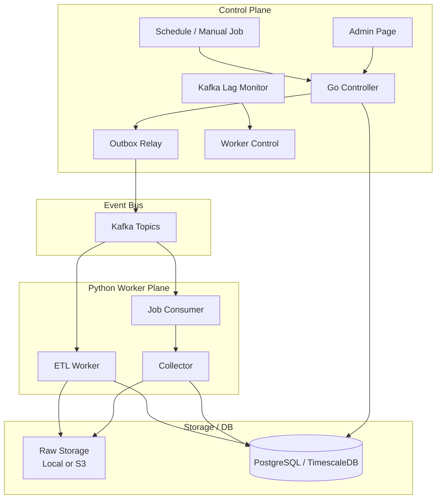

# Trader 데이터 파이프라인 운영 설계

> 이 문서는 SEC, BLS, KIS 데이터를 수집하고 raw 보존, Kafka 이벤트, ETL, lineage까지 연결하는 전체 구조를 설명한다.

---

## Summary

### 목표

- 외부 API에서 가져온 데이터를 raw 형태로 보존한다.
- raw와 정규화된 DB 레코드를 추적 가능하게 연결한다.
- 수집과 ETL을 분리할 수 있는 구조를 만든다.
- Kafka 장애나 worker 종료가 있어도 재처리할 수 있게 한다.
- 관리자 페이지에서 job, raw, Kafka, ETL 상태를 확인한다.

### 핵심 설계 결정

| 결정 | 선택 | 이유 |
| --- | --- | --- |
| 제어 서버 | Go controller | job 생성, outbox relay, lag monitor, worker control처럼 장시간 떠 있는 제어 로직에 적합 |
| 수집/ETL | Python worker | SEC/BLS/KIS 라이브러리, 데이터 파싱, batch 처리에 적합 |
| 이벤트 전달 | Kafka | job 실행과 raw ETL을 비동기로 분리하고 lag 기반 scale-out 가능 |
| Kafka 장애 대응 | DB outbox | Kafka publish 전 이벤트를 DB에 먼저 저장해 복구 후 재발행 |
| raw 저장 | Local/S3 | 원본 payload를 DB에 직접 넣지 않고 storage_key로 추적 |
| 추적성 | source_object + record_lineage | raw 객체와 정규화 결과의 연결을 보존 |
| 중복 처리 | processed_event + idempotency_key | Kafka 재전달 또는 worker 재시작 시 중복 실행 방지 |

---

## 1. 문제 정의

Trader 서비스는 과거 데이터를 기반으로 특정 시점의 시장 반응을 복기하는 것이 목적이다. 따라서 단순히 최신 값만 저장하면 부족하다.

중요한 구분:

| 시각 | 의미 |
| --- | --- |
| `reference_period` | 데이터가 설명하는 대상 기간 |
| `published_at`, `accepted_at`, `actual_released_at` | 외부에 공개된 시각 |
| `collected_at` | 내부 수집기가 데이터를 가져온 시각 |
| `processing_started_at`, `processing_finished_at` | ETL 처리 시작/완료 시각 |

예를 들어 CPI 2026년 5월 값은 `reference_period=2026-05`이지만, BLS 발표일과 내부 수집 시각은 다를 수 있다. 시장 반응 복기에서는 발표 시점과 수집 시점을 분리해야 한다.

---

## 2. 전체 구조



---

## 3. 주요 이벤트

| 이벤트 | Topic | 목적 |
| --- | --- | --- |
| `JOB_ITEM_QUEUED` | `trader.jobs.events` | 특정 job item을 실행하라는 제어 이벤트 |
| `RAW_OBJECT_READY` | `trader.raw.kis.ready` | KIS raw가 저장되었고 ETL 가능 |
| `RAW_OBJECT_READY` | `trader.raw.bls.ready` | BLS raw가 저장되었고 ETL 가능 |
| `RAW_OBJECT_READY` | `trader.raw.sec.ready` | SEC raw가 저장되었고 ETL 가능 |
| `RAW_OBJECT_READY` | `trader.raw.news.ready` | 뉴스 raw ETL 확장용 |

topic을 source별로 나누는 이유는 처리량, 실패 영향 범위, lag 기준이 다르기 때문이다.

- KIS: 종목 수가 많고 일별 반복 수집이 많다.
- SEC: company facts와 submissions가 크고 처리 시간이 길다.
- BLS: 데이터량은 작지만 발표 일정과 누락 여부가 중요하다.
- News: 빈도와 중복 가능성이 높아 별도 topic이 적합하다.

---

## 4. 데이터 흐름

### 4.1 통합 처리 흐름

초기 검증과 운영 단순화를 위해 일부 worker는 수집과 ETL을 한 번에 수행할 수 있다.

```text
JOB_ITEM_QUEUED
-> Python combined worker
-> 외부 API 호출
-> raw 저장
-> source_object 기록
-> 정규화 테이블 upsert
-> record_lineage 기록
-> processed_event SUCCESS
-> Kafka offset commit
```

장점:

- 디버깅이 쉽다.
- source별 최소 검증에 적합하다.
- 관리자 페이지에서 job 성공 여부를 바로 확인할 수 있다.

### 4.2 raw / ETL 분리 흐름

운영에서는 수집과 DB 적재를 분리할 수 있다.

```text
JOB_ITEM_QUEUED
-> collector-only worker
-> 외부 API 호출
-> raw 저장
-> source_object COLLECTED
-> Go controller raw-ready API 호출
-> pipeline_outbox RAW_OBJECT_READY
-> Kafka raw topic publish
-> etl-only worker
-> raw 읽기
-> 정규화 테이블 upsert
-> record_lineage 기록
-> source_object PROCESSED
-> processed_event SUCCESS
-> Kafka offset commit
```

분리 이유:

- 외부 API 호출 시간과 DB 적재 시간을 분리한다.
- raw를 먼저 보존해 ETL 오류를 원본에서 재현할 수 있다.
- Kafka lag를 기준으로 ETL worker만 scale-out할 수 있다.
- 사용자가 적은 시간대에 ETL을 몰아서 수행할 수 있다.

---

## 5. 주요 테이블

| 테이블 | 역할 |
| --- | --- |
| `pipeline_job` | 수동/스케줄 기반 job의 부모 레코드 |
| `pipeline_job_item` | 실제 worker가 처리할 단위 |
| `pipeline_outbox` | Kafka publish 전 이벤트를 먼저 저장하는 outbox |
| `processed_event` | Kafka 메시지 처리 결과와 idempotency 기록 |
| `source_object` | raw 객체의 위치, 상태, 처리 시각을 저장 |
| `record_lineage` | source_object와 정규화 결과 레코드 연결 |
| `price_bar` | KIS 주가 정규화 결과 |
| `macro_series`, `macro_observation` | BLS 매크로 정규화 결과 |
| `company`, `filing`, `financial_fact` | SEC 기업/공시/재무 정규화 결과 |

---

## 6. Source별 처리 방식

| Source | raw 단위 | 정규화 대상 | 특이점 |
| --- | --- | --- | --- |
| KIS | asset + date range | `price_bar` | invalid OHLC 검증, quality_status, display_policy |
| BLS | series + year range | `macro_*` | 발표 일정, 제공 불가 period, vintage 관리 |
| SEC | CIK/ticker | `company`, `filing`, `financial_fact` | submissions, companyfacts, history 파일 처리 |

---

## 7. 관리자 페이지에서 보는 것

| 탭 | 확인 내용 |
| --- | --- |
| Pipeline Jobs | job/item 상태, 실패/스킵, 수동 retry |
| Kafka Pipeline | outbox 상태, topic별 lag, processed_event |
| Raw Data | raw 수집 여부, Kafka 발행, consumer commit, lineage |
| Worker Control | worker target, policy, heartbeat, scale command |
| BLS Inventory | series별 coverage, gap, unavailable period |
| Price Coverage | asset별 price_bar 수집 범위 |

---

## 8. 검증 관측점

각 단계는 하나의 성공 상태만 보는 대신 DB 상태, Kafka offset, lineage를 함께 확인한다.

| 단계 | 핵심 상태 | 완료 판단 |
| --- | --- | --- |
| Job 생성 | `pipeline_job_item=QUEUED`, `JOB_ITEM_QUEUED` outbox 생성 | job item과 outbox가 같은 트랜잭션 경계에 존재 |
| Kafka 발행 | `pipeline_outbox=PUBLISHED` | `kafka_partition`, `kafka_offset`, `published_at` 기록 |
| Raw 수집 | `source_object=COLLECTED` | storage key, content hash, collected_at 기록 |
| ETL 적재 | source별 도메인 테이블 upsert | BLS `macro_*`, KIS `price_bar`, SEC `filing/financial_fact` 생성 |
| 추적성 | `record_lineage` 생성 | source_object와 정규화 레코드가 연결됨 |
| Consumer 완료 | `processed_event=SUCCESS` | idempotency key와 topic/partition/offset 기록 |
| Worker 확장 | `pipeline_worker_scale_command=SUCCEEDED` | target desired capacity와 실제 실행 환경의 용량 일치 |

하나의 raw 처리 결과는 다음 상태 조합으로 확인할 수 있다.

```text
source_object: processing_status=PROCESSED, storage_key=...
pipeline_outbox: RAW_OBJECT_READY, PUBLISHED, partition=0, offset=...
processed_event: source-specific-etl-worker, SUCCESS
record_lineage: source_object와 domain row 연결
```

---

## 9. AWS BLS 분리 흐름 검증 - 2026-07-08

AWS 환경에서 BLS 수동 job 하나를 생성해 `JOB_ITEM_QUEUED -> raw 수집 -> RAW_OBJECT_READY -> ETL` 흐름을 검증했다.

### 9.1 검증 대상

```text
pipeline_job_item.id=39
item_key=BLS:CES0000000001
source_object.id=8775
source_object.storage_key=bls_macro_collector/job-33/item-39/raw/bls/timeseries/2024-2025-CES0000000001-3f0ec611f1a43204.json
```

### 9.2 이벤트 흐름

```text
Admin Page
-> Go Controller
-> pipeline_job_item 39 QUEUED
-> pipeline_outbox JOB_ITEM_QUEUED PUBLISHED
-> Kafka trader.jobs.events
-> Python job worker
-> BLS collector
-> source_object 8775 생성
-> pipeline_outbox RAW_OBJECT_READY PUBLISHED
-> Kafka trader.raw.bls.ready
-> BLS ETL worker
-> source_object PROCESSED
```

### 9.3 확인된 상태

```text
pipeline_job_item:
id=39
status=COLLECTED
started_at=2026-07-08 09:04:28+09
completed_at=2026-07-08 09:04:29+09

pipeline_outbox:
JOB_ITEM_QUEUED -> trader.jobs.events, PUBLISHED, partition=0, offset=0
RAW_OBJECT_READY -> trader.raw.bls.ready, PUBLISHED, partition=0, offset=0

source_object:
id=8775
provider=BLS
data_type=TIMESERIES
processing_status=PROCESSED
processing_attempt_count=1
processing_started_at=2026-07-08 09:04:33+09
processing_finished_at=2026-07-08 09:04:33+09
```

### 9.4 처리 산출물

```text
macro_series rows=1
macro_release rows=0
macro_observation rows=24
macro_observation_status rows=0
macro_observation_vintage rows=24
source_object rows=1
record_lineage rows=49
```

이 검증으로 job event는 즉시 소비되고, raw ready event는 source별 ETL topic으로 분리되며, 최종 처리 상태가 `source_object`와 lineage로 추적되는 것을 확인했다.

### 9.5 결과 해석

- `pipeline_job_item=COLLECTED`는 collector 단계 완료를 의미하며 ETL 완료 상태와 동일하지 않다.
- raw ETL 완료는 `source_object=PROCESSED`, `processing_finished_at`, `record_lineage`, `processed_event`를 함께 확인한다.
- 수집과 ETL을 분리했기 때문에 worker가 중지되어도 raw 원본과 처리 대기 상태는 유지된다.
- source별 topic을 사용하므로 BLS, KIS, SEC는 서로 다른 lag threshold와 worker 정책을 적용할 수 있다.
