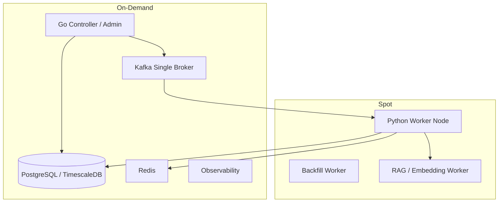

# AWS 배포 및 비용 최적화 설계

> 이 문서는 Trader 데이터 파이프라인을 AWS에 올릴 때 어떤 컴포넌트를 On-Demand로 유지하고, 어떤 컴포넌트를 Spot 후보로 둘지 정리한다.

---

## Summary

### 현재 결론

운영 전 검증 단계에서는 안정성이 필요한 control plane과 source of truth는 On-Demand로 유지하고, 재처리 가능한 Python worker만 Spot 후보로 둔다.

| 구분 | 인스턴스 정책 | 이유 |
| --- | --- | --- |
| DB | On-Demand | pipeline_job, outbox, source_object, lineage, processed_event의 source of truth |
| Kafka | On-Demand | 현재 단일 broker 기준. 이벤트 버퍼 안정성 우선 |
| Go controller/admin | On-Demand | worker 제어, outbox relay, 관리자 API 담당 |
| Python collector/ETL worker | Spot | stateless에 가깝고 Kafka/DB 상태 기반 재처리 가능 |

---

## 1. 초기 Terraform 구성

ASG 도입 전 Terraform은 기존 launch template을 data source로 참조하고 `aws_instance`를 직접 생성했다.

확인된 인스턴스 타입:

| 리소스 | 타입 |
| --- | --- |
| `app` | `t3.large` |
| `app2` | `t3.large` |
| `gateway` | `t3.large` |
| `redis` | `t3.large` |
| `kafka` | `t3.large` |
| `observability` | `t3.large` |
| `db` | `c6i.large` |

초기 Terraform에는 다음 구성이 없었다.

- `aws_autoscaling_group`
- `mixed_instances_policy`
- Spot market option
- Kafka replica broker 3대 구성
- DB HA/failover 구성

---

## 2. AWS 목표 구성



---

## 3. 왜 Python worker만 Spot인가

Python worker는 다음 이유로 Spot에 적합하다.

- Kafka 메시지를 기준으로 작업을 다시 받을 수 있다.
- raw는 Local/S3에 저장되고 DB에는 source_object가 남는다.
- ETL 완료 후 processed_event를 기록하므로 중복 처리 방어가 가능하다.
- worker가 죽어도 Kafka offset을 commit하지 않았다면 다른 worker가 이어 처리할 수 있다.
- lag 기반으로 scale-out/in하기 쉽다.

반대로 DB와 controller는 Spot에 부적합하다.

| 컴포넌트 | Spot 비추천 이유 |
| --- | --- |
| DB primary | source of truth. 중단 시 전체 control plane과 ETL 상태 판단 불가 |
| Go controller | outbox relay, lag monitor, admin API가 멈춤 |
| Kafka single broker | 단일 broker가 중단되면 이벤트 버퍼가 멈춤 |

---

## 4. Spot interruption 대응

AWS Spot 인스턴스는 중단 약 2분 전에 interruption notice를 제공한다.

확인 경로:

```text
http://169.254.169.254/latest/meta-data/spot/instance-action
```

Python worker의 권장 대응:

```text
1. notice 감지
2. 신규 Kafka poll 중단
3. 현재 처리 중인 item 마무리 시도
4. 마무리 불가 시 Kafka offset commit 하지 않음
5. 인스턴스 종료
6. 다른 worker가 미커밋 메시지 재처리
```

현재 구현 범위:

| 항목 | 상태 |
| --- | --- |
| Kafka offset commit을 DB 처리 이후로 미룸 | 구현 |
| processed_event 중복 방어 | 구현 |
| source_object PROCESSED + lineage skip | 구현 |
| worker heartbeat | 구현 |
| Go controller -> local docker actuator | 구현 |
| AWS ASG actuator | 구현 및 검증 |
| Spot interruption watcher | 설계만 정리, 미구현·미검증 |

---

## 5. AWS ASG actuator 설정

Go controller에는 두 종류의 worker actuator가 있다.

| Actuator | driver | 역할 |
| --- | --- | --- |
| Local Docker Worker Actuator | `LOCAL_DOCKER` | 로컬 Docker Compose 서비스 start/stop |
| AWS ASG Worker Actuator | `AWS_ASG` | AWS Auto Scaling Group desired capacity 변경 |

AWS에서는 `pipeline_worker_target`의 driver와 config를 AWS용으로 바꾼다.

예시:

```sql
UPDATE pipeline_worker_target
SET environment = 'AWS',
    driver = 'AWS_ASG',
    min_capacity = 0,
    max_capacity = 1,
    desired_capacity = 0,
    config = '{
      "autoScalingGroupName": "trader-python-worker-asg",
      "region": "ap-northeast-2",
      "honorCooldown": false
    }'::jsonb,
    updated_at = CURRENT_TIMESTAMP
WHERE target_key = 'python-worker-node';
```

이후 관리자 페이지에서 scale-out 요청을 보내면 다음 흐름이 된다.

```text
Admin Page
-> POST /api/v1/admin/worker-targets/python-worker-node/scale
-> pipeline_worker_scale_command REQUESTED
-> aws-asg-actuator RUNNING
-> aws autoscaling set-desired-capacity
-> pipeline_worker_scale_command SUCCEEDED or FAILED
```

controller EC2에는 다음 권한이 필요하다.

```text
autoscaling:SetDesiredCapacity
autoscaling:DescribeAutoScalingGroups
```

현재 구현은 AWS SDK가 아니라 AWS CLI를 호출한다. 따라서 controller 서버에는 `aws` CLI와 IAM role 또는 profile이 준비되어 있어야 한다.

---

## 6. 비용 판단 기준

비용은 인스턴스 타입, 리전, 실행 시간과 Spot 할인율에 따라 달라지므로 고정 월 금액을 제시하지 않았다. 대신 상시 용량과 장애 위험을 기준으로 채택 여부를 비교했다.

| 구성 | 비용 경향 | 운영 위험 | 판단 |
| --- | --- | --- | --- |
| 전체 On-Demand | 상시 고정 비용이 가장 큼 | 낮음 | DB, Kafka, controller 기준 구성으로 채택 |
| Python worker ASG, min 0 | idle 시간 비용 제거 | worker 재기동 지연 | ASG lifecycle 검증 완료, Spot 적용 후보 |
| Kafka 3 broker Spot | broker 단가 절감 가능 | 동시 interruption과 quorum 상실 | 현재 범위에서 제외 |
| DB read replica Spot | 읽기·분석 비용 절감 가능 | interruption 시 조회 경로 전환 필요 | source of truth가 아닌 보조 용도로만 검토 |
| DB primary Spot HA | 단가 절감 가능 | failover, fencing, split-brain 위험 | 현재 범위에서 제외 |

---

## 7. 검토했지만 제외한 확장안

### 7.1 Kafka Spot replica

비용 절감 대안으로 Kafka 3 broker를 Spot에 두는 구성을 검토했다.

권장 설정:

```text
broker count = 3
replication.factor = 3
min.insync.replicas = 2
producer acks = all
unclean.leader.election.enable = false
```

이 구조의 의미:

- broker 1대 중단은 Kafka가 버틸 수 있다.
- broker 2대 이상 중단 시 write가 실패할 수 있다.
- write 실패 이벤트는 DB outbox에 남고 Kafka 복구 후 재발행한다.

### 7.2 DB HA / Spot replica

DB는 Kafka보다 HA 난이도가 높다. 단순히 replica를 둔다고 안전해지지 않는다.

필요 개념:

- WAL streaming replication
- replication slot
- failover manager
- fencing
- split-brain 방지
- application endpoint 전환
- backup과 replica의 역할 분리
- Patroni, repmgr, pg_auto_failover 등

현재 구조에서는 DB primary를 On-Demand로 유지한다. DB HA는 replication만 추가해서 해결되는 문제가 아니므로 failover manager, fencing, endpoint 전환을 함께 검증하는 별도 범위로 분리했다.

---

## 8. AWS 검증 범위

| 검증 항목 | 결과 | 확인 상태 |
| --- | --- | --- |
| On-Demand controller, DB, Kafka 연결 | 통과 | `/readyz`, DB query, Kafka health check |
| Python worker node 기동과 heartbeat | 통과 | `pipeline_worker_node_heartbeat` 갱신 |
| BLS job end-to-end 처리 | 통과 | raw, outbox, ETL, lineage 생성 |
| Python worker 중지 후 raw lag 증가 | 통과 | BLS raw lag 0 → 2 |
| Worker 재개 후 밀린 raw 처리 | 통과 | BLS raw lag 2 → 0, source_object `PROCESSED` |
| Go controller의 ASG scale-out | 통과 | command `SUCCEEDED`, desired 0 → 1 |
| Idle timeout 기반 ASG scale-in | 통과 | 전체 lag 0, idle 120초, desired 1 → 0 |
| KIS/SEC AWS end-to-end 반복 검증 | 이 문서 범위 밖 | 동일 계약을 사용하지만 AWS 증거는 BLS 기준으로 수집 |
| Spot interruption graceful drain | 미구현·미검증 | ASG lifecycle과 별도 범위 |

핵심 상태 조합:

```text
worker target: python-worker-node, driver=AWS_ASG, desired_capacity=1
scale command: SCALE_OUT, reason=KAFKA_LAG_THRESHOLD_EXCEEDED, status=SUCCEEDED
kafka lag: trader.raw.bls.ready, total_lag=2 -> 0
processed_event: bls-macro-etl-worker, SUCCESS
```

---

## 9. AWS 배포 검증 결과 - 2026-07-08

AWS 환경에서 Controller, DB, Kafka, Python worker, CloudFront admin page를 연결하고 BLS job 1건을 기준으로 smoke test를 수행했다.

### 9.1 연결 검증

확인된 연결:

```text
CloudFront -> Go Controller API: OK
Go Controller -> PostgreSQL/TimescaleDB: OK
Go Controller -> Kafka: OK
Python worker -> Kafka: OK
Python worker -> Go Controller heartbeat endpoint: OK
Admin page login: OK
```

중간에 발견한 설정 이슈:

```text
DB security group inbound 5432 부족
Kafka security group inbound 9092 부족
Kafka advertised listener KAFKA_HOST 미설정
단일 Kafka broker의 consumer group replication factor 미설정
Controller admin bcrypt hash 입력값 불일치
```

수정 후 확인:

```text
Controller /readyz = 200 OK
DB asset count = 10971
pipeline_worker_control count = 7
Kafka health check succeeded
consumer lag measured
Python worker Kafka connection succeeded
```

### 9.2 Kafka 단일 broker 운영 설정

AWS smoke test 중 Python consumer가 topic은 보지만 group coordinator를 잡지 못하는 문제가 있었다.

증상:

```text
ClusterMetadata(brokers: 1, topics: 1, coordinators: 0)
trader.jobs.events lag=1
pipeline_job_item=QUEUED
processed_event rows=0
```

단일 broker 기준으로 Kafka compose에 아래 설정을 추가했다.

```yaml
KAFKA_OFFSETS_TOPIC_REPLICATION_FACTOR: 1
KAFKA_TRANSACTION_STATE_LOG_REPLICATION_FACTOR: 1
KAFKA_TRANSACTION_STATE_LOG_MIN_ISR: 1
KAFKA_GROUP_INITIAL_REBALANCE_DELAY_MS: 0
```

정상화 후:

```text
Coordinator for GROUP/trader-data-workers
Discovered coordinator coordinator-1
Stabilized group trader-data-workers
consumer lag measured
```

이 설정은 local/AWS 단일 broker 검증 환경에서 필요하며, 향후 Kafka 3 broker 구성으로 확장할 경우 replication factor와 min ISR 정책을 다시 조정한다.

### 9.3 BLS end-to-end smoke test

검증 item:

```text
pipeline_job_item.id=39
item_key=BLS:CES0000000001
```

최종 결과:

```text
pipeline_job_item.status=COLLECTED
source_object.id=8775
source_object.processing_status=PROCESSED
```

Outbox:

```text
id=30
event_type=JOB_ITEM_QUEUED
topic=trader.jobs.events
status=PUBLISHED
partition=0
offset=0

id=31
event_type=RAW_OBJECT_READY
topic=trader.raw.bls.ready
status=PUBLISHED
partition=0
offset=0
```

Collector/ETL 산출물:

```text
macro_series rows=1
macro_observation rows=24
macro_observation_vintage rows=24
source_object rows=1
record_lineage rows=49
```

### 9.4 운영 복구 검증

Kafka 설정 수정과 재시작 과정에서 DB outbox와 Kafka topic 상태가 어긋나는 상황이 발생했다.

복구 전:

```text
pipeline_job_item 39 = QUEUED
pipeline_outbox 30 = PUBLISHED
processed_event JOB_ITEM_QUEUED:39 = 없음
trader.jobs.events lag = 0
```

복구:

```text
pipeline_outbox 30을 PENDING으로 되돌림
Go outbox relay가 Kafka에 재발행
Python job worker가 소비
Kafka offset commit 성공
```

복구 후:

```text
pipeline_job_item 39 = COLLECTED
source_object 8775 = PROCESSED
RAW_OBJECT_READY = PUBLISHED
```

이 검증은 AWS 환경에서도 DB outbox를 기준으로 Kafka 메시지 상태 불일치를 복구할 수 있음을 보여준다.

### 9.5 현재 운영 경계

- On-Demand DB, Kafka, Controller는 source of truth와 control plane으로 유지한다.
- Python worker는 stateless 처리 노드로 분리되어 Spot 후보가 된다.
- Kafka 장애 또는 재시작으로 메시지 상태가 어긋나도 DB outbox를 기준으로 재발행할 수 있다.
- Raw/ETL 결과는 `source_object`, `record_lineage`, `processed_event`로 추적한다.
- 관리자 페이지는 login session, Kafka monitor, Raw Data, Worker Control을 통해 운영 상태를 확인한다.

### 9.6 raw lag 기반 ETL 재개 검증

BLS ETL worker를 중지한 상태에서 BLS raw job을 추가 생성해 raw topic lag가 쌓이는지 확인했다.

ETL worker 중지 중:

```text
topic=trader.raw.bls.ready
consumer_group=trader-data-bls-etl
total_lag=2
commitOffsets={"0":1}
latestOffsets={"0":3}
partitionLags={"0":2}
```

대기 중인 raw:

```text
source_object 8777 = COLLECTED, pipeline_job_item_id=40
source_object 8778 = COLLECTED, pipeline_job_item_id=41
```

BLS ETL worker 재시작 후:

```text
topic=trader.raw.bls.ready
total_lag=0
commitOffsets={"0":3}
latestOffsets={"0":3}
```

처리 결과:

```text
source_object 8777 = PROCESSED, processing_attempt_count=1
source_object 8778 = PROCESSED, processing_attempt_count=1
BLS raw message committed topic=trader.raw.bls.ready partition=0 offset=2 result=success
```

이 검증으로 AWS 환경에서도 raw 수집과 ETL이 분리되어 있고, ETL worker가 재개되면 Kafka raw topic에 남아 있던 메시지를 이어 처리하는 것을 확인했다.

### 9.7 lag 기반 scale decision 검증

BLS ETL policy는 아래처럼 설정되어 있었다.

```text
policy_key=bls-etl-policy
topic=trader.raw.bls.ready
consumer_group=trader-data-bls-etl
scale_out_lag_threshold=2
scale_out_queue_threshold=2
batch_size=20
max_concurrency=1
```

raw lag가 2가 되었을 때 scale planner가 scale-out command를 생성했다.

```text
pipeline_worker_scale_command:
command_type=SCALE_OUT
reason=KAFKA_LAG_THRESHOLD_EXCEEDED
triggered_by=LAG_MONITOR
details.totalLag=2
details.scaleOutLagThreshold=2
details.policyKey=bls-etl-policy
```

다만 이 시점의 AWS controller는 `local-docker-actuator`가 켜져 있었고, `aws-asg-actuator`는 꺼져 있었다. 따라서 실제 실행 단계에서는 controller 컨테이너 안에서 로컬 compose 파일을 찾으려다 실패했다.

```text
error=compose file docker-compose.local-worker.yml was not found
```

운영 판단:

- lag 기반 scale decision 자체는 DB policy 기준으로 동작했다.
- 이후 `pipeline_worker_target.driver=AWS_ASG`와 ASG 이름을 설정해 실제 node scale-out/in까지 검증했다.
- 개별 Python worker 컨테이너 중지는 ASG가 해결하는 영역이 아니라 worker node 내부의 Docker restart policy, healthcheck, heartbeat 운영 정책으로 다룬다.

### 9.8 AWS ASG 최종 검증

최종 검증에서는 `trader.jobs.events`를 worker node 기동 기준으로 사용했다. Python worker node가 없는 상태에서 job lag 1이 발생하자 controller가 ASG desired capacity를 0에서 1로 올렸고, worker가 job을 처리한 뒤 전체 topic lag 0과 idle heartbeat 120초를 확인해 다시 0으로 내렸다.

```text
SCALE_OUT command id=14
reason=KAFKA_LAG_THRESHOLD_EXCEEDED
status=SUCCEEDED
ASG desired=0 -> 1

SCALE_IN command id=15
reason=IDLE_TIMEOUT
status=SUCCEEDED
ASG desired=1 -> 0
```

상세 근거는 [04_AWS_WORKER_ASG_AUTO_SCALING_VALIDATION.md](./04_AWS_WORKER_ASG_AUTO_SCALING_VALIDATION.md)에 정리했다.

---

## 10. 범위와 한계

- ASG의 `min=0`, `max=1` lifecycle을 검증했으며 여러 worker node의 동시 처리량과 Kafka partition 확장은 검증하지 않았다.
- ASG 검증에서 node의 자동 기동과 종료는 확인했지만 Spot market option 자체와 interruption notice는 적용하지 않았다.
- Kafka는 단일 broker 구성이다. outbox는 broker 장애 중 발행 의도를 보존하지만 Kafka 고가용성을 대체하지 않는다.
- PostgreSQL/TimescaleDB는 단일 primary On-Demand 구성이다. replica, 자동 failover, fencing은 범위 밖이다.
- 월 비용은 가격 변동과 실제 가동 시간에 따라 달라지므로 임의의 절감액을 제시하지 않았다. 현재 확인된 비용 최적화 수단은 worker idle 시 desired capacity를 0으로 유지하는 것이다.
- controller는 AWS CLI를 호출해 ASG 용량을 변경한다. 장기 운영에서는 AWS SDK 적용, retry 분류, API throttling 관측을 추가할 수 있다.
