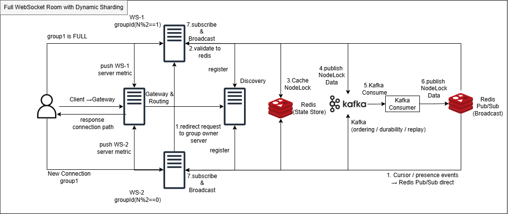

# 📄 Websocket-Room 한계치에서 동적 샤딩 설계

---

## 📑 목차

1. [서론](#1-서론)
2. [설계 목표](#2-설계-목표)
3. [문제 상황](#3-문제-상황)
4. [아키텍처](#4-아키텍처)
5. [시스템 구성](#5-시스템-구성)
6. [핵심 설계](#6-핵심-설계)
7. [이벤트 흐름](#7-이벤트-흐름)
8. [기술 선택 이유](#8-기술-선택-이유)
9. [트레이드오프 및 고려 사항](#9-트레이드오프-및-고려-사항)
10. [결론](#10-결론)

---

## 1. 서론

기존 그룹 기반 샤딩 구조에서는  
동일 그룹을 동일 WebSocket 서버에 연결하여 fanout locality를 유지할 수 있다.

그러나 실제 운영 환경에서는 특정 그룹의 접속자가 급격히 증가하여  
하나의 서버에 broadcast 부하가 집중되는 상황이 발생할 수 있다.

이 경우 broadcast 처리 비용 증가와 지연 상승으로 인해  
대형 room에서의 실시간 협업 성능이 저하되는 문제가 발생한다.

이를 해결하기 위해 Full Room 상황에서는  
동일 그룹을 여러 서버로 분산하는 Dynamic Sharding이 필요하다.

다만 그룹이 여러 서버로 분산되면  
기존 단일 서버 기반 구조에서 보장되던 이벤트 순서와 상태 정합성이 깨질 수 있다.

해당 문서는 이러한 상황을 가정하고,  
**Full Room 발생 시 Dynamic Sharding을 통해 신규 유입을 분산하면서도  
이벤트 정합성과 순서를 유지하기 위한 구조를 설계한 내용**을 정리한다.

특히 해당 문서는 순서 보장이 중요한 **노드 이동 시 락 점유 상황**을 기준으로  
분산 환경에서도 정합성을 유지하는 설계에 초점을 맞춘다.

---

## 2. 설계 목표

본 설계의 목표는 다음과 같다.

* Full Room 상황에서 신규 유입을 idle server로 분산
* 동일 그룹이 여러 서버에 분산된 경우에도 cross-node fanout 유지
* 순서와 정합성이 중요한 이벤트는 일관된 처리 흐름 보장
* 휘발성 이벤트와 상태 변경 이벤트를 구분하여 처리 비용 최적화
* 향후 replay 기반 복구 구조로 확장 가능하도록 설계

---

## 3. 문제 상황

기존 구조에서는 동일 그룹 사용자가 동일 서버에 연결되므로
fanout locality 측면에서는 효율적이다.

하지만 특정 그룹의 규모가 커질 경우 다음과 같은 문제가 발생한다.

* 특정 WebSocket 서버에 세션이 과도하게 집중됨
* 동일 room에 대한 fanout 비용이 단일 JVM에 몰림
* broadcast 증가에 따라 CPU, heap, GC 부담 증가
* 특정 room이 전체 서버 안정성에 영향을 줄 수 있음

이를 해결하기 위해, 기존 세션은 유지하면서
**신규 연결만 상대적으로 여유 있는 서버로 분산하는 Dynamic Sharding 구조**를 고려하였다.

---

## 4. 아키텍처



---

## 5. 시스템 구성

### Gateway

* WebSocket 연결 진입점
* 각 WS 서버의 부하 메트릭을 수집
* Full Room 판단 시 idle server로 라우팅

---

### WS Server

* WebSocket 연결 처리
* local fanout 수행
* owner 서버 역할 수행
* Kafka consumer 결과 반영 후 broadcast 수행

---

### Redis (State Store)

* 락 상태 저장
* node 점유 상태 관리
* TTL 기반 lock expiration 처리

---

### Kafka

* ordering / durability / replay 담당
* 동일 key 기준 이벤트 순서 보장

---

### Redis Pub/Sub

* cross-node fanout broadcast
* low-latency 전파 계층

---

## 6. 핵심 설계

### 6.1 Dynamic Sharding

기존 구조에서는 하나의 그룹이 하나의 서버에만 연결되도록 설계하였다.

하지만 Full Room 발생 시에는:

* 기존 세션은 유지
* 신규 세션만 idle server로 분산

즉,

> **세션은 분산되지만 기존 연결은 유지**

하는 구조를 적용하였다.

이를 통해 사용자 연결을 강제로 이동시키지 않고
fanout 부하를 자연스럽게 분산할 수 있다.

---

### 6.2 Owner Server

동일 그룹이 여러 서버에 분산되면
순서가 중요한 요청을 각 서버가 독립적으로 처리할 경우 정합성 문제가 발생할 수 있다.

예를 들어 서로 다른 서버에서 동시에 락 요청이 들어오는 경우
각 서버가 독립적으로 판단하면 선후 관계가 어긋날 수 있다.

이를 방지하기 위해:

**순서가 중요한 단일 점유성 write 요청은 owner 서버 한 곳으로 모아 직렬화**하였다.

하였다.

즉,

* 세션은 분산
* 순서가 중요한 일부 write path만 단일화

구조를 통해 정합성을 확보한다.

서비스가 제공하는 기능에서<br>
이러한 owner 서버 중앙 직렬화는 **오직 한 명만 가능한 락 점유 상황**에만 적용한다.

반면 설계상 여러 명이 동시에 작업 가능한 **노드 수정 이벤트**는  
Redis Draft와 DB Entity Version 기반 검증을 사용하므로,  
각 서버에서 처리하도록 하여 불필요한 중앙 집중, 서버 부하 증가, 반응성 저하를 방지한다.

---

### 6.3 Redis State Store

락이 필요한 작업은 Redis를 기준으로 즉시 판정한다.

예:

```text
SETNX lock:nodeId
TTL 설정
```

Redis는 이 구조에서

> **현재 상태를 저장하고 즉시 판단하는 계층**

으로 사용된다.

만약 동시에 여러 서버에서 락 요청이 들어올 경우,
모든 요청은 오너 서버로 전달되며 Redis SETNX 연산을 통해 단일 지점에서 원자적으로 락 획득 여부를 판정한다.

---

### 6.4 Kafka

Kafka는 락 판정 자체를 수행하지 않는다.
락 판정은 Redis와 owner 서버에서 즉시 처리하고,
그 결과로 확정된 이벤트를 Kafka에 기록한다.

Kafka의 역할은 다음과 같다.

* 동일 key 기준 순서 보장
* 이벤트 durability 확보
* replay 기반 복구 가능성 제공

즉,

> **Kafka는 상태 변경 이벤트의 정합성 계층**

으로 사용된다.

---

### 6.5 Redis Pub/Sub

Redis Pub/Sub는 cross-server fanout을 위한 broadcast 계층이다.

동일 그룹이 여러 서버에 분산된 경우
한 서버에서 처리된 이벤트를 다른 서버로 빠르게 전파하여
각 서버가 local fanout을 수행할 수 있도록 한다.

Redis Pub/Sub는 다음 특성을 가진다.

* low latency
* broadcast 적합
* latest-only 이벤트에 유리
* replay 불가

따라서 정합성 기준이 아닌

> **실시간 전파 계층**

으로 사용하는 것이 적절하다.

---

### 6.6 이벤트 경로 분리

이벤트 특성에 따라 처리 경로를 분리하였다.

---

#### 1) 정합성이 중요한 이벤트

예:

* node lock
* node move
* 상태 변경

```text
Connected WS
→ Owner WS
→ Redis State Store
→ Kafka
→ Kafka Consumer
→ Redis Pub/Sub
→ WS local fanout
```

---

#### 2) 휘발성 이벤트

예:

* cursor
* presence

```text
Connected WS
→ Redis Pub/Sub
→ WS local fanout
```

---

## 7. 이벤트 흐름

### 7.1 신규 연결

1. Client → Gateway 요청
2. Gateway → 서버 부하 확인
3. Full Room 판단
4. idle server로 라우팅
5. 동일 그룹이 여러 서버에 분산 가능

---

### 7.2 노드 이동 시작

1. Client → Connected WS
2. → Owner WS
3. → Redis lock 획득
4. → Kafka publish
5. → Kafka Consumer 처리
6. → Redis Pub/Sub broadcast
7. → WS local fanout

---

### 7.3 노드 이동 중

좌표 변경은 latest-only 이벤트로 처리한다.

* 일부 유실 허용
* 순서 중요도 낮음

```text
WS → Redis Pub/Sub → fanout
```

---

### 7.4 노드 이동 종료

1. Owner WS → Kafka commit 이벤트
2. Consumer → 순차 처리
3. 필요 시 DB 반영
4. Redis lock 해제
5. Redis Pub/Sub broadcast

---

## 8. 기술 선택 이유

### Redis Pub/Sub

* low-latency broadcast에 적합
* multi-node fanout 해결

Kafka로 broadcast를 직접 처리할 경우
consumer group 증가 및 비용 상승 문제가 발생할 수 있으므로
전파 계층을 분리하였다.

---

### Kafka

* 이벤트 순서 보장
* durability 확보
* replay 가능

Redis Pub/Sub만 사용할 경우
메시지 유실 및 순서 보장 문제가 발생할 수 있어
정합성 계층으로 Kafka를 도입하였다.

---

### Redis State Store

* lock 상태 즉시 판정 필요
* 빠른 read/write 필요

Kafka는 이 용도보다 이벤트 기록에 적합하므로
lock authority는 Redis에 두었다.

---

## 9. 트레이드오프 및 고려 사항

### 장점

* Full Room에서도 fanout 부하 분산 가능
* 사용자 연결 유지하면서 확장 가능
* 이벤트 중요도별 처리 비용 최적화
* replay 기반 확장 가능

---

### 단점

* 시스템 복잡도 증가
* owner 서버 의존성 존재
* Redis / Kafka 역할 분리 필요

---

### 고려 사항

* owner 서버 장애 시 재선정 전략
* Redis lock TTL 및 stale lock 처리
* Gateway 라우팅 기준 정의
* Kafka consumer 지연 대응

---

## 10. 결론

본 설계는 Full Room 상황에서 발생하는 fanout 집중 문제를 해결하기 위해
Dynamic Sharding 구조를 제안하였다.

핵심은 다음과 같다.

* 신규 유입을 idle server로 분산
* write path는 owner 서버로 단일화
* Kafka를 통해 ordering / durability 확보
* Redis Pub/Sub으로 low-latency fanout 수행

즉, 본 구조는 단순 연결 분산을 넘어

> **대형 WebSocket Room에서도 성능과 정합성을 동시에 확보할 수 있는 확장형 아키텍처**

를 목표로 한 설계이다.
