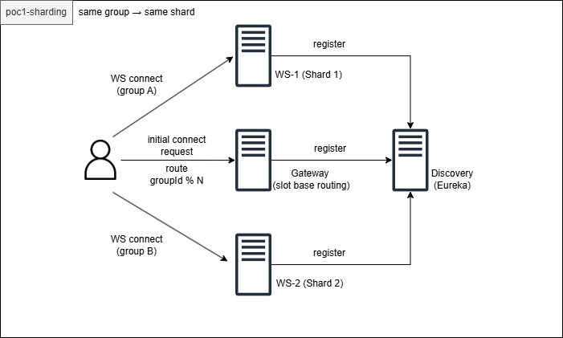

# 📄 PoC 1 - WebSocket 샤딩 기반 부하 분산


## 📑 목차
> 📌 각 항목을 클릭하면 해당 섹션으로 이동합니다.
1. [서론](#1-서론)
2. [테스트 목적](#2-테스트-목적)
3. [아키텍처](#3-아키텍처)
4. [시스템 구성](#4-시스템-구성)
5. [부하 테스트 조건](#5-부하-테스트-조건)
6. [핵심 설계](#6-핵심-설계)
7. [전체 흐름](#7-전체-흐름)
8. [검증 결과](#8-검증-결과)
9. [리소스 분석 (JFR/JMC)](#9-리소스-분석-jfr--jmc)
10. [결론](#10-결론)


---

## 1. 서론

단일 WebSocket 서버 구조에서는 동시 접속자 증가 시
특정 서버에 연결과 fanout이 집중되며, 브로드캐스트 비용 증가 및 병목이 발생할 수 있다.

본 PoC에서는 그룹 단위 샤딩을 적용하여 다음을 검증하였다.

* 동일 그룹을 동일 서버에 유지하여 fanout locality 확보
* 다중 인스턴스 환경에서 부하 분산 가능 여부 확인
* 단일 인스턴스 대비 서버별 처리 부담 감소 여부 확인

---

## 2. 테스트 목적

이번 PoC는 다음 두 구조를 비교하는 것을 목적으로 한다.

### 1) 베이스라인

* Gateway 없이
* 단일 WebSocket 서버 (ws-1)
* 두 개의 그룹을 하나의 서버가 모두 처리

### 2) 샤딩 구조

* Gateway 기반 라우팅
* WebSocket 서버 2개 (ws-1, ws-2)
* groupId 기준으로 각 서버에 분산

핵심 검증 포인트는 다음과 같다.

> 동일 그룹은 동일 서버로 유지하면서
> 전체 broadcast 부하를 서버 간에 분산할 수 있는가

---

## 3. 아키텍처



---

## 4. 시스템 구성

* **Gateway**

  * `/internal/ws-route` 제공
  * groupId 기반 shard 계산

* **WS Server (ws-1, ws-2)**

  * WebSocket 연결 처리
  * room 단위 broadcast 수행

* **Client (k6)**

  * 라우팅 후 WebSocket 연결
  * 일부 사용자만 이벤트 송신

---

## 5. 부하 테스트 조건

### 사용자 구성

* 총 사용자: 100명
* 그룹 수: 2개

  * groupId=1
  * groupId=32
* 그룹당 50명

### 송신 조건

* sender 비율: 20% (각 그룹 10명)
* 전송 주기: 100ms
* 총 송신자: 20명
* 초당 전송 시도: 약 200건

### 실행 조건

* 연결 안정화: 3초
* 송신: 30초
* 종료 대기: 10초

---

## 6. 핵심 설계

### 6.1 그룹 기반 샤딩

```text
slot = groupId % 32
shard = slot / (32 / instanceCount)
```

* 동일 groupId → 동일 shard
* fanout locality 유지
* 서버 간 이벤트 전달 없이 내부 broadcast 가능

---

### 6.2 Gateway 라우팅

```http
GET /internal/ws-route
```

```json
{
  "groupId": 1,
  "slot": 1,
  "selectedShardId": 1,
  "instanceId": "ws-1",
  "wsUrl": "ws://ws-1:8082/ws"
}
```

---

## 7. 전체 흐름

1. 클라이언트 → Gateway 라우팅 요청
2. Gateway → shard 계산
3. wsUrl 반환
4. 클라이언트 → 해당 WS 서버 연결
5. 이벤트 송신 및 broadcast

---

## 8. 검증 결과

### 8.1 샤딩 (2개 인스턴스)

```text
ws-1 totalSendAttempts ≈ 79,776
ws-2 totalSendAttempts ≈ 79,759
```

* 그룹 1 → ws-1
* 그룹 32 → ws-2
* 서버별 부하 분산 확인

---

### 8.2 단일 인스턴스 (베이스라인)

```text
ws-1 totalSendAttempts ≈ 159,317
```

* 두 그룹 모두 ws-1에서 처리
* fanout 부하 집중

---

### 8.3 비교

| 항목                | 단일 인스턴스 |   샤딩 (2개) |
| ----------------- | ------: | --------: |
| 서버 수              |       1 |         2 |
| totalSendAttempts |    159k | 79k + 79k |
| 부하 분산             |      없음 |        있음 |
| fanout locality   |      유지 |        유지 |

---

### 8.4 결과 해석

동일한 총 부하 조건에서 그룹 단위 샤딩을 적용한 결과,  
각 WebSocket 인스턴스의 브로드캐스트 전송 시도 수(totalSendAttempts)가  
단일 인스턴스 대비 약 절반 수준으로 분산되었다.

이는 단순히 연결 수가 분산된 것이 아니라,  
room 단위 fanout 처리 부담 자체가 인스턴스 단위로 나뉘었음을 의미한다.

또한 런타임 지표에서도 다음과 같은 차이를 확인했다.

- CPU 사용률: 단일 인스턴스 대비 감소
- GC 횟수: 감소
- Heap 사용 패턴: 단순화

즉, 샤딩 구조는 단순 트래픽 분산을 넘어  
JVM 레벨의 메모리 압력과 GC 부담까지 완화하는 효과를 가진다.

---

## 9. 리소스 분석 (JFR / JMC)

샤딩 전후 JVM 리소스 사용 차이를 확인하기 위해 JFR/JMC를 분석하였다.

---

### 9.1 Memory Usage

👉 여기에 이미지 추가

* baseline-memory.png
* ws1-memory.png
* ws2-memory.png

해석:

* 베이스라인: GC가 여러 번 반복 (약 3회)
* 샤딩: 각 인스턴스에서 GC 1회 수준
* 부하 분산으로 JVM 메모리 압력 감소

---

### 9.2 리소스 비교 (요약)

| 항목                       | Baseline |    ws-1 | ws-2 |
| ------------------------ | -------: | ------: | ---: |
| Peak Memory Usage        |  180 MiB | 176 MiB | [기입] |
| GC Count                 |        3 |       1 |    1 |
| Total GC Pause Time (ms) |     [기입] |    [기입] | [기입] |
| Top CPU Usage (%)        |     [기입] |    [기입] | [기입] |

---

### 9.3 Top Allocated 비교 (B 방식)

| Allocated Type | Baseline | ws-1 | ws-2 |
| -------------- | -------: | ---: | ---: |
| byte[]       |      205MiB |  93.5MiB |  111MiB |
| java.lang.String       |      33.4MiB |  19MiB |  16MiB |

- 분산 환경에서 인스턴스별 allocation 분포 차이가 존재하므로,  
  모든 환경에서 공통적으로 상위에 위치하는 주요 allocation 항목 2개를 기준으로 비교하였다.

- 일부 항목(e.g., Object)은 특정 환경에서는 상위에 나타나지 않거나,  
  상대적으로 낮은 할당량(약 3MiB 수준)을 보여 분석 대상에서 제외하였다.

---

### 9.4 해석

* 단일 인스턴스에서는 두 그룹의 broadcast가 하나의 JVM에 집중됨
* 샤딩 구조에서는 allocation 및 GC 부담이 인스턴스별로 분산됨
* Memory Usage에서도 GC 발생 패턴이 단순화되는 경향 확인

---

## 10. 결론

본 PoC를 통해 그룹 기반 샤딩 구조가 WebSocket broadcast 부하를 효과적으로 분산할 수 있음을 확인했으며

동일 부하 조건에서 샤딩 적용 시,  
브로드캐스트 처리량뿐 아니라 CPU 및 GC 부담도 함께 완화됨을 확인했다.

특히,

* 동일 그룹을 동일 서버에 유지하여 fanout locality를 보장했고
* Gateway 기반 라우팅을 통해 그룹별 분산이 가능했으며
* 단일 인스턴스 대비 서버별 처리 부담이 절반 수준으로 감소했다

또한 JFR/JMC 분석에서도:

* GC 횟수 감소
* 메모리 압력 완화

와 같은 경향을 확인할 수 있었다.

즉, 본 구조는 단순 연결 분산이 아니라
**실제 broadcast 처리 부담을 줄이는 확장 전략으로 유효함을 검증한 단계**라고 생각한다.

---