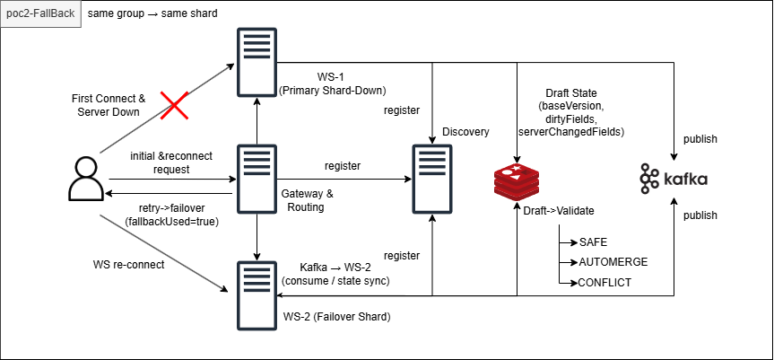
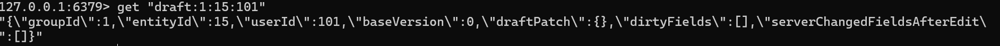
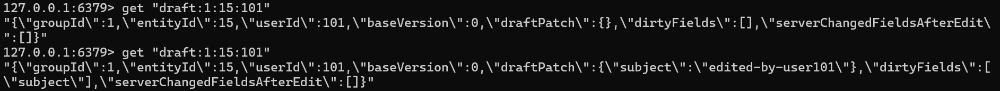
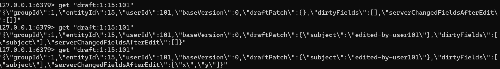
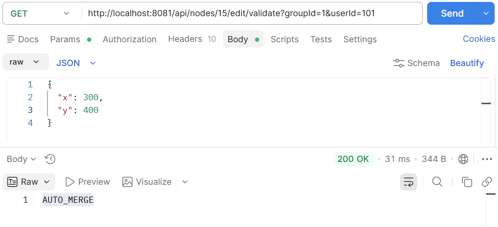
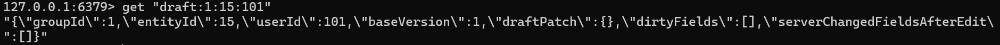
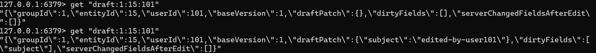
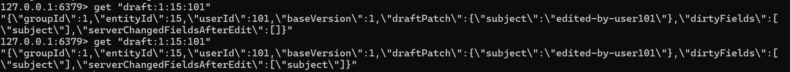
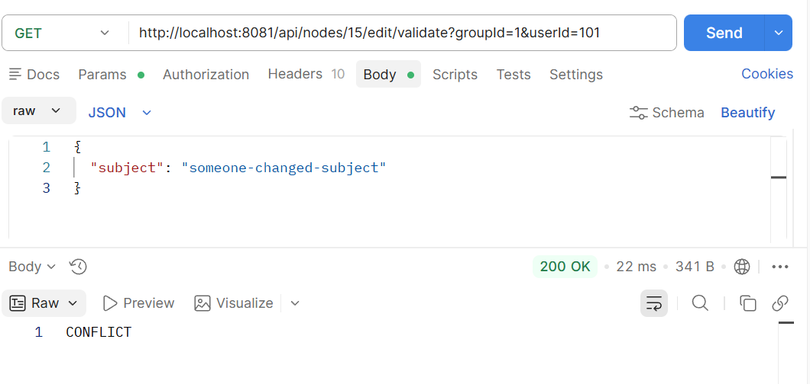

# PoC 2 - Kafka + Redis 기반 Failover & Fallback 및 충돌 제어

## 🚀 Summary

### 🎯 문제 정의
샤딩 기반 WebSocket 구조에서는 특정 shard 장애 시  
해당 그룹의 서비스가 중단되거나, fallback 서버에서 요청이 처리되면서  
인스턴스 간 상태 불일치 문제가 발생한다.

특히 협업 환경에서는 서로 다른 서버에서 동시에 편집이 이루어질 경우  
데이터 정합성과 충돌 제어 문제가 필수적으로 발생한다.

---

### 🔍 핵심 원인
- shard 장애 시 fallback 서버로 트래픽이 우회되며  
  인스턴스 간 메모리 상태 공유 불가
- 이벤트 전파가 없으면 상태 불일치 발생
- 동시 편집 시 동일 필드 변경에 대한 충돌 감지 필요

---

### 🛠 해결 전략
- Kafka 이벤트 로그를 이용해 서버 변경 이력을 Draft 메타데이터에 반영
- Redis 기반 Draft 상태 관리 (TTL + low-latency)
- Draft 메타 정보 기반 충돌 감지

```text
dirtyFields ↔ serverChangedFieldsAfterEdit 비교
````

* Validate 결과를 3단계로 분리:

  * SAFE
  * AUTO_MERGE
  * CONFLICT

---

### 📈 결과

* fallback 환경에서도 상태 동기화 유지
* 다중 인스턴스에서 편집 기능 정상 동작
* 필드 단위 충돌 감지 및 자동 병합 성공

---

### 💡 핵심 인사이트

* 분산 환경에서는 메모리 상태 공유가 불가능하므로
  **이벤트 기반 상태 동기화가 필수**
* Redis는 상태 저장소가 아니라
  **“사용자 편집 컨텍스트 관리”에 적합**
* Kafka는 단순 메시징이 아니라
  **“상태 일관성 확보를 위한 기준 이벤트 로그”**
* 충돌 제어는 단순 version 비교가 아니라
  **필드 단위 변화 추적이 필요**

---

###⚠️ 한계 및 확장 방향

* Redis TTL 만료 시 Draft 상태 유실 가능
* Kafka는 at-least-once 특성으로 중복 이벤트 가능

→ 따라서:

* DB 기반 idempotency 처리 필요
* replay 기반 상태 복구 전략 필요

---

### 🧠 최종 결론

Kafka + Redis를 결합한 구조를 통해

* 장애 상황에서도 서비스 지속성 확보
* 인스턴스 간 상태 일관성 유지
* 협업 환경에서의 충돌 제어

를 동시에 달성하였다.


---

## 목차

1. [서론](#1-서론)
2. [아키텍처](#2-아키텍처)
3. [시스템 구성](#3-시스템-구성)
4. [핵심 설계](#4-핵심-설계)
5. [전체 흐름](#5-전체-흐름)
6. [검증 결과](#6-검증-결과)
7. [실제 검증 로그 (E2E)](#7-실제-검증-로그-e2e)
8. [결론](#8-결론)
9. [현재 구현으로의 후속 개선](#9-현재-구현으로의-후속-개선)

---

## 1. 서론

샤딩 구조에서는 특정 서버 장애 시 해당 shard의 서비스 중단 및 상태 불일치 문제가 발생한다.

특히 fallback 환경에서는 서로 다른 인스턴스에서 요청이 처리되며, 편집 상태와 데이터 정합성 문제가 발생할 수 있다.

본 PoC에서는 이를 해결하기 위해 다음 구조를 설계하였다.

* failover 서버로 트래픽 우회
* Kafka 기반 이벤트 동기화
* Redis 기반 Draft 상태 관리 및 충돌 감지

---

## 2. 아키텍처



---

## 3. 시스템 구성

### Gateway

* shard 기반 라우팅
* failover 서버 선택

### Core

* 데이터 변경 시 Kafka 이벤트 발행

### WS Server

* Kafka 이벤트 소비
* Draft 상태 업데이트

### Redis

* Draft 상태 저장 (TTL 기반)

---

## 4. 핵심 설계

### 4.1 Failover 라우팅

```json
{
  "primaryShardId": 1,
  "selectedShardId": 2,
  "fallbackUsed": true
}
```

장애 발생 시 동일 groupId 요청을 다른 shard로 우회한다.

```java
RouteDecision decision = wsShardRouter.route(groupId, instances);
```

* groupId 기반 slot 계산
* shard 우선순위 기반 failover 서버 선택

---

### 4.2 Kafka 이벤트 동기화

```text
[KAFKA][RECEIVED] groupId=..., entityId=15 version=1 changedFields=[x,y]
```

모든 변경 사항은 Kafka 이벤트로 발행되며, PoC consumer가 이를 소비해 Draft 메타데이터를 갱신한다.

fallback 환경에서는 인스턴스 간 메모리 상태 공유가 불가능하기 때문에 Kafka를 통해 이벤트 기반 상태 동기화를 수행한다.

---

### 4.3 Redis Draft 구조

```json
{
  "baseVersion": 0,
  "draftPatch": {},
  "dirtyFields": [],
  "serverChangedFieldsAfterEdit": []
}
```

Draft 상태는 짧은 생명주기를 가지며 빠른 접근이 필요하므로 Redis를 사용하여 저지연 처리 및 TTL 기반 자동 정리를 수행한다.

---

### 4.4 Kafka → Redis 반영

```java
@KafkaListener(topics = "canvas-events")
public void consume(CanvasEventEnvelope event) {
    Set<String> editingUsers =
        draftRedisStore.findEditingUsers(event.getGroupId(), event.getEntityId());

    for (String userIdStr : editingUsers) {
        DraftEditState draft = draftRedisStore.find(...);

        if (event.getVersion() > draft.getBaseVersion()) {
            draft.getServerChangedFieldsAfterEdit()
                 .addAll(event.getChangedFields());
        }
    }
}
```

서버 변경 사항을 Draft 상태에 반영한다.

---

### 4.5 충돌 감지 로직

```java
public String validate(...) {
    if (draft.getBaseVersion().equals(node.getVersion())) {
        return "SAFE";
    }

    Set<String> conflict = new HashSet<>(draft.getDirtyFields());
    conflict.retainAll(draft.getServerChangedFieldsAfterEdit());

    return conflict.isEmpty() ? "AUTO_MERGE" : "CONFLICT";
}
```

---

### 4.6 이벤트 발행

```java
canvasEventPublisher.publish(event);
```

모든 변경은 이벤트로 기록되어 인스턴스 간 공유된다.

---

## 5. 전체 흐름

### 5.1 Edit 시작



```
draft 초기화 (baseVersion 설정)
```

---

### 5.2 Draft 작성



```json
dirtyFields = ["subject"]
```

---

### 5.3 서버 변경 발생 (non-conflict)



```json
serverChangedFieldsAfterEdit = ["x","y"]
```

---

### 5.4 Validate



```
AUTO_MERGE
```

---

### 5.5 재편집



---

### 5.6 동일 필드 변경



```json
serverChangedFieldsAfterEdit = ["subject"]
```

---

### 5.7 충돌 발생




```
CONFLICT
```

---

## 6. 검증 결과

### 6.1 fallback 상태 유지

Kafka 이벤트를 통해 인스턴스 간 상태 동기화 확인

---

### 6.2 충돌 감지 성공

* 동일 필드 수정 → CONFLICT
* 다른 필드 수정 → AUTO_MERGE

---

### 6.3 서비스 지속성 확보

shard 장애 상황에서도 편집 기능 정상 동작

---

## 7. 실제 검증 로그 (E2E)

### 7.1 Gateway Failover 동작

정상 라우팅

```json
{
  "primaryShardId": 1,
  "selectedShardId": 1,
  "fallbackUsed": false
}
```

Failover 발생

```json
{
  "primaryShardId": 1,
  "selectedShardId": 2,
  "fallbackUsed": true
}
```

---

### 7.2 Kafka 이벤트 수신

```text
[KAFKA][RECEIVED] groupId=1, entityId=15, version=0
[KAFKA][SKIP] no editing users
```

---

### 7.3 Draft 생성

```redis
draft:1:15:101
{
  baseVersion: 0,
  draftPatch: {},
  dirtyFields: [],
  serverChangedFieldsAfterEdit: []
}
```

---

### 7.4 Draft 수정

```json
dirtyFields = ["subject"]
```

---

### 7.5 Non-Conflict

```text
[KAFKA][RECEIVED] version=1 changedFields=[x,y]
[KAFKA][UPDATED_DRAFT_META]
```

```json
serverChangedFieldsAfterEdit = ["x","y"]
```

---

### 7.6 Validate

```
AUTO_MERGE
```

---

### 7.7 Conflict

```text
[KAFKA][RECEIVED] version=2 changedFields=[subject]
```

```json
dirtyFields = ["subject"]
serverChangedFieldsAfterEdit = ["subject"]
```

```
CONFLICT
```

---

## 8. 결론

Kafka 기반 이벤트 동기화와 Redis 기반 Draft 상태 관리를 결합하여 멀티 인스턴스 환경에서도 다음을 달성하였다.

* 데이터 정합성 유지
* fallback 환경에서 상태 일관성 확보
* 필드 단위 충돌 감지 및 자동 병합 지원

---

## 9. 현재 구현으로의 후속 개선

이 PoC에서는 Kafka consumer가 Redis Draft의
`serverChangedFieldsAfterEdit`를 갱신하고, 이를 사용자의 `dirtyFields`와 비교했다.
그러나 Redis Draft와 Kafka 소비 상태에만 충돌 판정을 의존하면 Redis TTL 만료,
consumer 지연 또는 재시작 시 변경 이력 체인이 불완전해질 수 있다.

현재 구현에서는 충돌 판정의 기준을 다음과 같이 보완했다.

1. 클라이언트가 수정 시작 시점의 `baseVersion`과 수정 필드를 요청에 포함한다.
2. 서버의 `currentVersion`이 더 크면 `baseVersion + 1`부터 현재 버전까지의 변경 필드를 조회한다.
3. Redis의 `canvas:version-hint:{teamId}:{graphId}:{nodeId}:{version}`를 MGET으로 조회한다.
4. version hint 체인이 하나라도 누락되면 DB의 `NodeHistory`에서 변경 이력을 조회한다.
5. 사용자 수정 필드와 서버 변경 필드의 교집합이 없으면 `AUTO_MERGE`, 있으면 `CONFLICT`로 판정한다.

즉, 현재 Redis version hint는 빠른 판단을 위한 캐시이고,
DB `NodeHistory`가 TTL 만료와 Redis 장애를 보완하는 영속 이력이다.

실시간 전파 경로 역시 현재는 역할을 분리했다.

* Redis Pub/Sub: 모든 WebSocket 서버에 정상 실시간 fan-out
* Kafka: reliable 이벤트 영속화와 Redis Pub/Sub 누락 보정
* 서버별 Kafka Consumer Group: `reliable-replay-${instanceId}`로 각 서버가 독립 소비

따라서 이 문서의 Kafka → Redis Draft 갱신 방식은 충돌 판정 아이디어를 검증한 초기 PoC이고,
현재 구현은 `baseVersion + Redis version hint + DB NodeHistory fallback`을 기준으로 동작한다.

---
