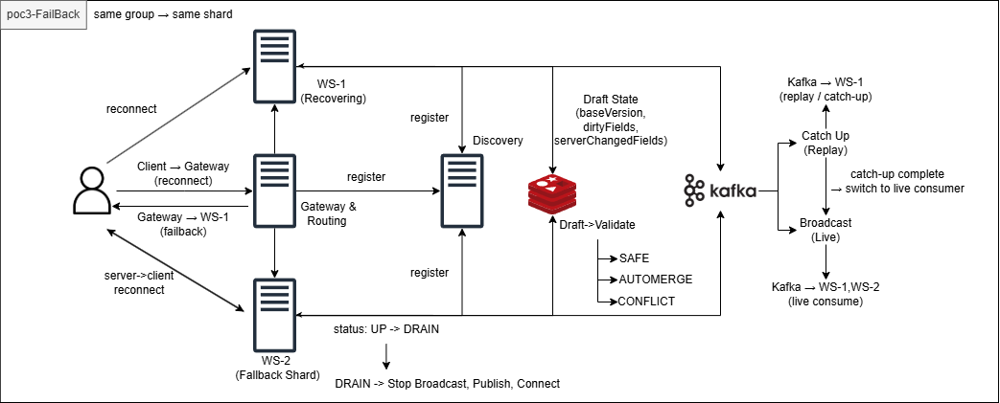
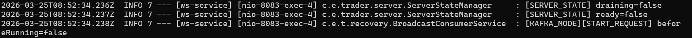
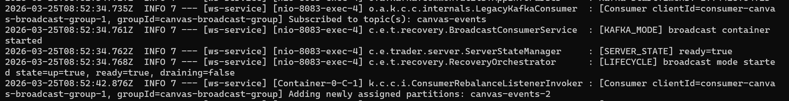
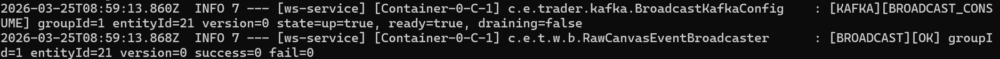
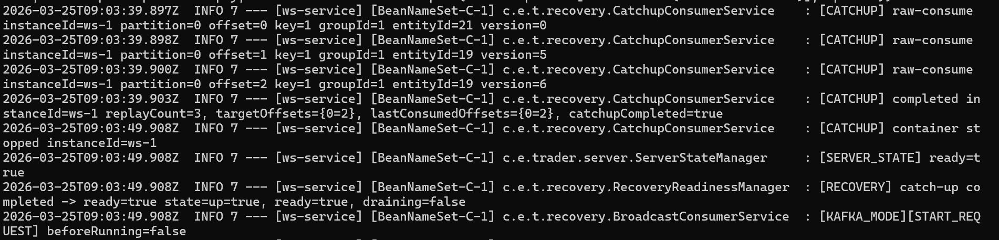
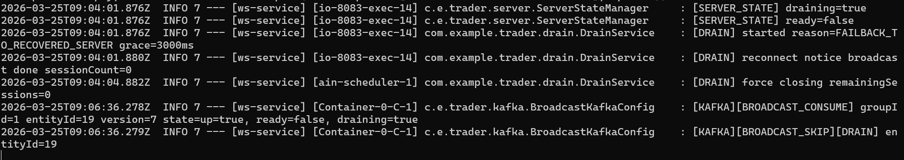
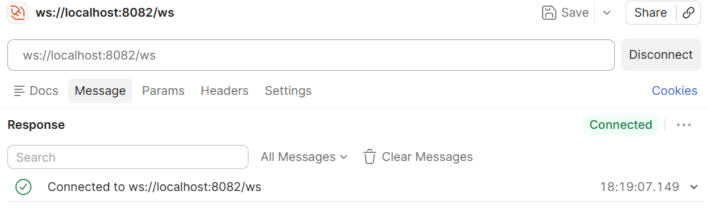
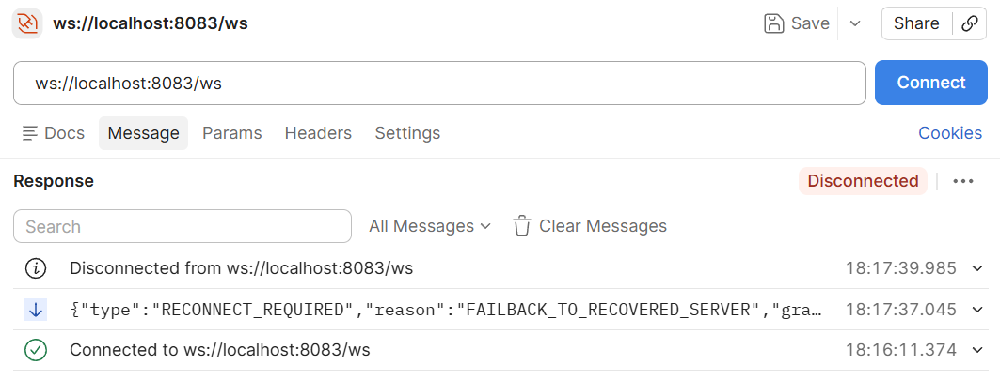

# 📄 PoC 3 - Kafka 기반 WebSocket Failback & Recovery

---
## 📑 목차

1. [서론](#1-서론)
2. [아키텍처](#2-아키텍처)
3. [시스템 구성](#3-시스템-구성)
4. [핵심 설계](#4-핵심-설계)
   - 4.1 [Gateway 기반 상태 관리](#41-gateway-기반-상태-관리)
   - 4.2 [Failback 및 Recovery 트리거 조건](#42-failback-및-recovery-트리거-조건gateway-server)
   - 4.3 [Kafka Consumer 분리](#43-kafka-consumer-분리)
   - 4.4 [Catch-up 설계](#44-catch-up-설계)
   - 4.5 [서버 상태 기반 제어](#45-서버-상태-기반-제어)
5. [전체 흐름](#5-전체-흐름)
   - 5.1 [초기 부팅](#51-초기-부팅)
   - 5.2 [정상 운영](#52-정상-운영)
   - 5.3 [장애 발생 (Failover)](#53-장애-발생-failover)
   - 5.4 [복구 (Catch-up)](#54-복구-catch-up)
   - 5.5 [운영 전환](#55-운영-전환)
   - 5.6 [Failback (Drain)](#56-failback-drain)
   - 5.7 [클라이언트 전환](#57-클라이언트-전환)
6. [검증 결과](#6-검증-결과)
   - 6.1 [이벤트 유실 없음](#61-이벤트-유실-없음)
   - 6.2 [서비스 연속성 유지](#62-서비스-연속성-유지)
   - 6.3 [Failback 성공](#63-failback-성공)
7. [결론](#7-결론)

## 1. 서론

실시간 협업 시스템에서 WebSocket 서버를 다중 인스턴스로 확장할 경우,
단순한 부하 분산을 넘어 **장애 발생 시 데이터 유실 없이 복구하는 구조**가 필요하다.

본 PoC에서는 다음을 목표로 설계 및 검증하였다:

* WebSocket 서버 장애 시 **서비스 연속성 유지**
* Kafka 기반 **이벤트 replay를 통한 데이터 복구**
* Gateway 중심의 **자동 failback orchestration**

특히 Kafka를 단순 메시지 브로커가 아닌
 **장애 복구를 위한 이벤트 로그 저장소**로 활용하였다.

---

## 2. 아키텍처



---

## 3. 시스템 구성

### 구성 요소

* **Gateway**

  * Health Check Polling
  * Failback orchestration
* **Core Server**

  * DB 저장 + Kafka Producer
* **WS Server (ws-1, ws-2)**

  * Kafka Consumer
  * WebSocket Broadcast
  * Lifecycle 제어

---

## 4. 핵심 설계

---

### 4.1 Gateway 기반 상태 관리

Gateway는 주기적으로 서버 상태를 polling한다.

```java
@Scheduled(fixedDelayString = "${FAILBACK_POLL_INTERVAL_MS:5000}")
public void poll()
```

* `/internal/health` 호출
* 상태 판별:

  * UP
  * HEALTHY
  * DRAINING
  * DOWN

👉 HEALTHY + ready=true일 때만 정상 서버로 판단 

---

### 4.2 Failback 및 Recovery 트리거 조건(Gateway Server)

```java
public class FailbackCoordinator {
    ...
    private void tryTriggerRecovery(GatewayServerState current) {
    ...
        //업 카운트가 설정값보다 높을 시에 리커버 요청
        if (current.getConsecutiveUpCount() < REQUIRED_UP_COUNT) {
            return;
        }
        //이미 리커버 된 서버 다시 Failback시도 막음
        if (!recoveryTriggeredServers.add(instanceId)) {
            return;
        }
    }
}
//복구 start-recovery 중복 요청 방지
private final Set<String> recoveryTriggeredServers = ConcurrentHashMap.newKeySet();
```
* UP 카운트가 설정값 이상이면 start-recovery 요청
* recoveryTriggeredServers로 중복 recovery 요청 방지

---

### 4.3 Kafka Consumer Group 분리

| 컨테이너      | 역할           |
| --------- | ------------ |
| Broadcast | 실시간 이벤트 처리   |
| Catch-up  | 장애 복구 replay |

---

### 4.4 Catch-up 설계

```java
Map<Integer, Long> targetOffsets = resolveEndOffsetsWithRetry(topic);
```

* Kafka 최신 offset 조회
* replay 진행
* target == consumed → 완료

```java
public class CatchupConsumerService {
    //RecoveryOrchestrator에서 호출하는 메서드
    
    public synchronized void startCatchupContainer() {
        ...
        //오프셋, 로그용 리플레이 횟수 초기화
        replayStateTracker.reset();
        //따라잡을 목표 오프셋 저장
        Map<Integer, Long> endOffsetsExclusive = resolveEndOffsetsWithRetry(topic);
        replayStateTracker.setTargetOffsets(endOffsetsExclusive);
        ...
        //새로운 consumer group세팅
        ContainerProperties properties = new ContainerProperties(topic);
properties.setGroupId(catchupGroupIdPrefix + "-" + instanceId);
        //메세지 리스너 등록
        properties.setMessageListener((org.springframework.kafka.listener.MessageListener<String, CanvasEventEnvelope>) record -> {
            CanvasEventEnvelope event = record.value();

            log.info("[CATCHUP] raw-consume instanceId={} partition={} offset={} key={} groupId={} entityId={} version={}",
                    instanceId,
                    record.partition(),
                    record.offset(),
                    record.key(),
                    event != null ? event.getGroupId() : null,
                    event != null ? event.getEntityId() : null,
                    event != null ? event.getVersion() : null);

            replayStateTracker.onReplay(record.partition(), record.offset());

            if (replayStateTracker.isCatchupCompleted() && replayStateTracker.markCompletedOnce()) {
                log.info("[CATCHUP] completed instanceId={} {}",
                        instanceId,
                        replayStateTracker.summary());

                stopCatchupContainer();
                recoveryReadinessManager.onCatchupCompleted();
                broadcastConsumerService.startBroadcastContainer();
            }
        });
        ...
        //캐치업 컨테이너 실행
        catchupContainer = new KafkaMessageListenerContainer<>(consumerFactory, properties);
        catchupContainer.start();
    }
    }

public class RecoveryOrchestrator {
    ...
    //복구 시작 : 
    public void startRecovery() {
        //state수정->ready,drain False(만약을 위해 확실히 상태 전환, 없어도 괜찮다)
        recoveryReadinessManager.onRecoveryStart();
        //기존 운영 컨테이너 동작 중이면 다운
        broadcastConsumerService.stopBroadcastContainer();
        //캐치업 컨테이너 실행 후 오프셋을 따라잡으면 운영 컨테이너로 전환
        catchupConsumerService.startCatchupContainer();

        log.info("[RECOVERY] start requested catchupRunning={} broadcastRunning={}",
                catchupConsumerService.isRunning(),
                broadcastConsumerService.isRunning());
    }
    ...
}
```
* resolveEndOffsetsWithRetry()는 따라잡을 목표 offset을 저장하는 역할이고, catchupContainer.start() 이후 Kafka consumer poll loop가 시작되면서 과거 이벤트를 자동 consume하며
* Kafka consumer는 container.start() 이후 poll loop를 통해 자동으로 backlog를 소비한다.

---

### 4.5 서버 상태 기반 제어

| 상태       | 의미           |
| -------- | ------------ |
| up       | 서버 alive     |
| ready    | broadcast 가능 |
| draining | 종료 진행 중      |

```java
//게이트웨이 헬스체크 및 서버 내 상태 저장용 
public class ServerStateManager {

    private final AtomicBoolean up = new AtomicBoolean(true);
    private final AtomicBoolean ready = new AtomicBoolean(false);
    private final AtomicBoolean draining = new AtomicBoolean(false);

    public void markReady(boolean value) {
        ready.set(value);
        log.info("[SERVER_STATE] ready={}", value);
    }

    public void markDraining(boolean value) {
        draining.set(value);
        log.info("[SERVER_STATE] draining={}", value);
    }
}
```

---

## 5. 전체 흐름

---

### 5.1 초기 부팅

### 엔드포인트

* `GET /internal/server-states`
* `POST /internal/lifecycle/start-broadcast`

---

### 로그

```text
[SERVER_STATE] draining=false
[SERVER_STATE] ready=false
[KAFKA_MODE][START_REQUEST] beforeRunning=false

[KAFKA_MODE] broadcast container started
[SERVER_STATE] ready=true
[LIFECYCLE] broadcast mode started state=up=true, ready=true, draining=false

[Consumer] Subscribed to topic(s): canvas-events
Adding newly assigned partitions: canvas-events-2
```

- GET `http://localhost:8080/internal/server-states`
```json
[
    {
        "instanceId": "ws-2",
        ...
        "status": "UP",
        "up": true,
        "ready": false,
        "draining": false,
        "consecutiveSuccessCount": 0,
        "consecutiveUpCount": 2,
    },
    {
        "instanceId": "ws-1",
        ...
        "status": "UP",
        "up": true,
        "ready": false,
        "draining": false,
        "consecutiveSuccessCount": 0,
        "consecutiveUpCount": 2,
    }
]
//게이트웨이에서 설정한 값인 up카운트 5회시에 서버에서 컨테이너 올리면서 헬스 전환
[
    {
        "instanceId": "ws-2",
        ...
        "status": "HEALTHY",
        "up": true,
        "ready": true,
        "draining": false,
        "consecutiveSuccessCount": 2,
        "consecutiveUpCount": 5,
    },
    {
        "instanceId": "ws-1",
        ...
        "status": "HEALTHY",
        "up": true,
        "ready": true,
        "draining": false,
        "consecutiveSuccessCount": 2,
        "consecutiveUpCount": 5,
    }
]

```
* 초기 부팅 및 컨테이너 올리기 전 속성


* 초기 부팅시 게이트 웨이 up카운트 검증 후 컨테이너 실행 및 운영 그룹 조인



---

### Gateway 상태 변화

```json
{
  "instanceId": "ws-1",
  "status": "UP",
  "ready": false
}
→
{
  "instanceId": "ws-1",
  "status": "HEALTHY",
  "ready": true
}
```

👉 up 5회 → broadcast 시작 → ready=true 

---

### 5.2 정상 운영

### 엔드포인트

* `POST /api/teams/{teamId}/graphs/{graphId}/nodes`

---

### 로그

```text
[CORE][PUBLISH] groupId=1 nodeId=21 version=0

[KAFKA][BROADCAST_CONSUME] groupId=1 entityId=21 version=0 state=up=true, ready=true, draining=false
[BROADCAST][OK]
```

* ws-1,ws-2는 같은 컨슈머 그룹으로 진행
    * 파티션 할당 된 ws-1에서 메세지 소비

---

### 5.3 장애 발생 (Failover)

### 동작

* ws-1 강제 종료

```bash
docker stop ws-1
```

---

### Gateway 상태

```json
{
  "ws-1": "DOWN",
  "ws-2": "HEALTHY"
}
```

---

### 로그

```text
[KAFKA][BROADCAST_CONSUME] entityId=19 version=5
[KAFKA][BROADCAST_CONSUME] entityId=19 version=6
[BROADCAST][OK]
```

👉 ws-2가 consumer group takeover

---

### 5.4 복구 (Catch-up)

### 엔드포인트

* `POST /internal/lifecycle/start`
    - 게이트 웨이 내부에서 요청할 복구(캐치업) 엔드포인트
* `GET /internal/lifecycle/replay-state`
    - 복구한 상태 조회

### 로그(복구 시작)

```text
[CATCHUP] raw-consume offset=0 version=0
[CATCHUP] raw-consume offset=1 version=5
[CATCHUP] raw-consume offset=2 version=6

[CATCHUP] completed
replayCount=3
targetOffsets={0=2}
lastConsumedOffsets={0=2}
catchupCompleted=true
```
- 복구 후 캐치업 진입 후 Kafka Replay

---

### 로그(replay-state)

```json
{
  "replayCount": 3,
  "targetOffsets": { "0": 2 },
  "lastConsumedOffsets": { "0": 2 },
  "catchupCompleted": true
}
```

---

### 5.5 운영 전환

```text
[CATCHUP] container stopped
[SERVER_STATE] ready=true
[KAFKA_MODE] broadcast container started
```

👉 ws-1 운영 그룹 재진입

---

### 5.6 Failback (Drain)

### 엔드포인트

* `POST /internal/drain`
* 게이트 웨이 내부에서 요청 진행

```java
@RequestMapping("/internal/drain")
public class DrainController {
    @PostMapping
    public ResponseEntity<Void> startDrain(@RequestHeader("X-Internal-Token") String token,
                                           @RequestBody DrainRequest request) {
        if (!internalToken.equals(token)) {
            return ResponseEntity.status(403).build();
        }
        drainService.startDrain(request);
        return ResponseEntity.ok().build();
    }
}
```
---

### 로그

```text
[SERVER_STATE] draining=true
[SERVER_STATE] ready=false

[DRAIN] started reason=FAILBACK_TO_RECOVERED_SERVER grace=3000ms
[DRAIN] reconnect notice broadcast done
[DRAIN] force closing remainingSessions
```

---

### broadcast 차단 확인
```java
public class RawCanvasEventBroadcaster {
    ...
    public void broadcast(CanvasEventEnvelope event) {
        if (serverStateManager.isDraining()) {
            log.info("[BROADCAST][SKIP][DRAIN] groupId={} entityId={} version={}",
                    event.getGroupId(), event.getEntityId(), event.getVersion());
            return;
        }
    ...
    }
}
```
```text
[KAFKA][BROADCAST_CONSUME] state=ready=false, draining=true
[KAFKA][BROADCAST_SKIP][DRAIN]
```

- Drain시 브로드캐스트 스킵

---

### 5.7 클라이언트 재연결 및 서버 전환

* 기존 서버 연결 종료
    * 핸드 쉐이크 거부 코드
    ```java
    public class DrainHandshakeInterceptor implements HandshakeInterceptor {
        @Override
    public boolean beforeHandshake(ServerHttpRequest request,
                                   ServerHttpResponse response,
                                   WebSocketHandler wsHandler,
                                   Map<String, Object> attributes) {
        if (serverStateManager.isDraining() || !serverStateManager.isReady()) {
            response.setStatusCode(HttpStatus.SERVICE_UNAVAILABLE);
            return false;
        }
        return true;
    }
    ...
    }
    ```
    * 소켓 재연결 요청 전송 코드
    ```java
    public class DrainService {
        ...
        private void broadcastReconnectRequired(DrainRequest request) {
            ...
             for (WebSocketSession session : sessionRegistry.getAllSessions()) {
                if (!session.isOpen()) continue;
                try {
                    session.sendMessage(new TextMessage(payload));
                    count++;
                } catch (Exception e) {
                    log.warn("[DRAIN] reconnect notify failed session={}", session.getId(), e);
                }
            }
        }
    ```
* 복구 서버 접속 가능

- 복구 후 ws-1서버 웹소켓 연결 가능


- ws-2서버 드레인 시 연결 종료 요청 전송 후 소켓 끊어짐

---

## 6. 검증 결과

---

### 6.1 이벤트 유실 없음
* 운영 컨테이너 내 이벤트 3개를 캐치업시 정상 replay
* replayCount=3
* offset 기준 복구 완료
```text
[ws-service] [BeanNameSet-C-1] c.e.t.recovery.CatchupConsumerService    : [CATCHUP] raw-consume instanceId=ws-1 partition=0 offset=0 key=1 groupId=1 entityId=21 version=0
[ws-service] [BeanNameSet-C-1] c.e.t.recovery.CatchupConsumerService    : [CATCHUP] raw-consume instanceId=ws-1 partition=0 offset=1 key=1 groupId=1 entityId=19 version=5
[ws-service] [BeanNameSet-C-1] c.e.t.recovery.CatchupConsumerService    : [CATCHUP] raw-consume instanceId=ws-1 partition=0 offset=2 key=1 groupId=1 entityId=19 version=6
[ws-service] [BeanNameSet-C-1] c.e.t.recovery.CatchupConsumerService    : [CATCHUP] completed instanceId=ws-1 replayCount=3, targetOffsets={0=2}, lastConsumedOffsets={0=2}, catchupCompleted=true
```
👉 Kafka replay 기반 데이터 정합성 확보

---

### 6.2 서비스 연속성 유지

* consumer group 재분배
* 장애 중에도 이벤트 처리 지속

---

### 6.3 failback 성공

* 복구 서버 ready 전환
* 기존 서버 drain
* 클라이언트 reconnect

1. 복구 서버(ws-1) 운영 그룹 조인 로그
```text
[ws-service] [BeanNameSet-C-1] o.a.k.c.c.internals.LegacyKafkaConsumer  : [Consumer clientId=consumer-canvas-broadcast-group-2, groupId=canvas-broadcast-group] Subscribed to topic(s): canvas-events

[ws-service] [BeanNameSet-C-1] c.e.t.recovery.BroadcastConsumerService  : [KAFKA_MODE] broadcast container started
```
2. 기존 폴백된 운영 서버(ws-2) 드레인 상태 전환 및 리커넥 요청 전송 로그
```text
[ws-service] [io-8083-exec-14] c.e.trader.server.ServerStateManager     : [SERVER_STATE] draining=true
[ws-service] [io-8083-exec-14] c.e.trader.server.ServerStateManager     : [SERVER_STATE] ready=false
[ws-service] [io-8083-exec-14] com.example.trader.drain.DrainService    : [DRAIN] started reason=FAILBACK_TO_RECOVERED_SERVER grace=3000ms
[ws-service] [io-8083-exec-14] com.example.trader.drain.DrainService    : [DRAIN] reconnect notice broadcast done sessionCount=1
[ws-service] [ain-scheduler-1] com.example.trader.drain.DrainService    : [DRAIN] force closing remainingSessions=0

```
---
### 최종 Failback 설계 선택 이유

- WebSocket 서버는 상태를 가지는 구조이기 때문에 단순 stateless failover로는 복구가 불가능하다.
- Kafka를 이벤트 로그 저장소로 활용하여 장애 발생 이후에도 과거 상태를 재구성할 수 있도록 설계하였다.
- Gateway에서 lifecycle을 통제함으로써 각 서버가 독립적으로 판단하지 않도록 하여 일관성을 유지하였다.
- drain → reconnect 구조를 통해 사용자 경험을 유지하면서 서버 전환이 가능하도록 하였다.

## 7. 결론

본 PoC를 통해 다음을 검증하였다:

* Kafka 기반 replay로 **장애 복구 가능**
* WebSocket 서버 간 **서비스 연속성을 고려한 failover 및 failback**
* Gateway 중심 **lifecycle orchestration**

---

## 🔥 최종 한 줄

> Kafka 기반 replay를 통해 장애 상황에서 누락 이벤트를 복구하고, 서비스 연속성을 고려한 failover/failback 구조를 설계·검증하였다.

---
