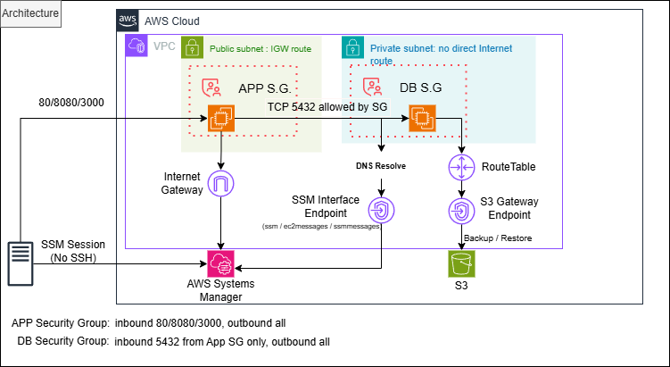
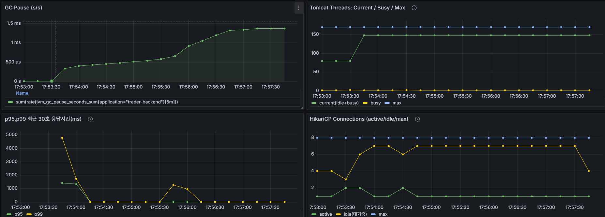

# SLO 기반 운영 사양 산정: 과사양 제거와 최적점 탐색

---

## 1. 실험 목적

* Node / Stock API의 성능을 측정한다.
* AWS 환경에서 SLO(p95 ≤ 300ms) 충족 여부를 검증한다.
* 현재 인프라 사양의 적정성을 판단한다.
* 성능 튜닝 이후, 비용 효율적인 인프라 구성을 도출한다.

---

## 2. 실험 환경

### 로컬 환경

* App + DB Server : 4 vCPU / 16GB
* CPU: Intel N100 (저전력 아키텍처, E-core 기반)
* Memory: LPDDR4x / LPDDR5 (온보드 메모리)
* Storage: M.2 2242 SSD (SATA 인터페이스, /dev/sda)
* DB: PostgreSQL

---

### 기존 환경 (Baseline)

* App Server: AWS EC2 m6i.xlarge (4 vCPU / 16GB, Intel Xeon Ice Lake)
* DB Server: AWS EC2 m6i.xlarge (4 vCPU / 16GB)
* Storage: AWS EBS gp3
* DB: PostgreSQL
* 네트워크: 동일 VPC 내부

---

### 다운사이징 환경

* App Server: AWS EC2 m6i.large (2 vCPU / 8GB)
* DB Server: 기존 유지 (이후 다운사이징 예정)

---

## 실험 인프라 아키텍처

본 실험은 실제 운영 환경과 유사한 조건에서 성능을 검증하기 위해 AWS VPC 기반 인프라를 구성하였다.

### 구성 개요

* App 서버: 퍼블릭 서브넷 배치
* DB 서버: 프라이빗 서브넷 배치
* App → DB 통신은 VPC 내부 사설 네트워크 사용

---

### 네트워크 및 접근 구조

* k6 Client → App: Public Endpoint
* App → DB: Private IP (VPC 내부 통신)
* DB 서버는 외부 직접 접근 불가

---

### 보안 구성

* App → DB (5432)만 허용
* 외부 → DB 접근 차단
* SSH 대신 SSM(Session Manager) 사용

---

### VPC 및 엔드포인트

* SSM, S3 등은 VPC Endpoint 사용
* 외부 인터넷 의존 최소화

---

### 설계 의도

* App-DB 분리 효과 검증
* 실제 운영 환경과 동일한 보안/네트워크 조건 반영
* 네트워크가 아닌 CPU / I/O 병목 검증

---

### 아키텍처 다이어그램

---

### 내부 요청 흐름

1. k6 → App 요청
2. App → HikariCP → DB
3. DB 쿼리 수행
4. 응답 반환

---

### 애플리케이션

* Spring Boot + JPA
* HikariCP
* JWT 인증 (검증 경로 최적화 적용)

---

### 설정

Tomcat max threads: 150
HikariCP

* maximumPoolSize: 8
* minimumIdle: 4

PostgreSQL

* max_connections: 30

---

## 3. 성능 기준

* 부하 도구: k6

SLO: p95 ≤ 300ms

---

## 4. 로컬 환경 성능 결과

### Node API (App + DB 단일 서버)

| RPS | p95(ms) | avg(ms) | 결과        |
| --- | ------- | ------- | --------- |
| 130 | 239     | -       | ⚠️ SLO 경계 |

---

### 분석

* App과 DB가 동일 서버에서 CPU, 메모리, 디스크 I/O를 공유
* PostgreSQL WAL fsync → 디스크 I/O 직접 영향
* 저전력 CPU → 단일 코어 병목

---

결론:

> 단일 서버 구조에서는 tail latency(p95)가 크게 증가한다.

---

## 5. 4core / 16GB / m6i.xlarge AWS 환경 성능 결과

### Node API

| RPS | p95(ms) | avg(ms) | 결과 |
| --- | ------- | ------- | -- |
| 130 | 14.45   | 9.23    | ✅  |
| 130 | 20.11   | 11.19   | ✅  |

---

### Stock API

| RPS | p95(ms) | avg(ms) | 결과 |
| --- | ------- | ------- | -- |
| 300 | 62.72   | 16.80   | ✅  |
| 300 | 13.31   | 8.65    | ✅  |

---

## 6. AWS 환경 분석

* CPU 사용률: 약 6~10%
* Thread / Connection 여유 충분
* 병목 없음

---

결론:

> AWS 환경은 안정적인 latency를 제공한다.

---

## 7. 다운사이징 실험 (2core / 8GB / m6i.large)

### Node

| RPS | p95(ms) |
| --- | ------- |
| 130 | 13.30   |

---

### Stock

| RPS | p95(ms) |
| --- | ------- |
| 300 | 11.64   |

---

결론:

> 4core/16GB는 과사양이며 2core/8GB로도 충분하다.

---

## 8. 다운사이징 2단계 (DB 포함)

### 환경

* App: 2core / 4GB / c6i.large
* DB: 2core / 8GB / m6i.large → 2core / 4GB / c6i.large비교

---

### Case 1: App 2/4 + DB 2/8

| API   | RPS | p95(ms) |
| ----- | --- | ------- |
| Node  | 130 | 10.54   |
| Stock | 300 | 10.85   |

---

### Case 2: App 2/4 + DB 2/4

| API   | RPS | p95(ms) |
| ----- | --- | ------- |
| Node  | 130 | 23.35   |
| Stock | 300 | 11.83   |

---

## 9. 다운사이징 분석

* DB 메모리 감소 → Node p95 증가 (10 → 23ms)
* Stock API는 영향 거의 없음

---

결론:

> 2core / 4GB 환경에서도 SLO를 충분히 만족한다.

---

## 10. 핵심 인사이트

1. 성능은 인프라 크기가 아니라 구조에 의해 결정된다
2. App-DB 분리는 tail latency에 큰 영향을 준다
3. CPU 단일 코어 성능이 중요하다
4. I/O 안정성이 p95를 결정한다
5. 비용 최적화가 핵심이다

---

## 운영 사양 선택 기준

본 실험에서는 다음 기준을 통해 최종 운영 사양을 결정하였다.

* SLO(p95 ≤ 300ms)를 안정적으로 만족할 것 
* CPU, 메모리, 커넥션 자원이 포화 상태에 도달하지 않을 것 
* 불필요한 리소스를 제거하여 비용 효율을 극대화할 것

이 기준을 바탕으로,
각 인스턴스 사양 2core / 4GB 환경에서도 충분한 성능 여유를 확인하였으며
추가적인 리소스 증설 없이 운영이 가능하다고 판단하였다.

---
## 11. 결론

* 로컬: p95 239ms
* AWS: p95 13ms

또한 다운사이징을 통해

* 4/16 → 2/8 → 2/4까지 축소하더라도
* SLO를 안정적으로 만족함을 확인하였다

---

따라서

> App 2core / 4GB + DB 2core / 4GB 환경이
> 최소 비용으로 SLO를 만족하는 최적 운영 사양이다

---

## 운영 최종 설정안

본 실험 결과를 바탕으로, 다음과 같이 운영 환경 설정을 도출하였다.

### App 서버 (2core / 4GB / c6i.large)

* Tomcat Threads: 30
* HikariCP

  * maximumPoolSize: 8
  * minimumIdle: 4

---

### DB 서버 (2core / 4GB / c6i.large)

* PostgreSQL

  * max_connections: 30

---

### 설정 근거

* Tomcat Threads
  → 실제 테스트에서 busy thread가 매우 낮게 유지되어 과도한 설정으로 판단
  → 30 수준으로 축소해도 충분한 처리 가능

* HikariCP
  → active connection이 낮고 idle 여유가 충분하여 8 유지
  → burst 상황 대응을 위한 최소 여유 확보

* PostgreSQL max_connections
  → Hikari pool + 운영 여유(약 20 connections)를 고려하여 30으로 설정

---

### 종합

> 본 설정은 단순 최대 처리량이 아닌,
> **현재 워크로드에서 안정성과 비용 효율을 동시에 만족하는 균형 지점**을 기준으로 도출하였다.

---

## 12. 운영 검증 및 최종 판단

2core / 4GB 환경에서 추가로 수집한 메트릭을 통해 다음을 확인하였다.

* GC Pause: 1~2ms 수준으로 매우 낮게 유지되며, GC로 인한 지연 영향 없음
* Tomcat Thread: busy thread가 매우 낮은 수준으로 유지되어 thread 병목 없음
* HikariCP: active connection이 낮고 idle 여유가 충분하여 커넥션 부족 없음
* p95/p99: 워밍업 이후 안정적으로 낮은 수준 유지

---

### 종합 해석

* CPU, 메모리, 커넥션 자원이 모두 여유 상태
* GC 및 커넥션, 스레드 관점에서 병목 구간 없음
* SLO(p95 ≤ 300ms)를 충분히 초과 달성 (여유 있는 수준)

---

### 최종 판단

추가적인 다운사이징(shared_buffers 조정, JVM Heap 축소 등)은 가능하지만,

* 현재 이미 충분한 성능 여유 확보
* 추가 감소 시 얻는 비용 이득은 제한적
* 반면 GC, 캐시, burst 상황에서의 안정성 저하 가능성 존재

따라서 본 실험에서는

> **최소 가능 사양이 아닌, SLO를 안정적으로 만족하는 최소 운영 사양**을 기준으로
> 2core / 4GB 환경에서 최종 사양을 확정하였다.
---

## 13. 한 줄 결론

> 본 실험은 성능 향상이 아니라
> SLO를 만족하는 인프라를 찾는 비용 최적화 과정

