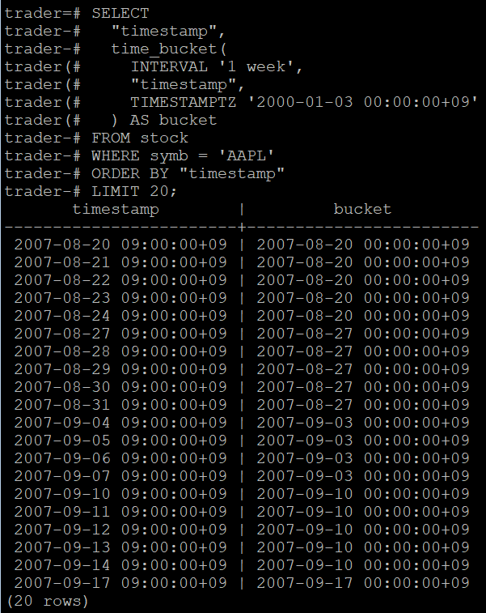

# 📈 StockController 조회 성능 최적화
### PostgreSQL + TimescaleDB 하이퍼테이블 및 청크 전략 분석

---

# 🚀 Summary

## 🎯 문제 정의
- 약 2,600만 행 규모 시계열 데이터에서 조회 성능 저하 발생
- 낮은 RPS(5~7)에서도 과부하 발생 및 p95 목표(300ms) 미달

## 🔍 핵심 원인
- 하이퍼테이블 미적용 (단일 테이블 구조)
- 인덱스 최적화 부족
- 청크 설계 부재로 인한 Planner 오버헤드 증가
- 시계열 조회 패턴(90일 범위)에 비해 비효율적인 시간 분할

## 🛠 해결 전략
- TimescaleDB 하이퍼테이블 적용 (시간 + 공간 분할)
- 인덱스 최적화 (symb, timestamp)
- 청크 전략 튜닝 (30day → 90day)
- 공간 분할(num_partitions) 비교 실험 (8 vs 4)
- EXPLAIN ANALYZE + k6 기반 성능 검증

## 📈 결과
- 인덱싱만으로 **약 10배 성능 개선**
- 하이퍼테이블 적용 후 p95:
  - **7247ms → 235ms (약 28배 개선)**
- 공간청크 튜닝으로 추가 **30% 성능 개선**
- 최종: **300RPS / p95 235ms 달성**

## 💡 핵심 인사이트
- 시계열 DB 성능은 execution보다 **planning cost 영향이 큼**
- chunk 수가 많을수록 planner 비용 증가
- read-heavy 환경에서는 **chunk를 줄이는 것이 유리**
- TimescaleDB는 단순 확장이 아니라 **쿼리 구조 최적화 도구**
- 단순 인덱스 튜닝이 아닌, 시계열 데이터 구조 설계를 통해 성능을 개선하였다.

## 전제조건

> 본 테스트는 동일한 조회 조건에서 시계열 데이터 조회 쿼리의 실행 시간이 P95 기준 7,247ms에서 235ms로 약 28배 개선되었으며,<br>
> 이는 인덱스 부재로 인한 Full Scan 구조에서 Index + Hypertable 기반 Chunk Pruning 구조로 전환되며 execution plan이 변경된 결과입니다.

> 해당 결과는 동일한 부하 조건에서 쿼리 실행 성능을 기준으로 측정된 값이며,<br>
> 실제 운영 환경에서는 커넥션 풀, 동시성 수준, 네트워크 및 I/O 상태 등에 따라 전체 응답 시간과 처리량은 달라질 수 있습니다.

# 📋 목차

- [1. 서론](#1-서론)
- [2. 테스트 환경](#2-테스트-환경)
- [3. 문제 정의 및 1차 결과](#3-문제-정의-및-1차-결과)
- [4. 하이퍼테이블 누락 확인](#4-하이퍼테이블-누락-확인)
- [5. 하이퍼테이블 구조](#5-하이퍼테이블-구조)
- [6. 청크 전략 비교](#6-청크-전략-비교)
- [7. 공간 분할 장단점](#7-공간분할의-장단점)
- [8. 부하 테스트](#8-k6부하테스트-테스트-고정시드-추가)
- [9. 최종 결과](#9-하이퍼-테이블-적용-전후-테스트-결과)
- [10. 최종 설계 결정](#10-하이퍼테이블-최종-선택-결과)
- [11. 전제 및 한계](#11-전제한계)
- [12. 조회 전략](#12-1d--1w--1m--1y-단위-조회-전략)

---------

# 1. 서론

본 문서는 대규모 시계열 데이터(약 2,600만 건)를 대상으로
Stock 조회 API의 성능 병목을 분석하고 개선한 과정을 정리한 것이다.

해당 서비스는 다음과 같은 특징을 가진다:

- **Append-only 구조**
  - 데이터는 배치로 적재되며 수정/삭제는 거의 없음
- **Read-heavy 워크로드**
  - 대부분 조회 요청 (차트/분석)
- **조회 패턴 고정**
  - 특정 종목(symb)에 대해 약 90일 구간 반복 조회

초기에는 일반 PostgreSQL 테이블 구조에서
낮은 RPS에서도 병목이 발생하였고,
단순 인덱스 튜닝만으로는 한계가 존재했다.

이에 따라 TimescaleDB 기반 하이퍼테이블 구조를 도입하고,
시간/공간 청크 전략을 비교 실험하여
최적의 조회 성능을 달성하는 것을 목표로 하였다.

# 2. 테스트 환경

| 항목                 | 설정                                                                                  |
| -------------------- | ------------------------------------------------------------------------------------- |
| 서버 사양            | 4 Core / 16GB / SSD                                                                   |
| DB                   | PostgreSQL 17 + TimescaleDB                                                           |
| 커넥션 풀            | HikariCP max=125,idle=80                                                              |
| 테스트 도구          | k6 v0.52                                                                              |
| 초기 부하 유형       | ramping-arrival 20RPS 시작으로도 과부하 -><br>매우 낮은 constant-arrival-rate(5~7RPS) |
| 네트워크             | 내부 브릿지 (Docker Compose 환경)                                                     |
| 데이터 구성          | 약 2,600만 행 규모의 OHLCV 시계열 데이터. PostgreSQL 17 + TimescaleDB로 확장하여 운용 |
| GC 지표 정의         | sum(rate(jvm_gc_pause_seconds_sum[5m]))                                               |
| JVM                  | OpenJDK Temurin 17 (64bit,JRE-only)                                                   |
| GC 종류              | G1GC (Garbage-First)                                                                  |
| 힙 초기/최대 크기    | Xms=248MB / Xmx=3942MB (컨테이너 자동 설정)                                           |
| Heap Region Size     | 2MB                                                                                   |
| Parallel Workers     | 4                                                                                     |
| Max Pause Target     | 200ms (기본값, G1 MaxGCPauseMillis)                                                   |
| String Deduplication | **Disabled** (명시 옵션 미사용)                                                       |

# 3. 문제 정의 및 1차 결과

## 1차 테스트 결과

| 항목     | 설정                |
| -------- | ------------------- |
| RPS      | 8RPS                |
| 시간     | 1분으로 짧은 테스트 |
| 목표 P95 | <300ms              |
| 결과 P95 | 315ms               |

## 문제점 요약

- 테스트가 진행이 되지 않을 정도의 병목이 발생하고 있음
- DB쿼리 성능저하로 인한 병목으로 진단
- 하이퍼테이블 누락

## 해결방법

- 인덱스 확인 및 최적화(symb,timestamp),(symb),(timestamp)인덱싱
- 하이퍼 테이블 적용
- 청크 변경 기존(30day로 운영중)

| 항목           | RPS | P95       | throughtput | failRate |
| -------------- | --- | --------- | ----------- | -------- |
| stock(인덱싱X) | 10  | 342.14 ms | 10.01 req/s  | 0.00%    |
| stock(인덱싱O) | 10  | 32.06 ms  | 10.01 req/s  | 0.00%    |

- 개선율 약 10~11배 성능 향상

# 4. 하이퍼테이블 누락 확인

```sql
SELECT
  hypertable_schema,
  hypertable_name,
  num_dimensions,
  num_chunks,
  compression_enabled
FROM timescaledb_information.hypertables
ORDER BY hypertable_schema, hypertable_name;
```

- 위 쿼리로 확인 결과 덤프/복원 과정에서 하이퍼테이블 메타데이터 누락 확인<br>
  -> 하이퍼테이블 추가
- 시간청크와 더불어 공간 청크에 대해서 알게된 후 시간,공간 청크를 각각 나누어 하이퍼 테이블을 생성 및 기존 데이터를 복사하여 Explain으로 쿼리 성능 비교

```sql
#3개월 데이터에 대해서 해당 쿼리를 비롯한 총 5개 다른 주식심볼값을 기준으로 테스트
#웜 캐시의 경우 같은 쿼리를 3번 반복 후 마지막 값으로 기록
#각 쿼리마다 테이블(stock,stock_new)의 소요시간 계산
EXPLAIN (ANALYZE, BUFFERS, TIMING, SUMMARY)
SELECT *
FROM stock
WHERE symb = 'ALGT'
AND timestamp BETWEEN '2022-01-01' AND '2022-04-01'
ORDER BY timestamp ASC;

EXPLAIN (ANALYZE, BUFFERS, TIMING, SUMMARY)
SELECT *
FROM stock
WHERE symb = 'CNOB'
AND timestamp BETWEEN '2024-01-01' AND '2024-04-01'
ORDER BY timestamp ASC;
...
```

> **Warm cache** 구간에서는 planner 재사용과 buffer hit으로 인해  
> 실제 차이가 0.1–0.2 ms 이내로 수렴하여 동일한 값으로 표기하였다.  
> **Cold/Warm execution time** 또한 동일한 인덱스 경로를 사용하므로  
> 측정값의 변동이 미미하며 근사치로 동일한 값으로 표기하였다.

| 항목                 | 평균 planningTime | 평균 executionTime |
| -------------------- | ----------------- | ------------------ |
| stock_30d_32콜드캐시 | 49ms              | 3ms                |
| stock_30d_8콜드캐시  | 47ms              | 3ms                |
| stock_30d_32웜캐시   | 3ms               | 0.4ms              |
| stock_30d_8웜캐시    | 3ms               | 0.4ms              |

| 항목                 | 평균 planningTime | 평균 executionTime |
| -------------------- | ----------------- | ------------------ |
| stock_90d_8 콜드캐시 | 31ms              | 3ms                |
| stock_90d_4 콜드캐시 | 23ms              | 3ms                |
| stock_90d_8 웜캐시   | 3ms               | 0.3ms              |
| stock_90d_4 웜캐시   | 3ms               | 0.3ms              |

- 실행 시간은 0.3–3ms로 거의 동일하나, 청크 수/파티션 수 차이에 따른 planner 오버헤드가 cold에서 planning time으로 나타났다.

- warm에서는 buffer hit + plan cache 영향으로 planning이 3ms로 수렴하여, 차이는 **콜드 플래닝 비용** 구간에서만 의미가 있다

# 5. 하이퍼테이블 구조

- TimescaleDB의 하이퍼테이블은 데이터를 시간(Time), 공간(Space)으로 나누어 관리한다.
- 테스트에 사용한 스키마의 경우 <br>시간은 timestamp값 <br>공간은 symb(주식티커)을 설정했다.

- 청크 분할은 다음 순서로 이루어진다(분할 순서: 시간 → 공간)

  1. 시간 기준 분할 (chunk_time_interval)

     - 우선 데이터를 timestamp 값 기준으로 일정 주기(예: 30일, 90일) 단위로 나눈다.

     - 이 단계에서 여러 symb의 데이터가 같은 시간 구간 청크에 포함된다.

  2. 공간 기준 분할 (num_partitions)

     - 이후 각 시간 청크 내부에서 symb 컬럼의 해시(hash) 값을 이용해 num_partitions 개의 버킷으로 나눈다.

     - 예시: hash(symb) % num_partitions

     - 동일한 해시 결과를 갖는 symb 값(즉, 같은 종목)은 항상 같은 버킷(같은 물리 청크)에 저장된다.

# 6. 청크 전략 비교

## 인터벌 30에서의 비교

- 애플리케이션의 조회기능은 주로 90일간격으로 조회하여 테스트에 반영하였다.
- 30일 인터벌(공간청크 차이 없음) : 3~4개 시간청크 스캔
- 90일 인터벌+공간청크8개 : 대게 1개 시간청크 스캔 → 결과 PlanningTime 35% 감소

## 인터벌 90에서의 비교

- 공간을 8로 나눈 것과 4로 나눈 것의 예시
  - 공간을 8로 나누었을 경우 8개의 버킷, 4로 나눌 경우 4개의 버킷만 스캔하면 됨 -> 평균 PlanningTime 20%감소
- 최종적으로 같은 90일 간격 공간청크(8)보다 대략 30%,<br>
  처음 30일간격보다 PlanningTime 55% 감소

# 7. 공간분할의 장단점

1. 공간청크가 클 수록(num_partitions ↓)

- 장점:

  - Planner 오버헤드 ↓
    - 청크 수가 적어 쿼리 계획을 세우는 시간이 짧다.
  - I/O효율 ↑
    - 큰 청크를 연속적으로 읽으므로 디스크 접근이 더 효율적이다.
  - 통계·인덱스 관리 간단
    - ANALYZE, VACUUM 등 관리 주기가 단순하다.
    - 청크 10개와 500의 경우 같은 ANALYZE를 돌려도 10번 500을 돌려야 하는 차이가 있음

- 단점:

  - 락 경합 및 쓰기 병목 ↑
    - insert,update가 같은 청크에 몰리게 되어 락·인덱스 경합 발생.
  - 병렬처리 효율 ↓

    - TimescaleDB의 병렬 스캔은 청크 단위로 워커를 분배하므로  
      청크 수가 적으면 병렬화 기회 자체가 줄어들고 CPU 활용률이 낮아진다.

  - 청크가 너무 커져 인덱스·테이블 크기 비대해짐
    - 인덱스 재구성 및 압축이나 삭제시에도 청크단위로 하다보니 부하와 걸리는 시간이 올라간다.
    - 청크마다 크기가 크다보니 ANALYZE,VACUUM등의 부하가 심해진다.

2. 공간청크가 작을 수록(num_partitions ↑)

- 장점:
  - symb별로 다른 청크에 분산되어 동시 쓰기 병목 완화된다.
    - postgreSQL은 데이터를 디스크에 페이지 단위로 저장하기에 청크가 많을 수록 symb별로 테이블이 분리되며 서로 같은 페이지에 쓰려 할 가능성이 적어 lock충돌이 일어날 가능성이 적어져 동시 쓰기 병목이 완화된다.
  - 병렬 쿼리 및 유지보수 효율 ↑
    - 여러 청크를 병렬로 VACUUM/압축/SELECT 가능하다.
  - 청크 단위 관리 유연성 ↑
    - 오래된 종목 일부만 압축하는 등 청크단위가 많아져 세밀하게 작업이 가능하다.
    - 일부 청크 장애나 데이터 삭제시에 영향 범위가 적다
- 단점:
  - Planner 오버헤드 ↑
    - 청크 수가 많아 쿼리 계획 세우는 시간이 길어진다.
  - 랜덤 I/O 증가
    - 데이터가 여러 청크로 흩어져 연속 읽기 불가하다.
  - 통계·인덱스 관리 비용 ↑
    - 청크별 ANALYZE(쿼리 실행 계획을 위한 통계 정보 수집), 인덱스 메타데이터가 늘어나 관리 오버헤드 발생.

# 8. K6부하테스트 테스트 고정시드 추가

- 테스트의 경우 본 부하 테스트 RPS의 20%의 RPS로 3분간 웜업을 하여 캐시를 채움
  - pg_statio_user_tables기준 buffer hit_ratio 99% 확인
- 성능, 구조등을 변경하며 동일한 조건에서 테스트를 하기 위해 웜업을 제외한 본 부하 테스트의 경우 시드값을 토대로 테스트가 같은 파라미터 순서를 타도록 설정함

## 테스트 결과

| 항목        | RPS | P95      | throughtput  | failRate |
| ----------- | --- | -------- | ------------ | -------- |
| stock_90d_8 | 300 | 331.99ms | 300.01 req/s | 0.00%    |
| stock_90d_4 | 300 | 235.32ms | 300.01 req/s | 0.00%    |

- 같은 시간청크, RPS 300기준 성능 30%향상

# 9. 하이퍼 테이블 적용 전후 테스트 결과

| 항목        | RPS | P95      | throughtput  | failRate |
| ----------- | --- | -------- | ------------ | -------- |
| plain_stock | 300 | 7247.28ms | 213.40 req/s | 0.00%    |
| stock_90d_4 | 300 | 235.32ms | 300.01 req/s | 0.00%    |

- 같은 인덱스를 적용한 테스트 결과 하이퍼테이블 튜닝 후 성능이 p95기준 약 28배 향상

# 10. 하이퍼테이블 최종 선택 결과

1. 시간분할 : 90day
2. 공간분할 : 4

- 단순 종목 조회(90일)가 주 기능이다보니 시간간격은 90일로 설정
- append-only 구조로 업데이트/삭제가 전혀 없기 때문에,
  VACUUM이나 인덱스 락 경합은 발생하지 않는다.
- 쓰기작업이 하루에 한번 배치처리로 되고 약 10000개의 데이터이다 보니 쓰기작업에서 병렬도나 시간은 중요하지 않다고 판단.
- 오히려 읽기 성능의 최적화가 중요하다 생각하여 num_partitions=4로 설정
- 다만 통계, 청크 장애등을 고려하여 공간청크를 두지 않는 것보다 4개로 나눔
- 부하테스트, DB내의 5~6개의 고정된 조회쿼리를 사용한 EXPLAIN결과를 토대로 결정하게 되었음
- 해당 조회 기능은 실시간성이 아니며 요청당 90일치 데이터를 반환하기에 300RPS p95=235.32ms는 만족할만한 성능이라고 판단
- 추후 서비스가 운영되고 트래픽 급증시 Redis캐시 단계적으로 도입 예정

# 11. 전제/한계

본 하이퍼테이블 및 청크 설계는 읽기 비중이 매우 높은 분석형 쿼리에 최적화되어 있다.

종목 수가 급격히 증가하거나, 동시 쓰기·업데이트가 빈번해질 경우 공간 청크 분할 전략은 재검토가 필요하다.

또한 실시간 단일 레코드 조회나 초저지연 트랜잭션 환경에서는 일반 B-Tree 기반 테이블이 더 적합할 수 있다.

본 결론은 현재 서비스의 접근 패턴과 데이터 생명주기를 기준으로 도출되었다

---

# 12. 1D / 1W / 1M / 1Y 단위 조회 전략

본 서비스는 차트 프레임(1D/1W/1M/1Y)에 따라 서로 다른 집계 단위의 OHLCV 데이터를 제공하도록 설계하였다.  
성능과 확장성을 동시에 확보하기 위해 다음과 같은 전략을 정의하였다.

## 1. 데이터 소스 분리 전략

* **1D(일봉)**: 원본 hypertable(`stock`)에서 직접 조회
* **1W/1M/1Y(주·월·연봉)**: TimescaleDB Continuous Aggregate(CAGG) 기반 사전 집계 view 활용

→ 범위 집계 쿼리의 반복 실행 비용을 제거하고, 고부하 환경에서도 안정적인 응답 시간을 확보하도록 설계하였다.

---

## 2. OHLCV 집계 규칙 정의

프레임별 캔들 데이터는 다음 기준으로 집계한다.

* `open`  = first(open, timestamp)
* `close` = last(close, timestamp)
* `high`  = max(high)
* `low`   = min(low)
* `volume` = sum(volume)

→ 집계는 `time_bucket()` 기반으로 수행하며, 프레임별 CAGG로 분리 관리한다.

---

## 3. 배치 기반 Refresh 전략 (수동 제어)

* 일봉 데이터는 영업일 기준 배치로 1일 1회 적재
* 배치 완료 이후 `refresh_continuous_aggregate()` 호출
* 전체가 아닌 **최근 구간만 refresh**

→ 자동 policy 대신 배치 타이밍에 맞춘 수동 제어를 통해  
**DB 부하를 예측 가능하게 유지하도록 설계하였다.**

---

## 4. 조회 최적화 전략

* `(symb, bucket DESC)` 인덱스 구성
* cursor 기반 조회 (`before`)
* offset 제거

→ 대량 데이터 환경에서 일정한 응답 성능을 유지하도록 설계하였다.

---

## 5. 정합성 및 운영 고려

* refresh 완료 이후 데이터 노출
* `lastRefreshedAt` 기준 시각 제공 가능

→ 데이터 신뢰성과 사용자 인지 일관성을 확보하도록 설계하였다.

---

## 6. 확장 전략

* 트래픽 증가 시 Redis 캐시 도입 가능
* 월/연 단위 조회는 별도 CAGG를 생성하지 않고 **주간 CAGG 기반 재집계 방식으로 처리**

→ 현재 구조를 기반으로 성능과 운영 복잡도를 균형 있게 고려한 확장 전략을 수립하였다.

---


## 7. CAGG 전략 도입 검증 결과

본 전략에 대해 실제 데이터 기반 성능 검증을 수행하였다.

timescaleDB의 CAGG(연속집계) Materialized View를 활용하여 주간, 월간 논리적 뷰를 생성하여 <br>
EXPLAIN ANALYZE를 통해 실제 조회 성능을 비교하였다. <br>공정성을 위해 비교시 한 종목당 순서를 바꿔가며 조회하였다.

### 요약

- 위에서 설계한 확장 전략에 대해 실제 성능 검증을 수행한 결과,  
  데이터 소스 분리, 집계 규칙 정의, 조회 최적화 전략은 최종적으로 도입하였다.

- 배치 기반 refresh 전략은 초기에는 refresh 범위와 운영 비용을 명확히 통제하기 위해  
  수동 refresh 방식으로 설계하였다.

- 그러나 CAGG refresh는 refresh window에 완전히 포함된 bucket만 처리되며,  
  진행 중인 bucket(incomplete bucket)은 반영되지 않는다는 특성이 존재한다.

- 이에 따라 최신 데이터까지 일관되게 반영하기 위해,  
  완료된 bucket은 refresh로 materialize하고,  
  진행 중 bucket은 real-time aggregate를 통해 raw 데이터를 포함하여 조회하는 방식으로  
  최종 운영 전략을 정리하였다.


---

### 7.1 뷰 생성과 CAGG구조

- CAGG는 Materialized View 형태의 논리적 인터페이스를 제공하지만,<br>
실제 데이터는 Backing Hypertable이라는 물리적인 하이퍼테이블에 저장된다.<br>
이를 통해 사전 집계된 결과를 빠르게 조회할 수 있다.

- 아래는 생성된 주간 CAGG 뷰에서 bucket(집계된 시간 그룹 기준 시점)과 원본 timestamp의 관계를 나타낸 예시이다.




#### CAGG vs Materialized View 차이

일반 Materialized View는 refresh 시 전체 데이터를 재계산하는 반면,<br>
CAGG는 time_bucket 기반으로 변경된 구간(refresh window)에 대해서만 재계산을 수행하여,
전체 재계산을 수행하는 일반 Materialized View 대비 효율적인 갱신이 가능하다..<br>

CAGG는 backing hypertable에 집계 결과를 저장하여
대용량 시계열 데이터 환경에서 효율적인 성능과 확장성을 제공한다.

또한 CAGG는 refresh 시 refresh window에 완전히 포함된 bucket만 재계산되며,  
진행 중인 bucket은 materialized 데이터에 반영되지 않는다.<br>  
최신 데이터는 별도의 raw 기반 계산 또는 real-time aggregate를 통해 조회 시점에 보완된다.

### 7.2 주간 CAGG vs Raw 집계 성능

| 구분              | Planning Time (ms) | Execution Time (ms) |
| --------------- | ------------------ | ------------------- |
| Raw Aggregation | 3.471              | 6.212               |
| CAGG 조회         | 2.641              | 0.329               |

→ CAGG 적용을 통해 **약 19배 실행 시간 감소**를 확인하였다.<br>
(집계 연산 제거에 따른 execution cost 감소 효과)

이는 반복적인 집계 연산을 제거하고, 사전 집계된 결과를 조회하는 구조로 전환되었기 때문이다.

---

### 7.3 주간 CAGG기준 Cursor vs OFFSET 조회 성능

| 종목   | 방식     | OFFSET | Planning Time (ms) | Execution Time (ms) |
| ---- | ------ | ------ | ------------------ | ------------------- |
| DIA  | Cursor | -      | 2.319              | **0.418**           |
| DIA  | OFFSET | 50     | 2.134              | **0.879**           |
| TSLA | Cursor | -      | 1.959              | **0.392**           |
| TSLA | OFFSET | 100    | 2.101              | **0.873**           |
| AAPL | Cursor | -      | 4.449              | **0.368**           |
| AAPL | OFFSET | 50     | 4.061              | **0.621**           |

→ OFFSET 대비 cursor 기반 조회는 약 **1.7 ~ 2.2배 빠른 실행 성능**을 보였다.

---

### 7.4 일간 vs 주간 vs 월간 집계 성능

| 종목   | 집계 방식   | Planning Time (ms) | Execution Time (ms) |
| ---- | ------- | ------------------ | ------------------- |
| AAPL | 월간 CAGG | 2.970              | **0.191**           |
| AAPL | 주간 재집계  | 1.922              | **0.543**           |
| AAPL | 일간 재집계  | 3.527              | **1.781**           |
| TSLA | 월간 CAGG | 1.420              | **0.272**           |
| TSLA | 주간 재집계  | 1.536              | **0.765**           |
| TSLA | 일간 재집계  | 3.648              | **6.791**           |
| VID  | 월간 CAGG | 1.447              | **0.264**           |
| VID  | 주간 재집계  | 1.517              | **0.709**           |
| VID  | 일간 재집계  | 3.422              | **5.077**           |

→ 집계 단위가 커질수록 사전 집계 효과가 극대화되며,
raw 기반 재집계 대비 execution cost가 크게 감소하는 것을 확인하였다.

---

### 7.5 성능 차이 요약

| 종목   | 주간 대비 월간   | 일간 대비 월간    |
| ---- | ---------- | ----------- |
| AAPL | 약 **2.8배** | 약 **9.3배**  |
| TSLA | 약 **2.8배** | 약 **25.0배** |
| VID  | 약 **2.7배** | 약 **19.2배** |

---

### 7.6 종합 분석

* CAGG를 통해 집계 연산 비용을 제거하여 성능 개선을 확인하였다.
* Cursor 기반 조회를 통해 OFFSET 대비 일관된 성능 향상(약 2배)을 확인하였다.
* 월간 CAGG는 주간 재집계 대비 **약 2.7~2.8배 빠른 성능**을 보였으나,<br>
  주간 재집계 역시 execution 시간이 충분히 낮아 실시간 조회 요구사항을 만족할 수 있었으며,<br>
추가 CAGG 생성에 따른 운영 복잡도 증가 대비 성능 이점이 제한적이라고 판단하였다.

→ 이에 따라 **운영 복잡도를 고려하여 주간 CAGG까지만 적용하고,
월/연 단위 조회는 주간 데이터 기반 재집계로 처리하는 전략을 채택하였다.**

----

### 7.7 운영 복잡도 고려
1. CAGG를 추가로 생성할 경우 refresh 대상 증가 및 배치 흐름 복잡도가 상승한다.<br>

2. 다중 CAGG 간 데이터 정합성 관리와 장애 대응 포인트가 증가한다.<br>
예를들어 주간 CAGG는 정상 refresh, 월간 CAGG는 refresh에 실패할 경우 차트간 데이터의 불일치가 비정상적으로 보이는 문제가 발생하며 추가 운영 비용이 발생한다.<br>

3. 집계 데이터가 물리적으로 저장되므로 저장 공간 및 인덱스 관리 비용도 함께 증가한다.

→ 이에 따라 현재 데이터 규모에서는 성능 대비 운영 비용이 더 크다고 판단하여,
주간 CAGG까지만 적용하는 전략을 유지하였다.

### 7.8 실제 운영시 refresh 전략

현재 구조에서는 매일 영업일 기준 한국투자증권 API를 통해 일간 데이터를 받아온다.

주간 CAGG는 현재 진행 중인 불완전 버킷을 제외하고,
완료된 주간 버킷까지만 refresh하는 방식으로 운용한다.

TimeScaleDB 공식 문서에서 권장하듯이,
최신 버킷 범위의 진행 중 데이터가 필요할 경우에는 raw 데이터 기반 계산 또는
real-time aggregate 방식으로 별도 처리할 수 있다.

```sql
-- 실시간 집계를 활성화하여 materialized data + 최신 raw data를 함께 조회
CREATE MATERIALIZED VIEW stock_1m_cagg
WITH (
  --CAGG활성화
  timescaledb.continuous,
  --아래부분
  timescaledb.materialized_only = false
) AS ...
```

#### 설계 한계 및 최종 전략

초기에는 배치 시점에 맞춰 CAGG를 refresh하여 최신 데이터까지 반영하는 구조를 고려하였다.

그러나 TimescaleDB 공식 문서 기준으로,<br>
CAGG refresh는 refresh window에 완전히 포함된 bucket만 처리되며,<br>
진행 중인 bucket(incomplete bucket)은 materialized 데이터로 반영되지 않는다는 제약이 존재한다.

즉, CAGG refresh만으로 최신 구간을 일관되게 반영하는 것은 구조적으로 비효율적이다

이에 따라 다음과 같은 방식으로 최종 전략을 정리하였다.

- **완료된 bucket**은 CAGG refresh를 통해 사전 집계된 결과를 활용
- **진행 중 bucket**은 real-time aggregate를 통해 raw 데이터를 포함하여 조회

이를 통해 CAGG의 성능 이점은 유지하면서도,<br>
최신 데이터에 대한 일관된 조회를 보장할 수 있도록 설계하였다.

또한 진행 중 bucket을 refresh 대상으로 포함시키지 않음으로써,<br>
불필요한 refresh 시도 및 최신 구간에 대한 반복 처리 구조를 제거하였다.

[→TimeScaleDB Reference 바로가기](https://www.tigerdata.com/docs/reference/timescaledb/continuous-aggregates/refresh_continuous_aggregate)