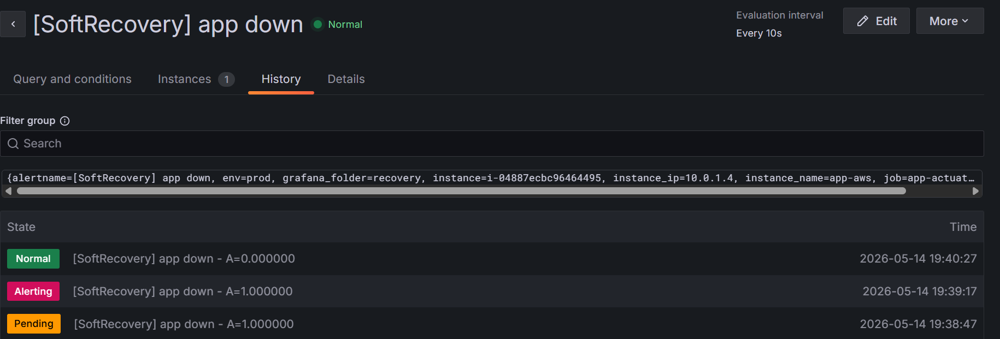
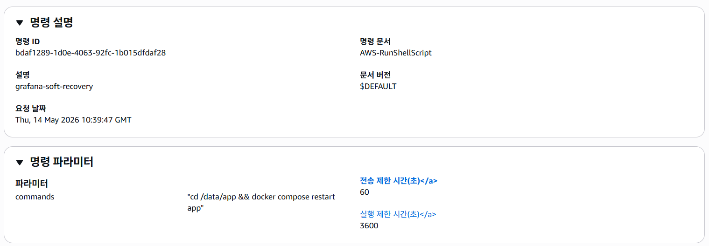
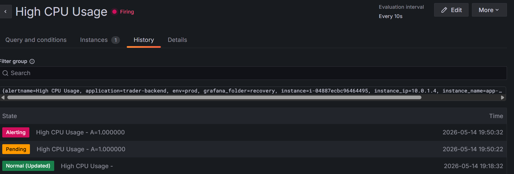
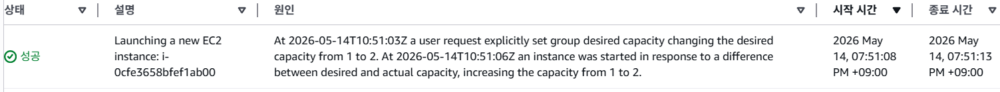
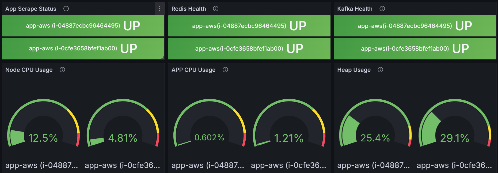
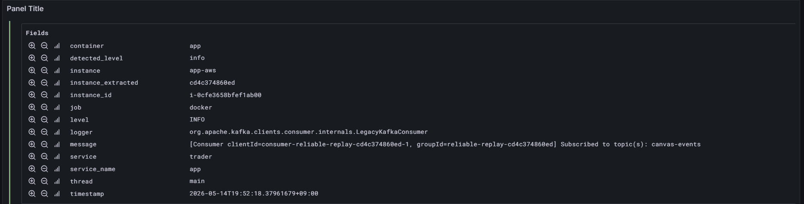
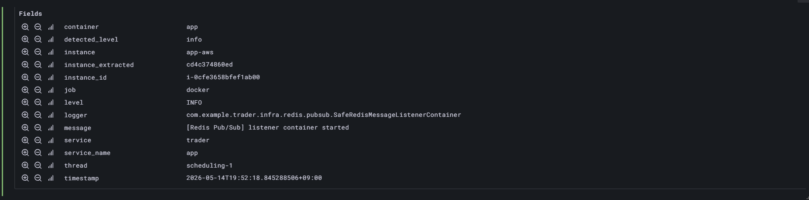

# 인스턴스 자동 복구 · 리소스 기반 확장 검증
> 본 문서는 Grafana Alert를 기반으로 애플리케이션 장애와 리소스 고갈을 감지하고,
> Lambda를 통해 SSM RunCommand 또는 Auto Scaling Group 조정을 수행하여
> 서비스 복구와 확장을 자동화하는 흐름을 검증한다.
>
> Kafka / Redis / Redis Pub/Sub 장애 자체의 fallback 정합성은 별도 문서에서 이미 검증했으며,
> 본 문서는 그 장애대응 경로 위에서 **인프라 복구·확장 자동화가 정상적으로 연결되는지**를 검증한다.
---
## 1. 목적
운영 환경에서 애플리케이션 장애는 크게 두 가지 형태로 나타난다.
1. **프로세스 또는 컨테이너 장애**
   * 앱 컨테이너가 중지되거나 Actuator scrape이 실패하는 상황
   * 즉시 EC2 replacement를 수행하기보다, 먼저 컨테이너 재시작을 시도하는 soft recovery가 유리하다.
2. **리소스 고갈 또는 지속적인 부하 증가**
   * CPU 사용률이 일정 시간 이상 높게 유지되는 상황
   * 단일 인스턴스 재시작보다 scale-out을 통해 처리 용량을 늘리는 것이 적합하다.
본 검증의 목표는 다음과 같다.
* App Down 감지 시 Grafana Alert가 firing 되는지 확인한다.
* Grafana webhook을 통해 Lambda가 호출되는지 확인한다.
* Lambda가 장애 유형에 따라 SSM RunCommand 또는 ASG scale-out을 수행하는지 확인한다.
* 복구 또는 확장된 인스턴스가 다시 Prometheus scrape, Redis, Kafka, Gateway 라우팅 경로에 합류하는지 확인한다.
* WebSocket 연결은 Rendezvous Hashing 기반으로 failover/failback되는지 확인한다.
---
## 2. 기존 장애대응 문서와의 관계
본 문서는 Kafka / Redis 장애대응 로직 자체를 다시 검증하는 문서가 아니다.
Kafka 장애 시 outbox 저장 및 복구 후 replay/catch-up,
Redis 장애 시 lock/autosave/version hint의 DB fallback,
Redis Pub/Sub 장애 시 gRPC relay fallback은 별도 문서에서 이미 검증했다.
따라서 본 문서에서는 장애 감지 이후의 자동화 흐름에 집중한다.
| 영역                     | 기존 검증 문서                                               | 본 문서와의 관계                                                        |
| ---------------------- | ------------------------------------------------------ | ---------------------------------------------------------------- |
| Kafka 장애               | `Kafka 장애 대응 전략 — Outbox Pattern`                      | Kafka publish 실패 시 outbox 저장, 복구 후 replay/catch-up, 이벤트 유실 0건 검증 |
| Redis 상태 저장소 장애        | `Redis 캐시 · 락 · 세션 장애 대응 검증`                           | lock/autosave/version hint의 DB fallback 및 Redis 복구 후 경로 복귀 검증    |
| Redis Pub/Sub relay 장애 | `Volatile 이벤트 릴레이 경로 비교 — gRPC / HTTP / Redis Pub/Sub` | Redis Pub/Sub 장애 시 gRPC fallback relay 선택 근거 검증                  |
| 자동 복구/확장               | 본 문서                                                   | Alert → Lambda → SSM/ASG → 신규 인스턴스 합류 → Gateway 라우팅 검증           |
즉, 기존 문서들은 도메인별 fallback의 정합성을 검증하고,
본 문서는 그 위에서 **인프라 자동 복구와 확장이 실제로 동작하는지**를 검증한다.
---
## 3. 전체 복구·확장 흐름
```text
[Prometheus]
  ├── app-actuator up / process_cpu_usage 수집
  └── node-exporter / Redis / Kafka health 수집
[Grafana Alert]
  ├── App Down Rule
  │     └── up{job="app-actuator"} == bool 0 & max_over_time(up{job="app-actuator", role="app"}[10m]) == bool 1
  │
  └── High CPU Rule
        └── process_cpu_usage threshold 초과
[Contact Point]
  └── Lambda Function URL webhook
[Lambda]
  ├── App Down alert
  │     └── SSM RunCommand → docker compose restart app
  │
  └── High CPU alert
        └── ASG desired capacity 증가 (max capacity 초과 시 skip)
[복구 / 확장 이후]
  ├── App Actuator scrape UP
  ├── Redis Pub/Sub listener start
  ├── Kafka consumer subscribe
  ├── Eureka 등록 / GatewayHealthPoller HEALTHY 마킹
  └── Rendezvous Hashing 기반 신규 WebSocket 라우팅 반영
```
---
## 4. Alert Rule 설계
### 4.1 App Down 감지
초기 앱 기동 시점에는 Actuator가 아직 뜨지 않아 `up=0` 또는 no data가 발생할 수 있다.
따라서 단순히 `up == 0`만 사용하면 앱이 처음 뜨는 과정에서도 firing이 발생할 수 있다.
이를 방지하기 위해, **과거에 한 번이라도 정상 scrape된 인스턴스만 장애 대상으로 판단**하도록 조건을 구성한다.
```promql
(
  up{job="app-actuator", role="app"} == 0
)
and on(instance)
(
  max_over_time(up{job="app-actuator", role="app"}[10m]) == 1
)
```
의미는 다음과 같다.
| 조건                             | 의미                        |
| ------------------------------ | ------------------------- |
| `up == 0`                      | 현재 app-actuator scrape 실패 |
| `max_over_time(...[10m]) == 1` | 최근 10분 내 정상 scrape 이력이 있음 |
| `and on(instance)`             | 같은 인스턴스에 대해서만 두 조건을 결합    |
즉, 한 번도 정상적으로 뜬 적 없는 초기 기동 중 인스턴스는 제외하고,
정상 운영 중이던 앱이 다운된 경우만 alert 대상으로 삼는다.
### 4.2 No Data / Error 처리
Alert rule의 no data / error 처리는 다음과 같이 설정한다.
| 항목      | 설정                       | 이유                                         |
| ------- | ------------------------ | ------------------------------------------ |
| No Data | Normal                   | 초기 기동 또는 타겟 미등록 상태를 장애로 오탐하지 않기 위함         |
| Error   | Error 또는 Keep Last State | Prometheus/Grafana 평가 오류와 실제 앱 장애를 분리하기 위함 |

- `No Data = Normal`은 앱이 stop 되었을 때 alert가 동작하지 않는다는 의미가 아니다.<br>
Prometheus가 target을 알고 있고 scrape에 실패하면 `up=0` 시계열이 남는다.
이 경우는 no data가 아니라 `up == 0` 조건에 해당하므로 alert가 동작한다.

- 반대로 target 자체가 아직 생성되지 않았거나, 신규 인스턴스가 Prometheus service discovery에 아직 잡히지 않은 경우에는 no data가 될 수 있다.<br>
이 상태를 alerting으로 처리하면 초기 scale-out 또는 배포 과정에서 오탐이 발생할 수 있다.

- `Keep Last State`는 평가 오류가 발생했을 때 이전 alert 상태를 유지하는 옵션이다.<br>
예를 들어 Prometheus가 일시적으로 timeout 되었을 때, 직전 상태가 Normal이면 Normal을 유지하고, Alerting이면 Alerting을 유지한다.<br>
일시적인 평가 실패로 alert 상태가 흔들리는 것을 줄일 수 있지만, 실제 복구 여부 판단이 늦어질 수 있으므로 운영 정책에 맞게 선택한다.

### 4.3 Pending Period
App Down rule은 pending period를 30초로 설정했다.
```text
Evaluation interval: 10s
Pending period: 30s
```

즉, 10초마다 평가하면서 조건이 30초 이상 지속될 때 firing으로 전환된다.
이를 통해 순간적인 scrape 실패나 앱 재기동 중 짧은 공백은 무시하고,
실제 장애가 일정 시간 지속될 때만 Lambda recovery를 실행한다.

---
## 5. 시나리오 1 — App Down → Soft Recovery
### 5.1 검증 목표
앱 컨테이너가 중지되었을 때 다음 흐름이 정상 동작하는지 확인한다.
```text
App stop
  → Prometheus up=0
  → Grafana Alert Pending
  → Grafana Alert Firing
  → Lambda webhook 호출
  → SSM RunCommand 실행
  → docker compose restart app
  → App scrape UP
  → Alert Normal 복귀
```
### 5.2 Grafana Alert History
> 
> 설명: App Down alert가 Pending → Alerting → Normal로 전환되는 화면
Alert history에서 다음 상태 전환을 확인했다.
```text
Pending  → 조건 감지, pending period 진입
Alerting → pending period 동안 조건 지속, firing 전환
Normal   → 앱 복구 후 up=1, 정상 복귀
```
중간에 `Normal (Updated)`가 보일 수 있는데, 이는 rule 설정 변경 또는 평가 상태 업데이트에 따른 기록이다.
최종적으로 Pending → Alerting → Normal 흐름이 확인되면 장애 감지와 복구 전환 증적으로 사용할 수 있다.
### 5.3 Lambda 수신 로그
CloudWatch 로그에서 Grafana alert payload가 Lambda로 전달되고 SSM 명령이 전송된 것을 확인했다.
```text
START RequestId: 9a72cbf4-3b17-454d-ae05-4fbd8eb22ae0 Version: $LATEST

[INFO] [RECOVERY] received:
  alertname : [SoftRecovery] app down
  status    : firing
  instance  : i-04887ecbc96464495
  instance_ip: 10.0.1.4
  values    : {"A": 1}

[INFO] [RECOVERY] ssm sent: commandId=f07fbbe4-2c3b-4bfd-926a-88064be4d327

END RequestId: 9a72cbf4-3b17-454d-ae05-4fbd8eb22ae0
Duration: 311.44 ms  Billed Duration: 804 ms  Init Duration: 492.35 ms
```
Lambda는 `status: firing` 및 alertname에 `SoftRecovery` 포함 여부를 확인한 뒤 SSM RunCommand를 전송했다.
### 5.4 SSM RunCommand 증적
> 
> 설명: AWS Systems Manager RunCommand 실행 결과
SSM 명령은 대상 인스턴스에서 다음 명령을 실행했다.
```bash
cd /data/app && docker compose restart app
```
명령 결과는 성공으로 확인되었고, 이는 EC2 replacement 없이 컨테이너 수준에서 빠르게 복구하는 soft recovery 전략이다.
### 5.5 해석
App Down 상황에서 즉시 ASG replacement를 수행하지 않고,
먼저 SSM 기반 `docker compose restart app`을 실행했다.
이는 다음 이유 때문이다.
* JVM 일시 정지, 컨테이너 hang, transient network issue는 컨테이너 재시작만으로 복구될 수 있다.
* EC2 replacement보다 복구 시간이 짧다.
* WebSocket reconnect 범위를 최소화할 수 있다.
* 인스턴스 자체는 살아 있으므로 로그와 진단 정보를 유지할 수 있다.
다만 soft recovery가 반복 실패하거나 health check가 지속적으로 DOWN이면,
ASG replacement 또는 scale-out으로 승격하는 정책을 둘 수 있다.
---
## 6. 시나리오 2 — High CPU → ASG Scale-out
### 6.1 검증 목표
앱 리소스 사용률이 임계치를 넘었을 때 다음 흐름이 정상 동작하는지 확인한다.
```text
High CPU condition
  → Grafana Alert Pending
  → Grafana Alert Firing
  → Lambda webhook 호출
  → ASG desired capacity 증가
  → 신규 EC2 launch
  → 신규 app container 기동
  → Prometheus scrape target 증가
  → Redis/Kafka health UP
```
### 6.2 테스트 조건
실제 부하를 크게 걸기보다, 검증 단계에서는 임계치를 낮춰 alert → Lambda → ASG scale-out 연결을 확인했다.
```promql
process_cpu_usage{job="app-actuator"} > 0.002
```
운영 환경에서는 다음과 같이 더 보수적인 조건을 사용한다.
```text
예시 운영 조건:
- process_cpu_usage 또는 node CPU가 85% 이상
- 3~5분 이상 지속
- pending period 적용
- scale-out cooldown 적용
```

운영 환경에서는 app process CPU와 node CPU를 함께 보고,
app CPU만 높은 경우 scale-out,
node CPU/iowait까지 높은 경우 인스턴스 또는 디스크/네트워크 병목으로 분리 판단한다.

즉, 본 테스트의 낮은 threshold는 운영 기준이 아니라 **자동화 경로 검증용 임계치**다.
### 6.3 Grafana Alert History
> 
> 설명: High CPU Usage alert가 Pending → Alerting으로 전환되는 화면
Alert history에서 High CPU Usage rule이 pending 이후 firing으로 전환되는 것을 확인했다.
```text
Normal (Updated)
  → Pending
  → Alerting
```
### 6.4 Lambda scale-out 로그
CloudWatch 로그에서 Grafana alert payload가 Lambda로 전달되고 ASG desired capacity가 증가한 것을 확인했다.
```text
START RequestId: 26ac4f67-1c79-4646-98c7-9a309407dd9d Version: $LATEST

[INFO] [RECOVERY] received:
  alertname  : High CPU Usage
  status     : firing
  instance   : i-04887ecbc96464495
  instance_ip: 10.0.1.4
  values     : {"A": 1}

[INFO] [RECOVERY] scale-out: 1 → 2

END RequestId: 26ac4f67-1c79-4646-98c7-9a309407dd9d
Duration: 646.57 ms  Billed Duration: 1123 ms  Init Duration: 475.95 ms
```
Lambda는 alertname에 `CPU`가 포함된 것을 확인하고 ASG desired capacity를 1에서 2로 증가시켰다.
### 6.5 신규 인스턴스 High CPU 및 max capacity 가드
scale-out 직후 `10:56:02` 요청에서 두 인스턴스 동시 firing이 발생했다.
```text
START RequestId: 8a1359c4-9c59-4cfa-be90-7ee5cdfd0135 Version: $LATEST

[INFO] [RECOVERY] received:
  alertname  : High CPU Usage
  status     : firing (FIRING:2)
  instances  : i-04887ecbc96464495, i-0cfe3658bfef1ab00

[WARNING] [RECOVERY] already at max capacity: 2
[WARNING] [RECOVERY] already at max capacity: 2

END RequestId: 8a1359c4-9c59-4cfa-be90-7ee5cdfd0135
Duration: 621.43 ms
```
이는 다음 이유에서 발생했다.

* 테스트 임계치(`> 0.002`)가 낮아 신규 인스턴스(`i-0cfe3658bfef1ab00`)가 기동 직후 동일 조건을 만족했다.
* Grafana가 두 인스턴스에 대해 각각 alert를 묶어 전송했고, Lambda는 alert 건별로 `_scale_out`을 호출했다.
* 두 호출 모두 ASG `DesiredCapacity(2) >= MaxSize(2)` 조건에 걸려 scale-out을 건너뜀.

즉, 운영 임계치를 낮게 설정한 테스트 환경에서 발생한 현상이며,
Lambda의 max capacity 가드가 의도대로 중복 scale-out을 차단했다.
운영 환경에서는 임계치를 높이고 pending period를 길게 설정하면 신규 인스턴스의 초기 기동 부하에 의한 오탐을 줄일 수 있다.

### 6.6 ASG Activity 증적
> 
> 설명: Auto Scaling Group activity history에서 신규 EC2 instance launch 성공 확인
ASG Activity History에서 다음 이벤트를 확인했다.
```text
Launching a new EC2 instance: i-0cfe3658bfef1ab00
A user request explicitly set group desired capacity changing the desired capacity from 1 to 2.
An instance was started in response to a difference between desired and actual capacity, increasing the capacity from 1 to 2.
```
이는 Lambda 로그의 `scale-out: 1 → 2`와 직접 연결된다.
### 6.7 Scale-out 이후 대시보드

> 
> 설명: scale-out 이후 app scrape, Redis health, Kafka health, CPU, heap 패널에서 2개 인스턴스가 표시되는 화면
Scale-out 이후 Grafana 대시보드에서 다음을 확인했다.

| 패널                | 확인 내용                   |
| ----------------- | ----------------------- |
| App Scrape Status | 기존 인스턴스와 신규 인스턴스 모두 UP  |
| Redis Health      | 두 인스턴스 모두 Redis 연결 UP   |
| Kafka Health      | 두 인스턴스 모두 Kafka 연결 UP   |
| Node CPU Usage    | 두 EC2 인스턴스의 CPU 사용률 표시  |
| App CPU Usage     | 두 app 인스턴스의 CPU 사용률 표시  |
| Heap Usage        | 두 app 인스턴스의 heap 사용률 표시 |

이를 통해 ASG가 단순히 EC2만 생성한 것이 아니라,
신규 앱 인스턴스가 Prometheus 관측 대상과 의존성 health 경로에 정상 합류했음을 확인했다.

---

## 7. 신규 인스턴스 이벤트 경로 합류 확인
Scale-out은 EC2 생성만으로 끝나지 않는다.
실시간 협업 서비스에서는 신규 인스턴스가 이벤트 처리 경로에 합류해야 한다.
확인 대상은 다음과 같다.
```text
1. Kafka consumer subscribe
2. Redis Pub/Sub listener start
3. GatewayHealthPoller HEALTHY 마킹
4. WebSocket 신규 연결 라우팅 후보 포함
```
### 7.1 Kafka consumer subscribe

> 
>신규 인스턴스에서 Kafka consumer가 canvas-events topic을 subscribe한 Loki 로그
신규 인스턴스에서 다음 로그를 확인했다.
```text
[Consumer clientId=consumer-reliable-replay-cd4c374860ed-1, groupId=reliable-replay-cd4c374860ed]
Subscribed to topic(s): canvas-events
```
현재 구조에서는 Pub/Sub 누락 보완과 노드별 replay/audit 목적 때문에
모든 인스턴스가 동일 consumer group을 공유하지 않고, 인스턴스별 group을 사용한다.
따라서 이 로그의 의미는 다음과 같다.
* 신규 인스턴스가 Kafka broker에 연결되었다.
* `canvas-events` topic 구독을 시작했다.
* 해당 인스턴스도 reliable replay/audit 경로에 합류했다.
Kafka 장애 시 outbox 저장 및 복구 후 replay/catch-up 정합성은 별도 Kafka Outbox 문서에서 검증했다.
본 문서에서는 scale-out 이후 신규 인스턴스가 해당 Kafka 경로에 합류하는지만 확인한다.
즉, 이 증적은 동일 consumer group 내 partition rebalance가 아니라,
신규 인스턴스가 인스턴스별 replay/audit consumer group으로 Kafka topic을 구독하기 시작했음을 의미한다.
### 7.2 Redis Pub/Sub listener start

> 
> 신규 인스턴스에서 Redis Pub/Sub listener container가 시작된 Loki 로그
신규 인스턴스에서 다음 로그를 확인했다.
```json
{
  "timestamp": "2026-05-14T19:52:18.845288506+09:00",
  "level": "INFO",
  "logger": "com.example.trader.infra.redis.pubsub.SafeRedisMessageListenerContainer",
  "thread": "scheduling-1",
  "message": "[Redis Pub/Sub] listener container started",
  "service": "trader",
  "instance": "cd4c374860ed"
}
```
이 로그는 신규 인스턴스에서 Redis Pub/Sub listener container가 정상 시작되었고,
기본 Pub/Sub 수신 경로에 합류할 준비가 되었음을 의미한다.
Redis Pub/Sub 장애 시 gRPC fallback relay를 선택한 근거와 경로별 latency/drop 비교는
별도 Volatile relay 문서에서 검증했다.
본 문서에서는 scale-out 이후 신규 인스턴스가 기본 Pub/Sub 수신 경로에 정상 합류하는지만 확인한다.
---
## 8. WebSocket 라우팅 — Rendezvous Hashing 기반 Failover / Failback
### 8.1 목적
Rendezvous Hashing + Redis capacity 예약 구조에서
인스턴스 장애 시 기존 세션이 올바르게 failover되고,
복구 후 신규 연결이 원래 hash 대상 인스턴스로 자연스럽게 복귀하는지 검증한다.
### 8.2 라우팅 구조
Gateway는 WebSocket 연결 대상 인스턴스를 아래 순서로 결정한다.
```text
1. Eureka에서 trader 서비스 인스턴스 목록 조회
2. GatewayHealthPoller가 UP 상태로 마킹한 인스턴스만 후보에 포함
   - ready=true 인스턴스만 신규 연결 허용
   - DOWN / DRAINING 제외
3. Rendezvous Hashing으로 groupId별 후보 순위 결정
   score = SHA-256(groupId + ":" + instanceId) → 내림차순 정렬
4. 1순위 인스턴스에 Redis capacity 예약 시도
   active + reserved < limit 이면 예약 성공
   capacity full이면 다음 순위로 이동
```
### 8.3 Failover / Failback 정책
| 상황              | 동작                       |
| --------------- | ------------------------ |
| A 정상            | 신규 연결 → A                |
| A 장애            | A 제외, 다음 순위 후보로 failover |
| A 복구            | 기존 세션 유지, 신규 연결부터 A로 복귀  |
| A capacity full | A 예약 실패 → 다음 순위 후보로 이동   |
자동 failback은 하지 않는다.
WebSocket은 장기 연결이므로 복구된 인스턴스로 강제 이동하면
불필요한 reconnect / room rejoin 비용과 사용자 체감 불안정이 발생한다.
따라서 기존 세션은 유지하고, 신규 연결부터 원래 hash 결과로 자연스럽게 수렴하도록 설계했다.
### 8.4 검증 결과 요약
| 항목                  | 결과                             |
| ------------------- | ------------------------------ |
| 최초 연결 대상            | A 인스턴스                         |
| 장애 감지               | WebSocket close 1006           |
| 기존 세션 failover      | 다음 순위 B 인스턴스로 재연결              |
| failover 소요 시간      | 약 4초, health poller 1 cycle 이내 |
| 장애 중 신규 연결          | B 인스턴스로 라우팅                    |
| 복구 후 신규 연결          | 원래 hash 대상 A로 복귀               |
| 기존 B 세션 강제 failback | 없음, 의도된 동작                     |
이를 통해 다음 정책이 실제로 동작함을 확인했다.
```text
장애 시  : 기존 세션 → 다음 순위 후보로 failover
복구 후  : 신규 연결부터 원래 hash 대상으로 자연 복귀
          기존 세션은 강제 failback하지 않음
```
---
## 9. 구현 포인트
### 9.1 Grafana Alert
* App Down rule은 `up == 0`만 사용하지 않고, 과거 정상 scrape 이력을 함께 확인한다.
* Pending period를 적용하여 순간적인 scrape 실패로 인한 오탐을 줄인다.
* Notification policy는 alertname 기준으로 라우팅하되, instance label을 payload에 포함한다.
### 9.2 Lambda Recovery Router
Lambda는 Grafana alert payload의 `alertname`을 기준으로 복구 전략을 분기한다.

```python
for alert in body.get("alerts", []):
    if alert.get("status") != "firing":
        continue
    labels = alert.get("labels", {})
    alertname = labels.get("alertname", "")
    instance_id = labels.get("instance")

    if "SoftRecovery" in alertname:
      _restart(instance_id)
    elif "CPU" in alertname or "Heap" in alertname:
      _scale_out(os.environ.get("ASG_NAME", ""))
```

`status: resolved` alert는 건너뛰고, firing 건에 대해서만 alertname으로 복구 액션을 분기한다.
이렇게 분리하면 동일한 Grafana contact point를 사용하더라도 장애 유형별로 다른 복구 액션을 실행할 수 있다.

### 9.3 SSM Soft Recovery
SSM RunCommand는 인스턴스 내부에서 다음 명령을 실행한다.
```bash
cd /data/app && docker compose restart app
```
이 방식은 EC2 replacement보다 빠르고,
인스턴스 내부 로그와 상태를 유지한 채 앱 컨테이너만 재시작할 수 있다.
### 9.4 ASG Scale-out
리소스 기반 alert는 ASG desired capacity를 증가시킨다.
scale-out 로직은 중복 실행을 방지하기 위해 현재 capacity와 max capacity를 먼저 확인한다.

```python
def _scale_out(asg_name):
    group = asg.describe_auto_scaling_groups(...)["AutoScalingGroups"][0]
    current = group["DesiredCapacity"]
    maximum = group["MaxSize"]
    if current >= maximum:
        logger.warning("[RECOVERY] already at max capacity: %d", maximum)
        return
    asg.set_desired_capacity(
        AutoScalingGroupName=asg_name,
        DesiredCapacity=current + 1,
        HonorCooldown=True,
    )
    logger.info("[RECOVERY] scale-out: %d → %d", current, current + 1)
```

`current >= maximum` 조건으로 max capacity 초과 시 scale-out을 건너뛴다.
`HonorCooldown=True`로 ASG cooldown 정책도 함께 적용된다.

신규 EC2는 user-data 또는 AMI 기반 초기화 과정을 통해 app container와 promtail/node-exporter 등을 기동한다.
이후 Prometheus scrape과 Grafana 대시보드에서 신규 인스턴스가 관측된다.
### 9.5 GatewayHealthPoller
Gateway는 Eureka에 등록된 인스턴스를 그대로 라우팅 후보로 사용하지 않고,
별도 `/internal/health` 결과를 기반으로 ready 상태를 판단한다.
```text
ready=true  → HEALTHY, 신규 연결 허용
ready=false → UP이더라도 라우팅 제외
DOWN        → 라우팅 제외
DRAINING    → 신규 연결 제외
```
이를 통해 앱 프로세스가 떠 있어도 Kafka/Redis 등 필수 의존성이 준비되지 않은 상태에서는 신규 WebSocket 연결을 받지 않도록 제한한다.

---

## 10. 운영 관점 해석
### 10.1 장애 유형별 복구 전략 분리
모든 장애를 동일하게 EC2 replacement로 처리하지 않았다.
| 장애 유형              | 우선 전략             | 이유                      |
| ------------------ | ----------------- | ----------------------- |
| App container down | SSM soft recovery | 빠른 복구, reconnect 범위 최소화 |
| 일시적 JVM hang       | SSM soft recovery | 프로세스 재시작으로 회복 가능        |
| 지속적 리소스 고갈         | ASG scale-out     | 처리 용량 증가 필요             |
| 인스턴스 자체 장애         | ASG replacement   | soft recovery 불가        |
이 구조는 복구 비용과 사용자 영향 범위를 함께 고려한 전략이다.
### 10.2 사용자 경험 관점
App Down 상황에서는 기존 WebSocket 연결이 끊길 수 있지만,
GatewayHealthPoller와 Rendezvous Hashing을 통해 다음 순위 인스턴스로 failover된다.
복구 후에는 기존 세션을 강제로 원래 인스턴스로 이동시키지 않는다.
이는 불필요한 reconnect와 room rejoin을 줄이기 위한 선택이다.
리소스 고갈 상황에서는 scale-out을 통해 신규 연결과 요청을 추가 인스턴스로 분산할 수 있다.
신규 인스턴스는 Redis Pub/Sub과 Kafka subscribe 경로에 합류하므로,
단순 HTTP 요청뿐 아니라 실시간 이벤트 처리 경로에도 참여할 수 있다.
### 10.3 장애대응 문서들과의 연결
본 문서는 자동 복구와 확장 흐름을 검증한다.
도메인별 fallback 정합성은 다음 문서에서 보완된다.
* Kafka 장애 시 이벤트 유실 방지와 replay/catch-up
* Redis 장애 시 lock/autosave/version hint DB fallback
* Redis Pub/Sub 장애 시 gRPC relay fallback
따라서 전체 장애대응 구조는 다음처럼 분리된다.
```text
도메인 fallback 문서
  → Kafka / Redis / PubSub 장애 시 서비스 기능 유지 검증
자동 복구·확장 문서
  → 장애 감지 후 인프라 액션과 신규 인스턴스 합류 검증
```
---
## 11. 한계 및 후속 보완
| 항목                     | 현재 상태                                             | 후속 보완                           |
| ---------------------- | ------------------------------------------------- | ------------------------------- |
| CPU alert threshold    | 테스트용 낮은 임계치 사용 (`> 0.002`)                        | 운영 기준 85% 이상, 3~5분 지속 조건 적용     |
| Scale-out cooldown     | `HonorCooldown=True` 적용, max capacity 가드로 중복 방지 확인 | 운영 threshold 조정 시 cooldown 정책 재검토 |
| Soft recovery 반복 실패 처리 | 기본 restart 검증                                     | N회 실패 시 ASG replacement로 승격     |
| 신규 인스턴스 요청 분산          | health 및 scrape 확인                                | API rate / WS session count by instance 추가 |
| Kafka consumer 역할      | 인스턴스별 group 기반 replay/audit                       | 팬아웃 전환 시 멱등성 강화 필요              |
| Redis Pub/Sub 수신       | listener start 확인                                 | 실제 message received 로그 추가 가능    |
---

## 12. 결론
본 검증을 통해 다음을 확인했다.
1. App Down 상황에서 Grafana Alert가 firing되고 Lambda가 webhook을 수신한다.
2. Lambda는 SSM RunCommand를 통해 앱 컨테이너를 재시작한다.
3. High CPU 상황에서 Lambda는 ASG desired capacity를 1에서 2로 증가시킨다.
4. ASG는 신규 EC2 인스턴스를 생성하고, 신규 앱은 Prometheus scrape 대상에 합류한다.
5. 신규 인스턴스는 Redis/Kafka health가 UP 상태이며, Kafka topic subscribe와 Redis Pub/Sub listener start를 수행한다.
6. max capacity 도달 시 Lambda가 scale-out을 건너뛰어 중복 확장을 방지한다.
7. WebSocket 라우팅은 Rendezvous Hashing 기반으로 장애 시 failover되고, 복구 후 신규 연결부터 자연스럽게 failback된다.
8. 기존 세션은 강제 이동하지 않아 불필요한 reconnect 비용을 줄인다.
따라서 본 구조는 단순히 장애를 감지하는 수준이 아니라,
장애 유형에 따라 soft recovery와 scale-out을 분리하고,
복구·확장된 인스턴스가 다시 실시간 이벤트 처리 경로에 합류하는 흐름까지 검증한 구조다.
기존 Kafka / Redis / Pub/Sub 장애대응 문서와 결합하면,
서비스 내부 fallback과 인프라 자동 복구가 분리되면서도 하나의 복구 체계로 연결된다.

---

## 부록. 운영 적용 시 정책 기준

본 검증은 Alert → Lambda → SSM/ASG 자동화 경로가 정상 동작하는지 확인하는 데 목적이 있다.
실제 운영 적용 시에는 임계치, cooldown, 중복 실행 방지, 승격 조건, scale-in 정책을 별도로 정의해야 한다.

| 항목 | 운영 정책 | 현재 검증 상태 |
|---|---|---|
| 운영 임계치 | SLO p95, CPU, heap, GC, DB connection pending, node iowait를 함께 보고 산정 | 테스트용 낮은 threshold로 자동화 경로 검증 |
| Scale-out cooldown | 신규 인스턴스 기동과 트래픽 반영 시간을 고려해 3~5분 이상 | ASG max capacity 가드 확인 |
| Lambda idempotency | alert fingerprint 또는 instance_id + alertname 기준 TTL lock 적용 | max capacity 가드로 중복 scale-out 일부 방지 |
| Soft → Hard recovery | N회 restart 실패 또는 M분 이상 DOWN 지속 시 ASG replacement 승격 | SSM restart 검증 |
| 신규 인스턴스 트래픽 합류 | request rate / WS session count by instance 확인 | health, Kafka subscribe, Redis listener start 확인 |
| Kafka/Redis 실제 수신 | consume success / message received 로그 확인 | subscribe/listener start 확인 |
| Scale-in | DRAINING → 신규 연결 차단 → 기존 세션 자연 종료 후 축소 | 정책 문서화 필요 |
| Notification grouping | 복구 액션용 alert는 instance 단위, 사람 알림용 alert는 role/alertname 단위 grouping | contact point routing 검증 |

---

### 운영 정책 요약

- Scale-out은 빠르게 수행하되, cooldown과 max capacity로 과확장을 방지한다.
- Scale-in은 WebSocket 세션 보호를 위해 drain-first 방식으로 수행한다.
- App Down은 먼저 soft recovery를 수행하고, 반복 실패 시 hard recovery로 승격한다.
- 자동 복구 Lambda는 동일 alert의 중복 실행을 막기 위해 fingerprint 또는 TTL lock 기반 idempotency를 갖추는 것이 바람직하다.
- 복구 액션이 필요한 alert는 instance label을 유지하고, 사람에게 전달되는 요약 알림은 grouping을 적용한다.