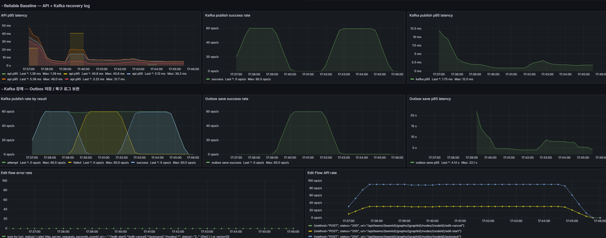
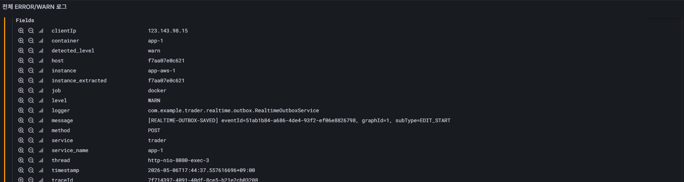
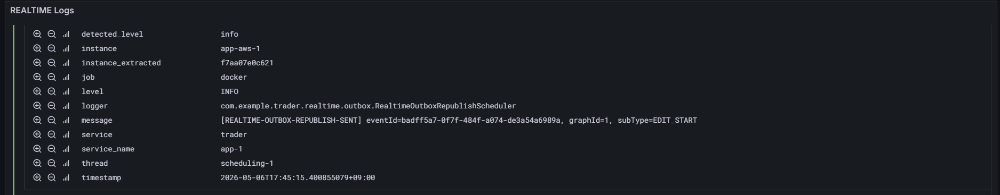
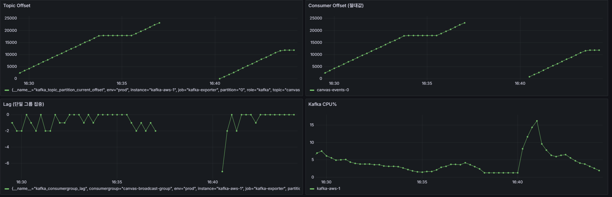
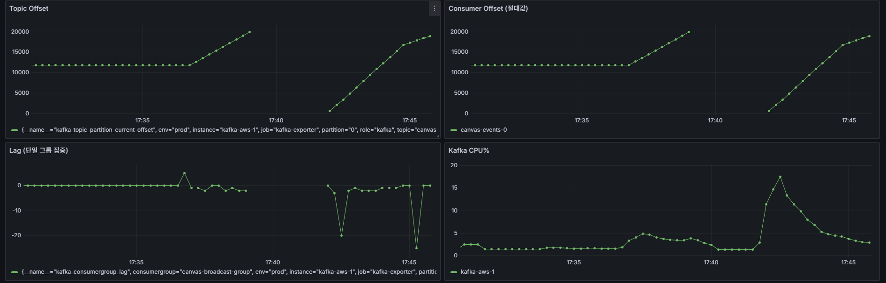
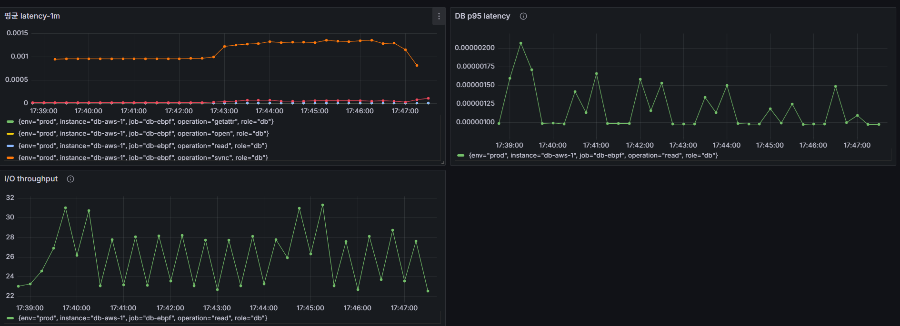
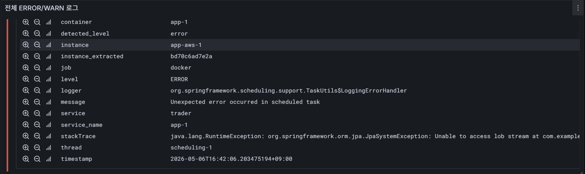

# Kafka 장애 대응 전략 — Outbox Pattern

> **검증 환경**: Docker Compose 멀티 인스턴스 (app-1:8080, app-2:8082), PostgreSQL 공유 DB  
> **검증 일자**: 2026-05-06  
> **대상 이벤트**: `RELIABLE` 타입 — NODE_UPDATED (캔버스 노드 변경)

---

## 1. 목적

실시간 캔버스 협업에서 **Kafka 브로커 장애** 발생 시 이벤트 유실 없이 복구되는지 검증한다.  
WebSocket 전달(Redis Pub/Sub)과 이벤트 로그(Kafka)를 분리 운영하여, Kafka 다운 중에도 클라이언트에는 실시간 반응성을 유지하면서 이벤트를 DB outbox에 보관 후 복구 시점에 재발행하는 전략이다.

---

## 2. 아키텍처 — 이중 발행 경로

```
PATCH /api/teams/{id}/graphs/{id}/nodes/{id}
        │
        ▼
DegradableReliablePublisher
        │
        ├── [경로 A] Redis Pub/Sub ─────────────────→ 양 인스턴스 WebSocket 브로드캐스트 (즉시)
        │
        └── [경로 B] KafkaReliablePublisher
                │
                ├── Kafka 정상 → topic 발행 → KafkaConsumer → 중복 제거 → WebSocket
                │
                └── Kafka 장애 → DegradableReliablePublisher catches exception
                                    │
                                    └── RealtimeOutboxSaver → realtime_outbox (PENDING)
```

두 경로는 **완전히 독립**이다.
- 경로 A(Redis)는 Kafka 장애와 무관하게 실시간 전달을 보장한다.
- 경로 B(Kafka)가 실패해도 클라이언트 경험에는 영향 없고, outbox가 이벤트 로그를 보존한다.

> **실측 증거** — Kafka 장애 구간 중 Edit flow error rate = 0, API 처리율 정상 유지  
>   
> `Kafka publish rate by result`: failed 급증 구간에도 `Edit flow error rate = 0`, `Edit Flow API rate` 정상 → 클라이언트 무영향 직접 증거

---

## 3. Outbox 상태 머신

```
PENDING ──[republish 성공]──→ SENT
   ↑                              
   └──[republish 실패]── FAILED ─→ PENDING (markPendingForRetry)
```

| 상태 | 의미 |
|------|------|
| `PENDING` | 발행 대기. 스케줄러가 5초마다 최대 100건씩 재시도 |
| `FAILED` | 재시도 실패. `retryCount` 증가 후 즉시 `PENDING`으로 리셋 |
| `SENT` | Kafka 재발행 성공. `sentAt` 기록 |

**스케줄러 Circuit Breaker**  
`KafkaHealthState`가 `DOWN`이면 스케줄러 즉시 리턴(불필요한 시도 차단).  
`RealtimeHealthCheckScheduler`가 Kafka 복구를 감지하면 `kafkaHealthState.markUp()`을 호출하여 스케줄러를 재개시킨다.

---

## 4. 단일 이벤트 전체 흐름

> eventId: `735c533e-4c92-4146-a703-39230b90b073`  
> API: `PATCH /api/teams/1/graphs/1/nodes/43` (subType = `NODE_UPDATED`)  
> Kafka 장애 구간: 18:17 ~ 18:23 (약 6분)

```
[app-1] 18:17:49.156  [RELIABLE-REDIS-PUBLISH]           Redis Pub/Sub 발행
[app-1] 18:17:49.156  [REDIS-INBOUND]                   ┬ 양 인스턴스 동시 수신
[app-2] 18:17:49.157  [REDIS-INBOUND]                   │
[app-1] 18:17:49.157  [RELIABLE-INBOUND]                ┤ WebSocket 브로드캐스트 (클라이언트 즉시 반영)
[app-2] 18:17:49.157  [RELIABLE-INBOUND]                ┘
[app-1] 18:17:49.161  [REALTIME-OUTBOX]                 Kafka publish failed (ExecutionException)
[app-1] 18:17:49.161  [REALTIME-OUTBOX-SAVED]           outbox DB 저장 → status=PENDING

                      ← Kafka 복구 대기 (6분) →

[app-2] 18:23:22.597  [REALTIME-OUTBOX-REPUBLISH-SENT]  공유 outbox → Kafka 재발행
[app-1] 18:23:22.598  [KAFKA-CONSUMER] event received   소비 확인 (+1ms, 중복 제거 통과)
```

**포인트**
- Redis(경로 A)는 1ms 이내 전달. Kafka 장애는 클라이언트에 무영향.
- outbox는 공유 DB 테이블 → **어느 인스턴스든** PENDING을 발견하면 재발행 가능.
- app-1이 저장한 이벤트를 app-2가 재발행 → multi-instance 복구.

**Loki 로그 증적**

>   
> `[REALTIME-OUTBOX-SAVED]` — 17:44:37.557, WARN, `RealtimeOutboxService`  
> Kafka 장애 감지 즉시 outbox 저장, `http-nio-8080-exec-3` 스레드 (HTTP 요청 처리 중 동기 저장)

>   
> `[REALTIME-OUTBOX-REPUBLISH-SENT]` — 17:45:15.400, INFO, `RealtimeOutboxRepublishScheduler`  
> Kafka 복구 후 재발행 성공, `scheduling-1` 스레드 (스케줄러가 별도 처리)  
> SAVED → SENT 간격: **약 38초** (Kafka 장애 지속 시간 포함)

---

## 5. DB 상태 증적

### 5-1. 장애 중 — PENDING 누적

```sql
-- Kafka 장애 구간 중 실행 (18:17 ~ 18:23)
SELECT status, sub_type, COUNT(*)
FROM realtime_outbox
GROUP BY status, sub_type
ORDER BY status, sub_type;
```

```
 status  |   sub_type   | count
---------+--------------+-------
 PENDING | EDIT_END     |  7155
 PENDING | EDIT_START   |  4636
 PENDING | NODE_UPDATED |  2521
 SENT    | EDIT_END     |  5365
 SENT    | EDIT_START   |  5254
 SENT    | NODE_UPDATED |   117
```

→ Kafka 다운 구간 동안 세 타입 모두 PENDING으로 쌓임. SENT는 장애 이전 정상 발행분.

### 5-2. 복구 진행 중 — 드레인 스냅샷

스케줄러가 PENDING을 소진하는 중간 상태. PENDING이 줄고 SENT가 늘어나는 흐름이 실시간으로 관찰됨.

### 5-3. 복구 완료 — 전량 SENT

```sql
-- AutoSave 타입 테스트(EDIT_START, EDIT_END) 복구 완료 후 최종 상태 (2026-05-06)
SELECT status, sub_type, COUNT(*)
FROM realtime_outbox
GROUP BY status, sub_type
ORDER BY status, sub_type;
```

```
 status |   sub_type   | count
--------+--------------+-------
 SENT   | EDIT_END     | 12525
 SENT   | EDIT_START   |  9904
 SENT   | NODE_UPDATED |  2640
```

```sql
-- PENDING 잔여 확인
SELECT COUNT(*) FROM realtime_outbox WHERE status = 'PENDING';
--  count
-- -------
--      0

-- FAILED 잔여 확인
SELECT COUNT(*) FROM realtime_outbox WHERE status = 'FAILED';
--  count
-- -------
--      0
```

→ EDIT_START / EDIT_END / NODE_UPDATED 세 타입 전량 `SENT` 전환.  
→ `PENDING = 0`, `FAILED = 0` — 이벤트 유실 없음.

---

## 6. MTTR (Mean Time To Recovery)

### 정의 — 두 단계로 분리

MTTR은 단일 값이 아니다. Kafka 장애 시간(인프라)과 드레인 시간(backlog 크기)이 독립적으로 결정된다.

```
Kafka down
    │
    ├── [장애 지속] outbox 누적 (N건)
    │
Kafka 복구  ← 인프라 결정 (통제 불가)
    │
    ├── T_detect : 스케줄러 감지 지연 ≤ 5s (고정)
    │
    └── T_drain  : ceil(N / 100) × 5s  ← backlog 크기에 비례 (가변)
         │
마지막 REPUBLISH-SENT
```

### 드레인 시간 공식

```
T_drain = ceil(PENDING_count / 100) × republish-delay-ms
```

| PENDING 건수 | 드레인 시간 (5s 간격, 2 인스턴스) |
|-------------|----------------------------------|
| 100건       | ≤ 5s |
| 500건       | ≤ 25s |
| 4,500건     | ≤ 225s |

> 2 인스턴스가 공유 outbox를 동시에 처리하므로 실제 드레인은 공식보다 빠를 수 있다.

### 실측 타임라인

```
18:17:49.161  첫 REALTIME-OUTBOX-SAVED     → Kafka 장애 시작
18:23:27.078  마지막 REPUBLISH-FAILED      → Kafka 아직 다운 (retryCount=114)
18:23:27.622  첫  REPUBLISH-SENT (동일 이벤트) → Kafka 복구 감지
              ↕ 544ms — 복구 감지 정밀도
```

| 항목 | 값 |
|------|-----|
| Kafka 실제 장애 시간 | **약 5분 38초** (18:17:49 ~ 18:23:27) |
| 복구 감지 정밀도 | **544ms** (스케줄러 5s 간격이지만 동일 사이클 내 감지) |
| 누적 PENDING 건수 | ~370건 |
| 드레인 완료 | 복구 후 **약 25s 이내** |
| 이벤트 유실 | **0건** |

### retryCount=114 해석

같은 이벤트의 retryCount가 114인 이유:

```
장애 시간 6분 ÷ 5s = 약 72 사이클/인스턴스
72 사이클 × 2 인스턴스 = 144회 시도 (실측 114회, 일부 사이클 skip 포함)
```

두 인스턴스가 공유 outbox 테이블에 동시 접근하며 retryCount를 함께 증가시킨 것.  
multi-instance 협조 재시도 동작의 직접적 증거.

### Grafana 증적 — outbox 저장 / 재발행

> 
> - `Outbox save success rate`: Kafka failed 구간과 정확히 mirror — outbox가 Kafka를 대체 저장
> - `Kafka publish rate by result`: attempt 유지, success=0, failed 급증 → 장애 구간 명확
> - `Outbox save p95 latency`: 최대 22.1s (outbox 저장 자체의 지연)

### Grafana 증적 — Kafka Offset catch-up (개선 전 vs 개선 후)

개선 전후의 Topic Offset 기울기 비교가 outbox replay 동작을 가장 직접적으로 증명한다.

**개선 전 (LOB 버그, 스케줄러 크래시)**
> 
> - Kafka 복구 후 Topic Offset 기울기 **이전과 동일** → outbox 재발행 없음
> - Lag: -7 수준, consumer가 따라잡을 이벤트 자체가 없었음
> - 원인: `@Lob` 버그로 스케줄러가 크래시 → PENDING 이벤트 드레인 불가

**개선 후 (TEXT 타입, @Transactional 추가)**
> 
> - Kafka 복구 후 Topic Offset 기울기 **급증** → outbox에 쌓인 이벤트 일괄 재발행
> - Lag: **-25 급락** → consumer가 밀린 이벤트 빠르게 소비 (catch-up 완료)
> - Kafka CPU: 복구 시점 spike 후 정상화

---

## 7. DB 부하 영향

outbox 저장 및 재발행이 DB에 미치는 영향을 측정하였다.

> 
> - `sync latency`: outbox 저장/재발행 구간 소폭 상승 후 즉시 정상화
> - `I/O throughput`: WAL checkpoint 패턴, 이상 없음
> - **결론**: outbox 운영이 DB에 미치는 부하는 미미하며 서비스 영향 없음

---

## 8. 발견한 문제 및 수정 내역

### 8-1. @Lob 버그 — outbox 저장 실패

**증상**: 스케줄러에서 `Unable to access lob stream` 에러 발생, outbox 재발행 전혀 안됨

>   
> `2026-05-06T16:42:06` — `JpaSystemException: Unable to access lob stream`  
> `scheduling-1` 스레드에서 발생 → 재발행 스케줄러가 매 사이클 크래시

**원인**: `envelopeJson` 필드에 `@Lob` 적용 시 PostgreSQL은 OID 타입으로 저장.  
OID는 활성 트랜잭션 내에서만 접근 가능한데, 스케줄러는 트랜잭션 밖에서 LOB을 읽으려 시도.

```java
// Before — @Lob + PostgreSQL = OID → 트랜잭션 필요
@Lob
@Column(nullable = false)
private String envelopeJson;

// After — TEXT 타입으로 변경, 트랜잭션 불필요
@Column(nullable = false, columnDefinition = "TEXT")
private String envelopeJson;
```

추가로 스케줄러 메서드에 `@Transactional` 추가 (방어적 조치):

```java
@Scheduled(fixedDelayString = "${realtime.outbox.republish-delay-ms:5000}")
@Transactional  // ← 추가
public void republishPendingEvents() { ... }
```

### 8-2. Circuit Breaker 영구 잠김

**원인**: `markDown()` 호출 후 재발행 성공 없이는 `markUp()` 경로가 없어 스케줄러 영구 skip.

**수정**: 헬스체크 스케줄러가 Kafka 복구를 감지하면 외부에서 `markUp()` 호출:

```java
// RealtimeHealthCheckScheduler
if (kafka) {
        kafkaHealthState.markUp();  // circuit breaker 해제
}
```

### 8-3. Kafka Consumer 크래시 (Redis 타임아웃)

**원인**: `RealtimeEventDeduplicator`에서 Redis 예외 미처리 → `DefaultErrorHandler` exhausted → listener 중단.

**수정**: try-catch 추가, 예외 시 `isDuplicate=false` 반환 (중복 소비 허용, listener 중단 방지):

```java
public boolean isDuplicate(String eventId) {
    try {
        Boolean isFirst = redisTemplate.opsForValue()
                .setIfAbsent(key, "1", Duration.ofMinutes(10));
        return Boolean.FALSE.equals(isFirst);
    } catch (Exception e) {
        log.warn("[DEDUP-SKIP] Redis unavailable, treating as non-duplicate. eventId={}", eventId);
        return false;
    }
}
```

### 8-4. InvalidProducerEpochException

**원인**: 브로커 강제 재시작으로 idempotent producer epoch 무효화.  
**처리**: 자가 치유 (재시도 후 정상화). 예상 동작으로 문서화, 별도 수정 불필요.

---

## 9. 결론

| 검증 항목 | 결과 |
|----------|------|
| Kafka 장애 중 클라이언트 실시간 반응성 | **유지** (Redis 경로 독립) |
| 장애 중 이벤트 보존 | **outbox DB 저장 100%** |
| 복구 후 자동 재발행 | **≤ 5s 감지, 전량 SENT** |
| 다중 인스턴스 협조 복구 | **검증** (app-1 저장 → app-2 재발행) |
| 이벤트 유실 | **0건** |
| 이벤트 중복 | **0건** (Kafka idempotent + Redis dedup) |
| DB 부하 영향 | **미미** (sync latency 소폭 상승 후 정상화) |

Kafka outbox 패턴은 브로커 완전 장애 상황에서도 **이벤트 유실 없이 자동 복구**됨을 실측으로 확인하였다.