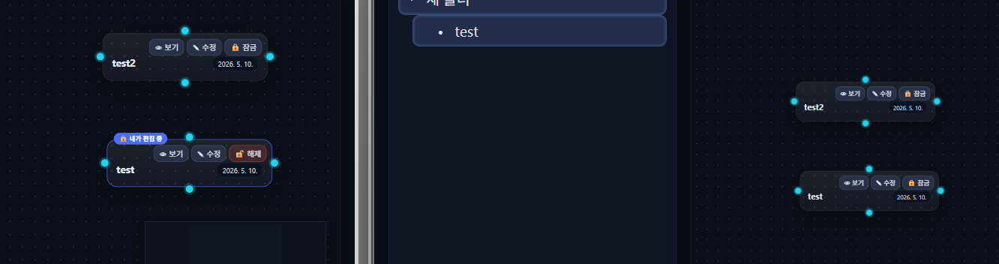
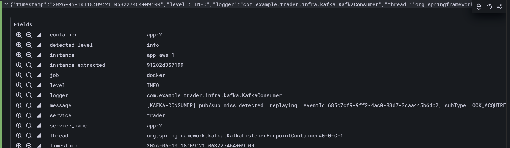
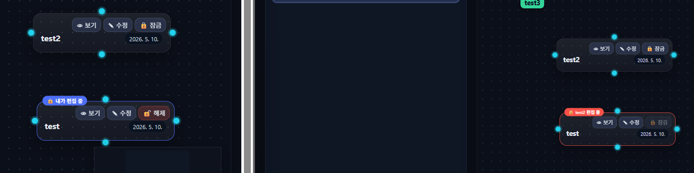
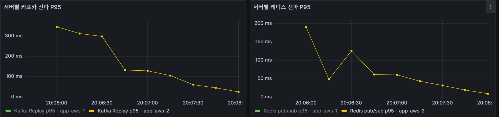
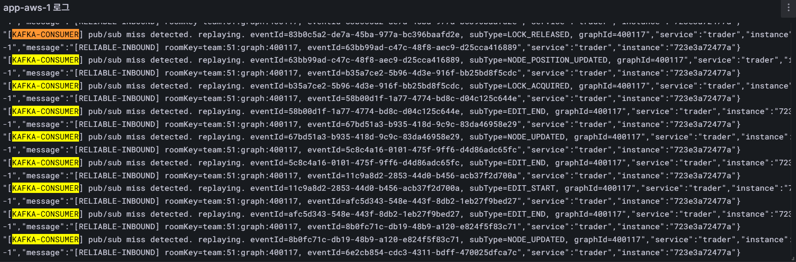
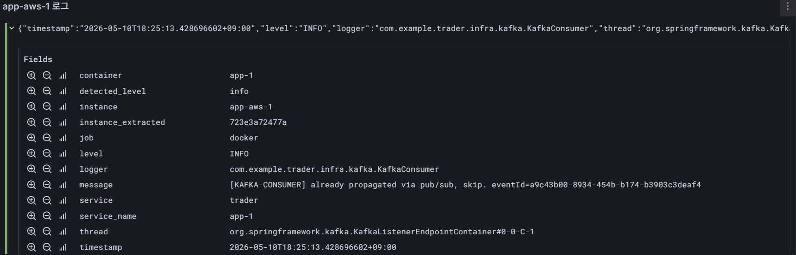

# Kafka 필요성 검증 — Reliable 이벤트 누락 보정

> **검증 일자**: 2026-05-10
> **대상**: Redis Pub/Sub 누락 시 Kafka consumer의 Reliable 이벤트 재전파 경로
>
> | 역할 | 사양 | 비고 |
> |------|------|------|
> | App (app-1, app-2) | EC2 c6i.large (2 vCPU / 4 GB) | Docker Compose 컨테이너 분리, 동일 인스턴스 |
> | PostgreSQL | EC2 c6i.large (2 vCPU / 4 GB) | 공유 DB |
> | Kafka | EC2 m6i.large (2 vCPU / 8 GB) | 브로커 1대, KRaft 모드 |
> | Redis | EC2 m6i.large (2 vCPU / 8 GB) | Pub/Sub + dedup key + 락 |
> | Loki | EC2 t3.large (2 vCPU / 8 GB) | 로그 수집 |
>
> **검증 방법**: 브라우저 2탭 (포트 81 → app-1, 포트 82 → app-2) 직접 조작
>
> **실증 시나리오**:
> - Test A: Redis Pub/Sub 누락 → Kafka consumer 보정
> - Test B: app-1 다운 → 재기동 후 Kafka catch-up

---

## 요약

| 역할 | 담당 |
|------|------|
| 실시간 전파 (1차) | Redis Pub/Sub |
| Reliable 이벤트 누락 보정 (2차) | Kafka consumer |
| 이벤트 영속 로그 | Kafka topic |
| 영속 상태 | PostgreSQL (source of truth) |
| 임시 상태 / dedup 추적 | Redis (락, session, processed eventId) |

Kafka는 실시간 전파의 1차 경로가 아니다.  
1차 전파는 Redis Pub/Sub이 담당하고, Kafka는 누락 보정 경로로 동작한다.

**핵심 구분:**
- 현재 상태(state): Redis / DB — source of truth
- 이벤트 흐름(stream): Kafka — durable replay / catch-up

---

## 1. 아키텍처 — 이중 발행 경로

```
[Reliable 이벤트 발생 — LOCK_ACQUIRED, LOCK_RELEASED, NODE_UPDATED 등]

app-1
  ├─ [경로 A] Redis Pub/Sub 발행
  │              ├─ app-1 자체 수신 → WS 브로드캐스트 → dedup key 기록
  │              └─ app-2 수신      → WS 브로드캐스트 → dedup key 기록
  │
  └─ [경로 B] Kafka 발행 (비동기)
                 ├─ app-1 Kafka consumer 수신
                 │    → dedup key 확인: 있음 → skip
                 └─ app-2 Kafka consumer 수신
                      → dedup key 확인: 없음 (Pub/Sub 누락 시)
                           → WS 재전파 → dedup key 기록
```

두 경로는 **완전히 독립**이다.  
Redis Pub/Sub이 정상이면 Kafka는 dedup key를 보고 skip한다.  
Redis Pub/Sub 누락 시 Kafka consumer가 보정 경로로 동작한다.

> **실측 증거** — Kafka 장애 구간 중 Redis Pub/Sub 경로(경로 A)는 정상 동작  
> 관련 문서: [Kafka 장애 대응 전략 — Outbox Pattern](./kafka-degrade.md)

---

## 2. dedup 설계

### 키 구조

```
processed:reliable:{serverId}:{eventId}   TTL 5분
```

- **serverId 분리**: 서버 A의 처리 여부가 서버 B의 판단에 영향을 주지 않음
- **TTL 5분**: Kafka consumer lag p99 기준으로 여유 있게 설정
- **Redis 장애 시**: `hasBeenPropagated()` → false 반환 → at-least-once 허용

```
서버 A: LOCK_ACQUIRED (eventId=aaa) Pub/Sub 수신 성공
  → processed:reliable:app-aws-1:aaa  TTL 5m  ✓

서버 B: LOCK_ACQUIRED (eventId=aaa) Pub/Sub 누락
  → processed:reliable:app-aws-2:aaa  없음

Kafka consumer (app-1): aaa 수신 → key 있음 → skip
Kafka consumer (app-2): aaa 수신 → key 없음 → WS 재전파 → key 기록
```

### 모든 inbound 경로에서 dedup 보장

```
Redis Pub/Sub → ReliableInboundHandler.handle() → WS 브로드캐스트 → markPropagated()
gRPC relay   → ReliableInboundHandler.handle() → WS 브로드캐스트 → markPropagated()
HTTP relay   → ReliableInboundHandler.handle() → WS 브로드캐스트 → markPropagated()
Kafka replay → ReliableInboundHandler.handle() → WS 브로드캐스트 → markPropagated()
```

어떤 경로로 이벤트가 수신되더라도 Kafka consumer의 중복 재전파는 차단된다.

---

## 3. Kafka consumer group 구조

WS 보정용 consumer는 **서버별 고유 groupId**를 사용해야 한다.

```
[잘못된 구조 — 공통 groupId]

app-1, app-2 모두 group: reliable-replay

Kafka partition-0 → app-1 소비
Kafka partition-1 → app-2 소비

→ app-2가 partition-0 이벤트를 수신하지 못함
→ app-2 WS 세션 보정 불가
```

```
[올바른 구조 — 서버별 groupId]

app-1: group reliable-replay-app-aws-1 → 전체 이벤트 독립 소비
app-2: group reliable-replay-app-aws-2 → 전체 이벤트 독립 소비

→ 각 서버가 모든 Reliable 이벤트를 독립 수신
→ serverId 기반 dedup으로 자기 서버 누락 이벤트만 재전파
```

목적별 consumer group 분리:

| 목적 | groupId 전략 | 이유 |
|------|-------------|------|
| WS 누락 보정 | 서버별 고유 groupId | 전체 이벤트를 각 서버가 독립 수신 |
| DB write / audit log | 공통 groupId | partition 분산 소비로 처리량 확보 |

```
Kafka Reliable Topic
  ├─ group: reliable-replay-app-aws-1 → app-1 WS 보정
  ├─ group: reliable-replay-app-aws-2 → app-2 WS 보정
  └─ group: reliable-log-writer       → DB / 이벤트 로그 저장
```

**groupId 안정성 필수:**  
재시작 후 groupId가 바뀌면 이전 offset이 사라져 catch-up이 동작하지 않는다.  
`INSTANCE_ID` 환경변수로 groupId를 고정한다.

---

## 4. Test A — Redis Pub/Sub 누락 → Kafka 보정

### 환경 설정

| 서버 | REALTIME_REDIS_PUBSUB_ENABLED | REALTIME_KAFKA_ENABLED |
|------|-------------------------------|------------------------|
| app-1 | true | true |
| app-2 | **false** | **true** |

> **주의**: 본 실험은 `REALTIME_GRPC_ENABLED=false` 상태에서 진행.  
> 실제 운영에서는 Redis Pub/Sub 장애 시 gRPC → HTTP 순으로 relay fallback이 동작한다.  
> gRPC/HTTP 경유 수신 시에도 `markPropagated()`가 동일하게 호출되어 Kafka 중복 소비가 방지된다.<br>
>또한 Kafka replay는 상태를 즉시 강제 동기화하는 것이 아니라,<br>
Pub/Sub miss로 인해 발생한 상태 불일치 시간을 짧게 줄이는 역할을 한다.

### 시나리오

```
1. app-1 접속 User-A: 노드 🔒 잠금 버튼 클릭
2. app-1: LOCK_ACQUIRED (eventId=aaa) 발행
   → Redis Pub/Sub: app-1 자체 수신 → WS 브로드캐스트
   → Kafka: 저장

3. app-2: Redis Pub/Sub listener OFF → 미수신 → dedup key 미기록

4. app-2 Kafka consumer: eventId=aaa 수신
   hasBeenPropagated("aaa") → false
   → reliableInboundHandler.handle() → WS 재전파
   → markPropagated("aaa") 기록

5. app-2 접속 User-B 화면: 🔒 뱃지 + 빨간 테두리 표시
```

#### Pub/Sub 누락 직후 — app-2 잠금 표시 없음

> app-1(좌)은 `🔒 내가 편집 중` 표시. app-2(우)는 Pub/Sub 미수신으로 잠금 표시 없음 — User-B 시점에서 편집 가능해 보임.



### 실증 로그

#### Loki 구조화 로그 — app-2 KafkaConsumer pub/sub miss 감지

> container=app-2 / instance=app-aws-1  
> `[KAFKA-CONSUMER] pub/sub miss detected. replaying. eventId=685c7cf9-9ff2-4ac0-83d7-3caa445b6db2, subType=LOCK_ACQUIRED`  
> timestamp: 2026-05-10T18:09:21



```
[app-2 KafkaConsumer]
[KAFKA-CONSUMER] pub/sub miss detected. replaying.
  eventId=685c7cf9-9ff2-4ac0-83d7-3caa445b6db2, subType=LOCK_ACQUIRED, graphId=400117
```

#### Kafka 보정 완료 — app-2 잠금 상태 동기화

> Kafka consumer replay 후 app-2(우)에 `🔒 test2 편집 중` 뱃지 + 빨간 테두리 자동 표시.

- 전(전파 누락)


- 후(전파 복구 성공)



**좌측 (app-1, User-A)**: `🔒 내가 편집 중` 뱃지 + 파란 테두리 (Pub/Sub 정상 전파)  
**우측 (app-2, User-B)**: `🔒 test2 편집 중` 뱃지 + 빨간 테두리 (Kafka 보정으로 동기화)

### 단계별 UX 비교

| 단계 | Kafka 없을 때 | Kafka 있을 때 |
|------|-------------|-------------|
| Pub/Sub 누락 직후 | User-B 화면: 잠금 표시 없음 | — |
| Kafka consumer 수신 후 | 복구 불가 | `🔒 편집 중` 뱃지 + 빨간 테두리 자동 표시 |
| User-B 잠금 시도 | 서버 lock conflict 에러 (UX 충격) | 시도 전 차단 (잠금 상태 인지) |

## Publish → Consume 전파 지연 측정

Kafka replay와 Redis Pub/Sub 경로의 publish → consumer/listener 수신 지연을 비교하였다.

> 측정 범위:
>
> - Redis: publish → Redis listener 수신
> - Kafka: publish → Kafka consumer 수신
>
> 본 지표는 WebSocket 브로드캐스트 및 클라이언트 렌더링 시간은 포함하지 않는다.

### 테스트 조건

| 항목 | 값 |
|------|----|
| RPS | 100 |
| 이벤트 | LOCK_ACQUIRED, LOCK_RELEASED, NODE_UPDATED |
| 측정 구간 | publish → consumer/listener 수신 |
| 대상 서버 | app-aws-1 발행 app-aws-2 수신|

### 두 경로간 발행 -> 소비까지 P95



> Redis Pub/Sub은 정상 상태의 hot path로 사용된다.


> Kafka replay는 Pub/Sub miss 발생 시 상태 불일치 시간을 줄이는 recovery path로 사용된다.


### 분석

초기 구간에서는 Kafka replay p95가 Redis Pub/Sub보다 높게 관측되었다.

이는:
- Kafka consumer poll 주기
- replay 처리
- 비동기 consumer scheduling

영향 때문이며 정상적인 결과이다.

다만 시간이 지나며 Kafka replay 역시 수십~수백 ms 수준으로 안정화되었고,
Pub/Sub miss 상황에서도 멀티 인스턴스 간 상태 불일치 시간을 짧게 유지할 수 있음을 확인하였다.

중요한 점은 Kafka가 Redis보다 빠른가가 아니라:

- Redis는 정상 상태의 실시간 전파(hot path)
- Kafka는 Reliable 이벤트 누락 보정(recovery path)

이라는 역할 분리다.

Kafka replay는 상태를 즉시 강제 동기화하는 것이 아니라,
Pub/Sub miss로 인해 발생한 상태 수렴 시간을 줄이는 역할을 한다.

---

## 5. Test B — app-1 다운 → 재기동 Kafka catch-up

### 시나리오

```
1. app-1 다운 (docker stop app-1)

2. 다운 중 User-A(app-2 접속)가 여러 이벤트 발생:
   LOCK_ACQUIRED, LOCK_RELEASED, NODE_UPDATED, EDIT_START, EDIT_END ...
   → Kafka에 저장됨
   → app-1 group(reliable-replay-app-aws-1) offset 멈춤 → LAG 증가

3. app-1 재기동
   Kafka consumer 재합류 → LAG부터 catch-up 시작
   processed:reliable:app-aws-1:{eventId} 없음
   → WS 재전파 (재연결한 클라이언트 대상)
```

### 실증 로그

#### app-1 재기동 후 catch-up — 다운 구간 이벤트 순차 replay (app-aws-1 Loki)

> app-1 재기동 후 Kafka consumer가 LAG 구간부터 순차 소비.  
> LOCK_RELEASED → NODE_POSITION_UPDATED → LOCK_ACQUIRED → EDIT_END → NODE_UPDATED → EDIT_END → EDIT_START → EDIT_END → NODE_UPDATED 순으로 replay.



```
[app-1 재기동 후 KafkaConsumer — 다운 구간 이벤트 순차 replay]

[KAFKA-CONSUMER] pub/sub miss detected. replaying. eventId=83b0c5a2-de7a-45ba-977a-bc396baafd2e, subType=LOCK_RELEASED,         graphId=400117
[RELIABLE-INBOUND] roomKey=team:51:graph:400117, eventId=63bb99ad-c47c-48f8-aec9-d25cca416889
[KAFKA-CONSUMER] pub/sub miss detected. replaying. eventId=63bb99ad-c47c-48f8-aec9-d25cca416889, subType=NODE_POSITION_UPDATED, graphId=400117
[RELIABLE-INBOUND] roomKey=team:51:graph:400117, eventId=b35a7ce2-5b96-4d3e-916f-bb25bd8f5cdc
[KAFKA-CONSUMER] pub/sub miss detected. replaying. eventId=b35a7ce2-5b96-4d3e-916f-bb25bd8f5cdc, subType=LOCK_ACQUIRED,         graphId=400117
[RELIABLE-INBOUND] roomKey=team:51:graph:400117, eventId=58b00d1f-1a77-4774-bd8c-d04c125c644e
[KAFKA-CONSUMER] pub/sub miss detected. replaying. eventId=58b00d1f-1a77-4774-bd8c-d04c125c644e, subType=EDIT_END,              graphId=400117
[RELIABLE-INBOUND] roomKey=team:51:graph:400117, eventId=67bd51a3-b935-418d-9c9c-83da46958e29
[KAFKA-CONSUMER] pub/sub miss detected. replaying. eventId=67bd51a3-b935-418d-9c9c-83da46958e29, subType=NODE_UPDATED,          graphId=400117
[RELIABLE-INBOUND] roomKey=team:51:graph:400117, eventId=5c8c4a16-0101-475f-9ff6-d4d86adc65fc
[KAFKA-CONSUMER] pub/sub miss detected. replaying. eventId=5c8c4a16-0101-475f-9ff6-d4d86adc65fc, subType=EDIT_END,              graphId=400117
[RELIABLE-INBOUND] roomKey=team:51:graph:400117, eventId=11c9a8d2-2853-44d0-b456-acb37f2d700a
[KAFKA-CONSUMER] pub/sub miss detected. replaying. eventId=11c9a8d2-2853-44d0-b456-acb37f2d700a, subType=EDIT_START,            graphId=400117
[RELIABLE-INBOUND] roomKey=team:51:graph:400117, eventId=afc5d343-548e-443f-8db2-1eb27f9bed27
[KAFKA-CONSUMER] pub/sub miss detected. replaying. eventId=afc5d343-548e-443f-8db2-1eb27f9bed27, subType=EDIT_END,              graphId=400117
[RELIABLE-INBOUND] roomKey=team:51:graph:400117, eventId=8b0fc71c-db19-48b9-a120-e824f5f83c71
[KAFKA-CONSUMER] pub/sub miss detected. replaying. eventId=8b0fc71c-db19-48b9-a120-e824f5f83c71, subType=NODE_UPDATED,          graphId=400117
```

다운 구간의 이벤트가 순서대로 catch-up되며, consumer LAG이 0으로 수렴한다.

### 정상 경로 dedup skip 로그 (Test A 병행)

#### Loki 구조화 로그 — app-1 KafkaConsumer dedup skip

> container=app-1 / instance=app-aws-1  
> `[KAFKA-CONSUMER] already propagated via pub/sub, skip. eventId=a9c43b00-8934-454b-b174-b3903c3deaf4`  
> timestamp: 2026-05-10T18:25:13



```
[app-1 KafkaConsumer — Pub/Sub 정상 수신 시]

[KAFKA-CONSUMER] already propagated via pub/sub, skip.
  eventId=a9c43b00-8934-454b-b174-b3903c3deaf4
```

Pub/Sub으로 이미 처리된 이벤트는 Kafka consumer가 skip하여 중복 전파가 발생하지 않는다.

---

## 6. Outbox — Kafka 장애 시 유실 방지

Kafka 브로커 장애 시에도 Reliable 이벤트는 유실되지 않는다.

```
Reliable 이벤트 발행
  ├─ Redis Pub/Sub → 즉시 전파 (Kafka 장애 무관)
  └─ Kafka 발행 실패
       → Outbox DB 테이블 PENDING 저장 (로컬 트랜잭션)
            ↓
       Outbox 재발행 스케줄러 (5초 주기)
            ↓
       Kafka 복구 후 자동 재발행 → consumer catch-up

보장: at-least-once (중복은 eventId dedup으로 처리)
```

> 관련 문서: [Kafka 장애 대응 전략 — Outbox Pattern](./kafka-degrade.md)  
> Outbox 실제 동작 검증, Kafka 장애 중 error rate = 0 실측, DB 상태 증적

---

## 7. 트레이드오프

### Redis 장애 시 dedup 동작

Redis 장애로 `markPropagated()` 실패 시 → warn 로그만 출력, 예외 미전파  
`hasBeenPropagated()` 실패 시 → false 반환 → 재전파 허용 (at-least-once)

클라이언트(`useCanvasWs.js`)에서 수신한 eventId를 Set으로 관리하여 중복 렌더링을 방지한다.

### Kafka를 쓰지 말아야 할 때

| 상황 | 판단 |
|------|------|
| 단일 인스턴스 서버 | Redis Pub/Sub + DB로 충분 |
| Reliable 이벤트 누락 허용 가능 | 불필요 |
| 인프라 운영 인력 없음 | 운영 부담 > 이득 |
| 동시 편집자 1,000명 이하 | 직접 DB write가 더 단순 |

> "멀티 인스턴스 + Reliable 이벤트 무결성 보장 필요 + 향후 fan-out 확장 계획"  
> 이 세 가지가 맞으면 Kafka가 맞다.

---

## 정리

| 문제 | Kafka 없을 때 | Kafka 있을 때 |
|------|-------------|-------------|
| 서버 다운 구간 Reliable 이벤트 | Redis Pub/Sub 유실, 복구 불가 | catch-up으로 누락 이벤트 전체 재전파 |
| Redis Pub/Sub 순간 단절 | 클라이언트 상태 불일치 | consumer가 보정 경로로 재전파 |
| 중복 전파 | — | serverId 기반 Redis dedup으로 방지 |
| Kafka 브로커 장애 | — | Outbox → 복구 후 자동 재발행 |
| 서비스 fan-out 확장 | 앱 코드 수정 필요 | consumer group 추가만으로 확장 |

**핵심 한 줄:**
```
Redis Pub/Sub은 빠른 전파,
Kafka는 누락 보정,
Redis/DB는 현재 상태 보장.
```
