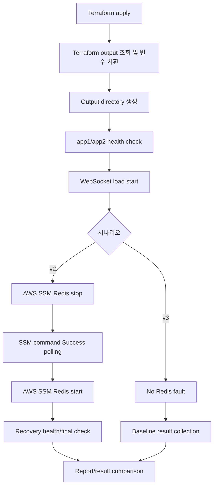

# Load Test Orchestrator Redis 장애 검증 리포트

> **검증 대상**: cursor relay 3-path benchmark  
> **검증 목적**: 오케스트레이터가 Terraform 인프라 생성, health check, WebSocket 부하, Redis 장애 주입, 복구 확인까지 한 번에 자동화할 수 있는지 확인  
> **비교군**: Redis 장애 주입 시나리오(v2) vs Redis 장애 없는 baseline(v3)  
> **시나리오 파일**: `scenario.yml`은 별도 첨부 예정

---

## Summary

이번 검증의 핵심은 단순히 k6 WebSocket 부하를 실행하는 것이 아니라, **실제 운영에서 발생할 수 있는 Redis Pub/Sub 장애를 부하 중에 주입하고, 장애 주입과 복구가 자동화 흐름 안에서 검증되는지** 확인하는 것이었다.

결론은 다음과 같다.

| 항목 | 결과 |
|---|---|
| Terraform apply | 성공. 신규 AWS 리소스 생성 및 output 변수 치환 확인 |
| App health check | app1/app2 health check 통과 후 부하 시작 |
| WebSocket 부하 | 50 VU, 약 90초 동안 연결 errors 0 |
| Redis 장애 주입 | AWS SSM command-id 기반 stop/start 실행 및 Success polling |
| Redis 장애 중 연결 안정성 | WebSocket open/close 정상, errors 0 |
| Redis 장애 효과 | 정상 baseline이 장애군보다 received 메시지를 약 2.6배 더 많이 수신 |
| 복구 검증 | Redis start 이후 app health가 503에서 200으로 회복되는 흐름 확인 |

즉, 오케스트레이터는 **부하 실행기**가 아니라 **인프라 생성 -> 부하 -> 장애 주입 -> 복구 검증 -> 결과 비교**를 하나의 검증 워크플로우로 묶는 도구로 동작했다.

---

## 1. 검증 배경

Trader-replay 프로젝트에서는 Redis Pub/Sub가 WebSocket 실시간 이벤트 fanout 경로로 사용된다. 이 구조에서는 Redis가 정상일 때 여러 인스턴스가 같은 채널을 구독하고, publisher가 한 번 publish하면 broker가 subscriber들에게 fanout한다.

문제는 Redis가 장애 상태가 되었을 때다.

- WebSocket 연결 자체는 유지되는가?
- Redis stop/start 장애 주입이 실제로 성공했는가?
- 장애 중 메시지 수신량은 얼마나 줄어드는가?
- Redis 복구 후 app health가 정상으로 돌아오는가?
- 이 흐름을 사람이 수동으로 하지 않고 오케스트레이터가 끝까지 실행할 수 있는가?

이번 검증은 위 질문에 답하기 위해 v2와 v3 두 시나리오를 비교했다.

| 시나리오 | 목적 |
|---|---|
| v2 | WebSocket 부하 중 Redis stop/start 장애 주입 및 fallback 전환 영향 관찰 |
| v3 | Redis 장애 없는 정상 baseline |

---

## 2. 검증 환경

Terraform apply를 오케스트레이터 실행 흐름에 포함했다.

오케스트레이터는 Terraform output을 읽어 다음 변수로 치환했다.

| 변수 | 의미 |
|---|---|
| `${app_url}` | app1 public endpoint |
| `${app2_url}` | app2 public endpoint |
| `${prometheus_url}` | observability/private endpoint |
| `${redis_instance_id}` | AWS SSM으로 Redis stop/start를 실행할 EC2 instance id |

Terraform apply 이후 output 예시는 다음과 같았다.

```text
app_public_ip = "3.36.127.121"
app2_public_ip = "54.180.247.148"
gateway_public_ip = "3.38.165.104"
observability_private_ip = "10.0.1.49"
redis_instance_id = "i-0e8c51fd946a7c91b"
redis_private_ip = "10.0.2.43"
```

초기에는 Terraform state가 비어 있어 output이 0개였고, app health check 단계에서 실패했다. 이후 오케스트레이터에서 Terraform apply 옵션을 켜고 실행하면서 신규 인프라 생성과 output 치환이 정상화되었다.

---

## 3. 시나리오 구조

시나리오 YAML은 별도 파일로 첨부한다.

<details>
<summary>v2 클릭해서 보기</summary>

```yaml
meta:
  name: cursor-relay-3path-bench-v2
  description: "Cursor volatile relay + Redis failure with SSM wait and recovery checks"

infra:
  type: terraform
  apply: true
  dir: C:/Users/USER/kosw006/terraform-test
  outputs:
    app_url: app_public_ip
    app2_url: app2_public_ip
    prometheus_url: observability_private_ip
    redis_instance_id: redis_instance_id  

prometheus:
  url: "http://${prometheus_url}:9090"
  step: 5s

steps:
  - id: setup
    name: setup output dir
    type: command
    command: New-Item -ItemType Directory -Force -Path outputs

  - id: health-app1
    name: app1 health
    type: final_check
    depends_on: [setup]
    base_url: "http://${app_url}:8080"
    checks:
      - id: app1-health
        method: GET
        path: /actuator/health
        retry: 90
        interval: 5s
        assert:
          status: 200

  - id: health-app2
    name: app2 health
    type: final_check
    depends_on: [setup]
    base_url: "http://${app2_url}:8080"
    checks:
      - id: app2-health
        method: GET
        path: /actuator/health
        retry: 90
        interval: 5s
        assert:
          status: 200

  - id: auth
    name: login
    type: auth
    depends_on: [health-app1, health-app2]
    base_url: "http://${app_url}:8080"
    users:
      file: data/user_multi.csv
      key: userId
      assign: round_robin
      auth:
        type: login
        request:
          method: POST
          url: /api/login/signin
          body:
            loginId: "{{user.loginId}}"
            password: "{{user.password}}"
        extract:
          type: cookie
          name: accessToken
        apply:
          type: cookie
          name: accessToken

  - id: cursor-realtime
    name: cursor relay realtime
    type: k6_ws
    depends_on: [auth]
    template: realtime
    vus: 50
    duration: 90s
    sender_ratio: 0.3
    lat_ok_ms: 200
    lat_warn_ms: 1000
    ws_nodes:
      - "ws://${app_url}:8080/ws/canvas-raw?teamId=1&graphId=1"
      - "ws://${app2_url}:8080/ws/canvas-raw?teamId=1&graphId=1"
    ws_messages:
      - type: CURSOR
        interval: 50
        body:
          - key: teamId
            value_type: fixed
            fixed: "1"
          - key: graphId
            value_type: fixed
            fixed: "1"
          - key: x
            value_type: randomInt
            min: 0
            max: 1000
          - key: y
            value_type: randomInt
            min: 0
            max: 800

  - id: redis-down
    name: redis stop and wait
    type: command
    depends_on: [auth]
    delay: 30s
    command: >
      powershell -ExecutionPolicy Bypass -File scripts/ssm-redis-stop-wait.ps1
      -InstanceId ${redis_instance_id}
      -Region ap-northeast-2
      -TimeoutSeconds 120
      -PollSeconds 5

  - id: redis-up
    name: redis start and wait
    type: command
    depends_on: [auth]
    delay: 70s
    command: >
      powershell -ExecutionPolicy Bypass -File scripts/ssm-redis-start-wait.ps1
      -InstanceId ${redis_instance_id}
      -Region ap-northeast-2
      -TimeoutSeconds 120
      -PollSeconds 5

  - id: recovery-health-app1
    name: app1 recovery health
    type: final_check
    depends_on: [cursor-realtime, redis-up]
    base_url: "http://${app_url}:8080"
    checks:
      - id: app1-recovery-health
        method: GET
        path: /actuator/health
        retry: 30
        interval: 5s
        assert:
          status: 200

  - id: recovery-health-app2
    name: app2 recovery health
    type: final_check
    depends_on: [cursor-realtime, redis-up]
    base_url: "http://${app2_url}:8080"
    checks:
      - id: app2-recovery-health
        method: GET
        path: /actuator/health
        retry: 30
        interval: 5s
        assert:
          status: 200


```

</details>

<details>
<summary>v3 클릭해서 보기</summary>

```yml
meta:
  name: cursor-relay-3path-bench-v3
  description: "Cursor volatile relay baseline without Redis failure injection"

infra:
  type: terraform
  apply: true
  dir: C:/Users/USER/kosw006/terraform-test
  outputs:
    app_url: app_public_ip
    app2_url: app2_public_ip
    prometheus_url: observability_private_ip
    redis_instance_id: redis_instance_id

prometheus:
  url: "http://${prometheus_url}:9090"
  step: 5s

steps:
  - id: setup
    name: setup output dir
    type: command
    command: New-Item -ItemType Directory -Force -Path outputs

  - id: health-app1
    name: app1 health
    type: final_check
    depends_on: [setup]
    base_url: "http://${app_url}:8080"
    checks:
      - id: app1-health
        method: GET
        path: /actuator/health
        retry: 90
        interval: 5s
        assert:
          status: 200

  - id: health-app2
    name: app2 health
    type: final_check
    depends_on: [setup]
    base_url: "http://${app2_url}:8080"
    checks:
      - id: app2-health
        method: GET
        path: /actuator/health
        retry: 90
        interval: 5s
        assert:
          status: 200

  - id: auth
    name: login
    type: auth
    depends_on: [health-app1, health-app2]
    base_url: "http://${app_url}:8080"
    users:
      file: data/user_multi.csv
      key: userId
      assign: round_robin
      auth:
        type: login
        request:
          method: POST
          url: /api/login/signin
          body:
            loginId: "{{user.loginId}}"
            password: "{{user.password}}"
        extract:
          type: cookie
          name: accessToken
        apply:
          type: cookie
          name: accessToken

  - id: cursor-realtime
    name: cursor relay realtime
    type: k6_ws
    depends_on: [auth]
    template: realtime
    vus: 50
    duration: 90s
    sender_ratio: 0.3
    lat_ok_ms: 200
    lat_warn_ms: 1000
    ws_nodes:
      - "ws://${app_url}:8080/ws/canvas-raw?teamId=1&graphId=1"
      - "ws://${app2_url}:8080/ws/canvas-raw?teamId=1&graphId=1"
    ws_messages:
      - type: CURSOR
        interval: 50
        body:
          - key: teamId
            value_type: fixed
            fixed: "1"
          - key: graphId
            value_type: fixed
            fixed: "1"
          - key: x
            value_type: randomInt
            min: 0
            max: 1000
          - key: y
            value_type: randomInt
            min: 0
            max: 800

  - id: recovery-health-app1
    name: app1 post-load health
    type: final_check
    depends_on: [cursor-realtime]
    base_url: "http://${app_url}:8080"
    checks:
      - id: app1-post-load-health
        method: GET
        path: /actuator/health
        retry: 30
        interval: 5s
        assert:
          status: 200

  - id: recovery-health-app2
    name: app2 post-load health
    type: final_check
    depends_on: [cursor-realtime]
    base_url: "http://${app2_url}:8080"
    checks:
      - id: app2-post-load-health
        method: GET
        path: /actuator/health
        retry: 30
        interval: 5s
        assert:
          status: 200

```

</details>

논리 흐름은 다음과 같다.



중요한 점은 Redis stop/start를 단순 shell command 성공 여부로 판단하지 않았다는 것이다. SSM command-id를 받은 뒤 `aws ssm get-command-invocation`으로 `Success` 상태까지 기다려, 실제 장애 주입 명령이 대상 인스턴스에서 완료됐는지 확인했다.

---

## 4. v2: Redis 장애 주입 시나리오

v2는 WebSocket 부하가 진행되는 동안 Redis stop과 start를 실행한다.

의도한 검증 포인트는 다음과 같다.

1. WebSocket 부하 중 Redis 장애를 주입할 수 있는가?
2. Redis stop/start 명령이 실제 대상 인스턴스에서 성공했는가?
3. Redis 장애 중에도 WebSocket 연결은 유지되는가?
4. Redis 복구 후 app health가 정상화되는가?

관찰 결과는 다음과 같다.

| 항목 | 결과 |
|---|---|
| WebSocket sent | 약 26,988 |
| WebSocket received | 약 34,020 |
| WebSocket errors | 0 |
| Redis stop | SSM command Success |
| Redis start | SSM command Success |
| Recovery health | Redis 복구 직후 일부 503 이후 200 회복 |

해석:

- 연결 안정성 관점에서는 WebSocket errors가 0으로 유지되었다.
- 하지만 Redis Pub/Sub fanout 경로가 중간에 끊기면서 received 메시지 수가 baseline 대비 크게 줄었다.
- 이는 "연결은 유지되지만 fanout 성능과 수신량은 Redis 상태에 영향을 받는다"는 점을 수치로 보여준다.
- 복구 직후 health가 바로 200이 아니라 503을 거친 것은 Redis 재기동 이후 app health dependency가 정상화되는 시간이 있음을 의미한다.

---

## 5. v3: Redis 장애 없는 Baseline

v3는 동일한 WebSocket 부하를 Redis 장애 없이 실행한 기준 시나리오다.

k6 WebSocket 요약은 다음과 같았다.

```text
duration: 90.47s
open: 50 / close: 50 / errors: 0
sent: 26990 / received: 89564
sent/s: 298.33 / recv/s: 989.98
connect(ms) avg=291.8 p95=454.3 p99=462.5
```

| 항목 | 결과 |
|---|---|
| Duration | 90.47s |
| VUs | 50 |
| Open / Close | 50 / 50 |
| Errors | 0 |
| Sent | 26,990 |
| Received | 89,564 |
| Sent/s | 298.33 |
| Received/s | 989.98 |
| Connect avg | 291.8 ms |
| Connect p95 | 454.3 ms |
| Connect p99 | 462.5 ms |

해석:

- 정상 상태에서는 동일한 50 VU, 약 90초 부하에서 WebSocket errors 0으로 안정적으로 종료되었다.
- received 메시지 수는 89,564로, Redis 장애군보다 약 2.6배 많았다.
- 이는 Redis Pub/Sub fanout이 정상 동작할 때 다중 인스턴스 실시간 이벤트 수신량이 크게 증가한다는 근거다.

---

## 6. 장애군과 Baseline 비교

| 항목 | v2: Redis 장애 주입 | v3: Baseline | 해석 |
|---|---:|---:|---|
| WebSocket sent | 약 26,988 | 26,990 | 거의 동일한 송신 부하 |
| WebSocket received | 약 34,020 | 89,564 | baseline이 약 2.6배 많음 |
| WebSocket errors | 0 | 0 | 양쪽 모두 연결 안정성 유지 |
| Redis stop/start | 있음 | 없음 | v2에서 장애 주입 효과 확인 |
| Recovery check | 있음 | 없음 | v2에서 복구 흐름 확인 |

수신 메시지 비율:

```text
89564 / 34020 = 약 2.63
```

이번 결과는 "Redis 장애가 나면 WebSocket이 바로 끊긴다"는 단순한 현상이 아니라, **연결은 유지되지만 Redis Pub/Sub 기반 fanout 수신량이 감소한다**는 형태로 나타났다.

따라서 장애 대응 문서에서는 다음처럼 구분해 설명하는 것이 적절하다.

| 관점 | 결론 |
|---|---|
| 연결 안정성 | 장애 중에도 WebSocket errors 0 |
| 실시간 fanout | Redis 장애 시 received 메시지 수 감소 |
| 자동화 성숙도 | Terraform, health, 부하, 장애 주입, 복구 확인까지 한 번에 실행 |
| 추가 보강 | 반복 실행, Grafana/Prometheus 지표 캡처, Redis DOWN/UP 타임라인 스크린샷 |

---

## 7. 오케스트레이터 관점에서 검증된 DX 개선

이전에는 다음 과정을 사람이 직접 수행해야 했다.

1. Terraform apply 실행
2. output IP와 instance id 확인
3. health endpoint 확인
4. k6 WebSocket 부하 실행
5. Redis 인스턴스 접속 또는 SSM 명령 실행
6. Redis stop/start 타이밍 조절
7. health 복구 확인
8. 결과 로그를 모아 비교

오케스트레이터 적용 후에는 ZIP 시나리오를 주입하고 실행하는 방식으로 흐름이 단순화되었다.

| 항목 | 수동 검증 | 오케스트레이터 검증 |
|---|---|---|
| 인프라 생성 | Terraform 직접 실행 | `infra.apply` 옵션으로 실행 |
| 변수 치환 | IP/instance id 수동 복사 | Terraform output 기반 자동 치환 |
| 사전 검증 | health curl 수동 실행 | final_check/health step으로 자동화 |
| 부하 실행 | k6 명령 직접 실행 | scenario step으로 실행 |
| 장애 주입 | SSH/SSM 직접 실행 | command step + SSM polling |
| 복구 확인 | 사람이 로그와 health 확인 | recovery final_check로 확인 |
| 재현성 | 실행자 의존 | scenario zip 기반 재실행 가능 |

DX 측면의 개선은 "명령을 대신 실행해준다"에 그치지 않는다. 어떤 순서로 검증해야 하는지, 장애 주입이 실제로 성공했는지, 복구 후 어떤 상태를 확인해야 하는지를 시나리오에 고정할 수 있다.


## 8. 현재 한계와 DX/UX 추상화 과제

이번 검증으로 Terraform apply, health check, WebSocket 부하, Redis 장애 주입, 복구 확인까지 하나의 시나리오로 묶을 수 있다는 점은 확인했다.

다만 아직 이 흐름은 “자동 실행”에 가깝다. 사용자가 반복해서 안정적으로 활용하려면 엔진 기능 자체보다, 검증 의도를 더 쉽게 표현하고 실패를 더 잘 해석할 수 있게 만드는 DX/UX 추상화가 필요하다.

### 8-1. DX 관점의 한계

현재 시나리오는 자동화할 수 있지만, 작성자는 여전히 Terraform output, health endpoint, SSM command, k6 옵션, recovery check를 각각 이해하고 조합해야 한다.

즉, 도구가 실행은 대신해주지만 “어떤 검증 흐름을 만들어야 하는지”는 아직 사용자에게 많이 남아 있다.

현재 DX의 한계는 다음과 같다.

| 현재 방식 | 한계 |
|---|---|
| command step 직접 작성 | Redis stop/start 같은 장애 주입 의도를 명령어 수준으로 표현해야 함 |
| final_check 직접 구성 | 복구 확인이 어떤 의미인지 사용자가 직접 해석해야 함 |
| Terraform output key 직접 매핑 | 환경마다 output 이름이 다르면 시나리오 수정 필요 |
| baseline/fault 비교 수동 해석 | 정상군과 장애군 결과 차이를 사용자가 직접 읽어야 함 |
| 실패 시 전체 로그 확인 | 실패 원인과 다음 행동이 UI에서 바로 드러나지 않음 |

다음 과제는 시나리오 작성 단위를 더 높은 수준으로 올리는 것이다.

예를 들어 사용자는 다음처럼 “Redis를 중간에 내렸다가 복구하고 baseline과 비교한다”는 의도를 작성하고, 구체적인 command, polling, recovery check는 템플릿이 채워주는 방식이 더 적절하다.

```yaml
experiments:
  - type: redis_fault_during_ws_load
    load:
      vus: 50
      duration: 90s
    fault:
      target: ${redis_instance_id}
      down_after: 30s
      down_for: 20s
    recovery:
      wait_health: ${app_url}/actuator/health
    compare_with: baseline
```

이 방향은 엔진 기능을 무작정 늘리는 것이 아니라, 자주 쓰는 검증 패턴을 제품 레벨의 추상화로 제공하는 것이다.

---

### 8-2. UX 관점의 한계

현재 로그에는 실행 순서와 실패 원인이 남지만, 사용자가 UI에서 바로 판단하기에는 아직 정보가 낮은 수준으로 노출된다.

특히 장애 검증에서는 실패가 항상 나쁜 결과가 아니다. Redis stop 이후 health가 503이 되는 것은 장애 주입이 실제로 반영됐다는 신호일 수 있고, 이후 200으로 회복되는지가 더 중요하다.

따라서 UX는 단순 성공/실패 표시보다 상태 전이를 보여줘야 한다.

필요한 UX 개선은 다음과 같다.

| 개선 항목 | 기대 효과 |
|---|---|
| step timeline | Terraform, health, load, fault, recovery 순서를 한눈에 확인 |
| retry 상태 표시 | “실패”가 아니라 “복구 대기 중”인지 구분 |
| 실패 원인 요약 | command failed, health timeout, connection refused 등을 분류 |
| retry from failed step | 전체 시나리오 재실행 없이 실패 지점부터 재개 |
| baseline vs fault diff | received, errors, p95, recovery status 차이를 자동 비교 |
| next action guide | “Terraform output 없음”, “app health 거부”, “SSM command 실패”별 다음 조치 안내 |

이렇게 되면 사용자는 로그 전체를 읽지 않아도 현재 검증이 어디에서 멈췄고, 실패가 인프라 문제인지 애플리케이션 문제인지, 아니면 복구 대기 상태인지 빠르게 판단할 수 있다.

---

### 8-3. 다음 과제

다음 단계의 목표는 엔진을 더 복잡하게 만드는 것이 아니라, 사용자가 검증 의도를 더 쉽게 표현하고 실패를 더 잘 해석하도록 만드는 것이다.

우선순위는 다음과 같다.

1. **검증 패턴 템플릿화**
   - Redis 장애, Kafka 장애, baseline 비교, recovery check 같은 반복 패턴을 템플릿으로 제공한다.

2. **실패 원인 분류**
   - 단순 exit status가 아니라 network, HTTP status, SSM command, assertion, timeout으로 실패를 분류한다.

3. **재시도 정책 추상화**
   - health/recovery/command polling에 대해 retry 조건, timeout, 허용 가능한 중간 상태를 명시할 수 있게 한다.

4. **UI 기반 재실행 경험 개선**
   - 실패 step부터 재시도, 마지막 실행 결과 불러오기, baseline/fault diff 보기 기능을 제공한다.

5. **보고서 자동 해석 강화**
   - 단순 로그 수집을 넘어 “연결은 유지됐지만 received가 감소했다”처럼 검증 결과의 의미를 요약한다.

이번 검증은 오케스트레이터가 end-to-end 자동화 흐름을 만들 수 있음을 보여줬다. 다음 과제는 이 흐름을 더 많은 사용자가 실수 없이 작성하고, 실패 상황에서도 원인을 이해하며, 반복 가능한 검증 자산으로 남길 수 있게 만드는 것이다.


## 9. 결론

이번 v2/v3 비교는 오케스트레이터의 목적을 잘 보여준다.

단순히 k6를 실행하는 도구였다면 WebSocket 부하 결과만 남았을 것이다. 하지만 이번 검증에서는 Terraform으로 인프라를 만들고, output을 치환하고, health를 확인하고, 부하 중 Redis 장애를 주입하고, SSM command 성공까지 기다리고, 복구 후 health를 다시 확인했다.

그 결과 다음을 확인했다.

- Redis 장애가 있어도 WebSocket 연결 errors는 0으로 유지되었다.
- Redis 장애 중에는 Pub/Sub fanout 수신량이 정상 baseline이 장애군보다 received 메시지를 약 2.6배 더 많이 수신
- Redis stop/start와 복구 확인은 오케스트레이터 시나리오 안에서 자동화할 수 있었다.

따라서 이 검증은 오케스트레이터가 **부하 테스트 실행 도구**를 넘어, 백엔드 운영 환경의 장애와 복구를 재현하는 **검증 워크플로우 도구**로 동작할 수 있음을 보여준다.
