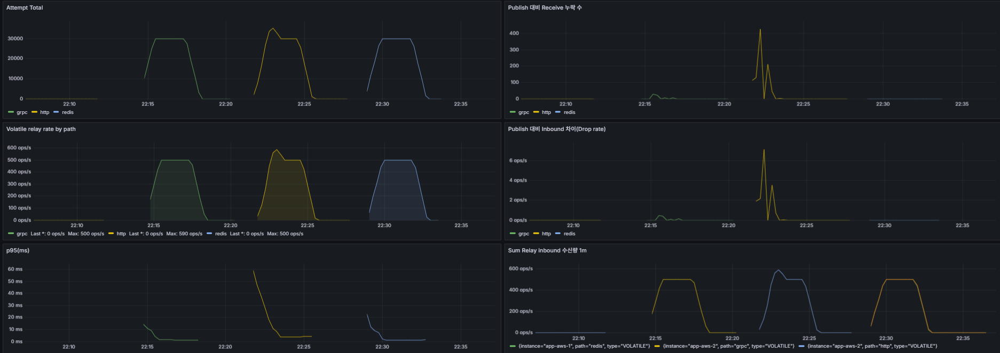
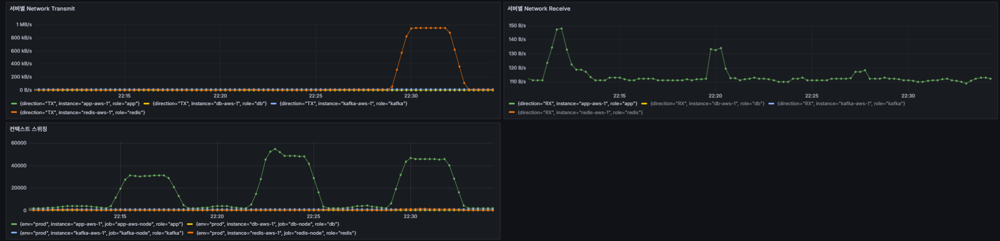

# Volatile 이벤트 릴레이 경로 비교 — gRPC / HTTP / Redis Pub/Sub

> **검증 일자**: 2026-05-08  
> **대상**: 실시간 커서·협업 이벤트의 인스턴스 간 전파 경로 — gRPC relay / HTTP relay / Redis Pub/Sub
>
> | 역할 | 사양 | 비고 |
> |------|------|------|
> | App (app-1, app-2) | EC2 c6i.large (2 vCPU / 4 GB) × 2 | 동일 AZ, Docker Compose 컨테이너 분리 |
> | Redis | EC2 m6i.large (2 vCPU / 8 GB) | Pub/Sub 브로커 역할 |
> | Loki | EC2 t3.large (2 vCPU / 8 GB) | 로그 수집 |
> | Prometheus | Loki 서버 내 동거 | app-1(8080), app-2(8082) 스크랩 |
>
> **부하 설정**
>
> | 항목 | 값 |
> |------|-----|
> | 발행 인스턴스 | app-1 (publisher) |
> | 수신 인스턴스 | app-2 (receiver) |
> | 목표 처리량 | ~500 ops/s |
> | 테스트 방식 | 경로별 순차 전환 (gRPC → HTTP → Redis) |
> | 이벤트 유형 | VOLATILE / CURSOR |

---

## 1. 목적

Redis Pub/Sub 장애 시에도 Volatile 이벤트 전파를 유지하기 위해,
fallback relay 경로가 필요하였다.

fallback 후보로 다음 두 경로를 검토하였다.

- gRPC relay
- HTTP relay

본 문서는 Redis Pub/Sub을 기본 relay 경로로 유지한다는 전제 하에,
Redis 장애 시 fallback relay로 어떤 경로가 적합한지 검증하기 위해
gRPC / HTTP / Redis Pub/Sub 경로를 비교한다.

### 실제 운영 기준 경로

현재 운영 기준 Volatile relay 구조는 다음과 같다.

```text
기본:
Redis Pub/Sub

Redis 장애 시 fallback 후보:
1. gRPC relay
2. HTTP relay
```

Redis Pub/Sub은 broker 기반 fanout 구조와 단순한 multi-node 확장 구조를 가지므로
기본 relay 경로로 사용한다.

다만 Redis 장애 상황에서도
커서 이동 등 Volatile 이벤트 전파를 유지해야 했기 때문에,
fallback relay 경로가 필요하였다.

초기 설계 단계에서는 어떤 relay 경로가 더 적합한지 확정되지 않았으므로,
gRPC relay와 HTTP relay를 모두 구현한 뒤
동일 부하 환경에서 직접 비교 검증하였다.

`REALTIME_VOLATILE_ROUTE_MODE` 환경 변수로 경로를 런타임에 전환할 수 있어,  
동일 부하 조건에서 세 경로의 성능을 직접 비교할 수 있다.

### 헬스 체크 구조

`RealtimeHealthCheckScheduler`가 5초마다 각 경로의 가용 여부를 갱신한다.

```java
// REALTIME_GRPC_ENABLED=true 일 때 DefaultGrpcHealthChecker 활성화
// REALTIME_GRPC_ENABLED=false 또는 미설정 → NoopGrpcHealthChecker (항상 false)
// → publishToGrpc() → "gRPC unavailable" → dropped 카운터 증가
```

> **주의**: `REALTIME_GRPC_ENABLED=true` 설정 없이 `REALTIME_VOLATILE_ROUTE_MODE=grpc`만
> 설정하면 모든 gRPC 이벤트가 silently dropped 된다.

---

## 2. 아키텍처 — 경로별 전달 구조

```
[Redis Pub/Sub]
app-1 publish → Redis broker → app-1 자신 + app-2 모두 수신
                               ↑ publisher도 subscriber이므로 2배 카운팅 주의

[gRPC]
app-1 GrpcVolatilePublisher → app-2:9090 RealtimeCommandGrpcService
                              persistent connection, binary protocol (Protobuf)

[HTTP]
app-1 HttpVolatilePublisher → app-2:8080/internal/realtime
                              요청별 connection, JSON
```

**수신 측 메트릭 등록 위치**

| 경로 | 카운터 등록 클래스 | 인스턴스 |
|------|-----------------|--------|
| redis | `RedisPubSubListener` | app-1·2 모두 |
| grpc | `RealtimeCommandGrpcService` | app-2만 |
| http | `InternalRealtimeController` | app-2만 |

Redis 경로는 publisher인 app-1도 동일 채널을 구독하므로  
`sum by (path, type)` 집계 시 inbound가 2배 집계된다.  
경로 비교 시에는 `instance="app-aws-2"` 필터로 수신 측만 분리해야 한다.

---

## 3. 측정 결과

---

### 3-1. 처리량 및 latency

> 
> 대시보드: `trader-volatile-relay` — **Attempt / Rate / p95 / Inbound**

**Attempt Total (테스트 구간 누적)**

| 경로 | 총 시도 | 비고 |
|------|--------|------|
| gRPC | ~30,000 | |
| HTTP | ~30,000 | |
| Redis | ~30,000 | |

**Volatile relay rate by path**

| 경로 | Max ops/s | 비고 |
|------|----------|------|
| gRPC | **500** | |
| HTTP | **590** | |
| Redis | **500** | |

**p95 latency (구간 최댓값 기준)**

| 경로 | p95 max | 비고 |
|------|---------|------|
| gRPC | **14.5 ms** | persistent connection + Protobuf |
| Redis | **22.7 ms** | broker 경유, gRPC 대비 +8.2ms |
| HTTP | **59.2 ms** | 요청별 connection + JSON, 최고 |

**Publish 대비 Receive 누락 수 / Drop rate**

| 경로 | 누락 피크 | Drop rate |
|------|----------|----------|
| gRPC | ~0 | ~0.5 ops/s |
| HTTP | ~400 | ~6 ops/s |
| Redis | ~0 | ~0 ops/s |

HTTP 경로에서 눈에 띄는 누락 스파이크가 발생하였고 grpc는 극미량 발생하였다.

**Sum Relay inbound (instance 분리 후)**

```promql
sum by (path, type, instance) (
  rate(realtime_relay_inbound_total[1m])
)
```

| 경로 | 수신 인스턴스 | inbound ops/s |
|------|------------|-------------|
| gRPC | app-aws-2만 | ~450 |
| HTTP | app-aws-2만 | ~550 |
| Redis | app-aws-1 + app-aws-2 각각 | ~450씩 (합산 ~900) |

---

### 3-2. 인프라 부하 — Network Transmit / Context Switching

> 
> 대시보드: `trader-volatile-relay` — **서버별 Network TX / 컨텍스트 스위칭**

**Network Transmit (서버별)**

| 구간 | Redis 서버 TX | App 서버 TX |
|------|-------------|-----------|
| gRPC 구간 | ~0 B/s | 미미 |
| HTTP 구간 | ~0 B/s | 미미 |
| Redis 구간 | **~1 MB/s** | 미미 |

Redis Pub/Sub 구간에서만 Redis 서버 TX가 급등한다.  
gRPC/HTTP는 broker를 경유하지 않으므로 Redis TX = 0.

**컨텍스트 스위칭 (app-aws-1, 1분 평균)**

| 경로 | 컨텍스트 스위칭 | 상대 비교 |
|------|-------------|--------|
| gRPC | ~30,000 | 최저 |
| Redis | ~45,000 | 중간 |
| HTTP | ~55,000 | 최고 |

p95 latency 순서(gRPC < Redis < HTTP)와
컨텍스트 스위칭 순서(gRPC < Redis < HTTP)가 일치한다.

- **gRPC**: persistent connection으로 스레드 재사용 → 스위칭 최소
- **Redis**: broker subscribe dispatch 오버헤드 → 중간
- **HTTP**: 요청마다 connection·스레드 경합 → 스위칭 최대, p95 55ms로 직결

---

## 4. 해석 및 Trade-off

### 현재 테스트 환경 특성

- 단일 AZ, 짧은 network path
- 노드 수 2개 (app-1 → app-2)
- 동일 VPC 내 직접 통신

이 조건에서 gRPC는 broker hop 없는 직접 전달로  
Redis(22.7ms)보다 낮은 p95(14.5ms)를 기록하였다.  
Redis는 broker 경유로 인한 추가 hop이 약 +8.2ms로 반영된다.

현재 테스트 환경은 동일 AZ 내 짧은 network path와
2노드 구조를 가진다.

따라서 Redis broker RTT가 매우 낮았으며,
현재 워크로드에서는 broker dispatch 비용보다
gRPC application thread scheduling 비용이 더 크게 반영된 것으로 추정하였다.

### 경로별 Trade-off

| 항목 | gRPC | HTTP | Redis Pub/Sub |
|------|------|------|--------------|
| p95 latency (max) | **14.5 ms** | **59.2 ms** | **22.7 ms** |
| 누락(drop) | 없음 | 간헐적 발생 | 없음 |
| 브로커 의존 | 없음 | 없음 | 있음 (Redis) |
| 브로커 TX 비용 | 없음 | 없음 | subscriber 수 × 메시지 크기 |
| 컨텍스트 스위칭 | 최저 | 최고 | 중간 |
| 노드 확장 시 복잡도 | **O(N²) mesh** | O(N) | O(1) — 중앙 브로커 |
| fanout 구현 | peer별 호출 필요 | peer별 호출 필요 | 채널 구독만으로 자동 fanout |
| publisher 자신 수신 | 없음 | 없음 | **있음** (별도 필터 필요 시) |

### 노드 확장 시 시나리오

**gRPC mesh 복잡도**

```
N=2: app-1 → app-2  (1 connection)
N=3: app-1 → app-2, app-1 → app-3, app-2 → app-3  ...
N개: O(N²) peer connection

→ 연결 상태 관리, health check, reconnect storm 가능성 증가
→ fanout을 위해 publisher가 모든 peer에 개별 호출 필요
```

**Redis Pub/Sub 확장**

```
N=10: 각 인스턴스가 동일 채널 subscribe
→ publisher 1회 publish → broker가 N개 subscriber에 fanout
→ app간 직접 연결 0
→ subscriber 추가 = subscribe 1회
```

소규모(현재 2노드)에서는 gRPC가 경쟁력 있으나,  
노드 수 증가 시 Redis Pub/Sub의 단순한 fanout 구조가 운영 우위를 갖는다.

### 사용자 경험(UX) 관점 해석

Volatile 이벤트(커서 이동 등)는
정확한 replay보다 “현재 상태의 최신성”이 더 중요하다고 판단하였다.

따라서 본 구조에서는:

```text
일부 이벤트 유실 허용
대신:
- 낮은 p95 latency
- 빠른 relay
- reconnect 이후 최신 상태 동기화

### 결론

> 워크로드 / 노드 규모 / 운영 복잡도에 따라 trade-off가 존재한다.  
> 현재 2노드 환경에서는 세 경로 모두 기능적으로 동작하며 처리량 기준 유사하다.  
> 노드 확장 시 Redis Pub/Sub의 브로커 기반 fanout 단순성이 운영 우위로 작용한다.

현재 구조에서는 Redis Pub/Sub을 기본 Volatile relay 경로로 유지한다.

다만 Redis unavailable 상황에서도
실시간 이벤트 전파를 유지해야 했기 때문에,
fallback relay 후보로 gRPC와 HTTP를 비교 검증하였다.

검증 결과:

- HTTP relay는 높은 p95와 간헐적 drop 발생
- gRPC relay는 persistent connection 기반으로 안정적인 전달 유지
- Redis 대비 broker dependency 없이 fallback 가능

하였으므로,
Redis 장애 시 fallback relay 경로로 gRPC를 사용하는 방향을 선택하였다.

```text
기본:
Redis Pub/Sub

Redis unavailable:
gRPC relay degrade
HTTP relay는 비교 검증 및 최후 fallback 후보로 유지한다
```

---

## 5. 측정 쿼리 (Grafana)

```promql
# 경로별 발행 시도 횟수
sum by (path) (
  rate(realtime_volatile_relay_attempt_total[1m])
)

# 경로별 relay 처리율 (dropped 제외)
sum by (path) (
  rate(realtime_volatile_relay_total{path!="dropped"}[1m])
)

# 경로별 p95 latency
histogram_quantile(0.95,
  sum by (path, le) (
    rate(realtime_volatile_relay_latency_seconds_bucket[1m])
  )
)

# 수신 측 inbound (instance 분리)
sum by (path, type, instance) (
  rate(realtime_relay_inbound_total[1m])
)

# publish 대비 inbound 차이 (drop rate)
sum by (path) (rate(realtime_volatile_relay_total{path!="dropped"}[1m]))
  -
sum by (path) (rate(realtime_relay_inbound_total[1m]))

# Redis 서버 TX (broker 대역폭 비용)
rate(node_network_transmit_bytes_total{instance="redis-aws-1"}[1m])

# 컨텍스트 스위칭
rate(node_context_switches_total[1m])
```

---

## 6. 검증 포인트

- [o] gRPC: 500 ops/s, p95 ~8ms, 누락 극미량
- [o] HTTP: 590 ops/s, p95 ~55ms, 간헐적 누락 발생
- [o] Redis Pub/Sub: 500 ops/s, p95 ~22.7ms, 누락 없음
- [o] Redis TX: gRPC/HTTP 구간 ~0, Redis 구간 ~1MB/s (broker 비용 실측)
- [o] 컨텍스트 스위칭: gRPC(30K) < Redis(45K) < HTTP(55K) — p95 순서와 일치
- [o] Redis inbound 2배 집계 구조 확인 (publisher 자신도 수신)
- [o] `REALTIME_GRPC_ENABLED=true` 없이 grpc 모드 설정 시 silently dropped 확인
- [o] 보안그룹 8082 포트 누락 → Prometheus scrape timeout 확인 및 조치
