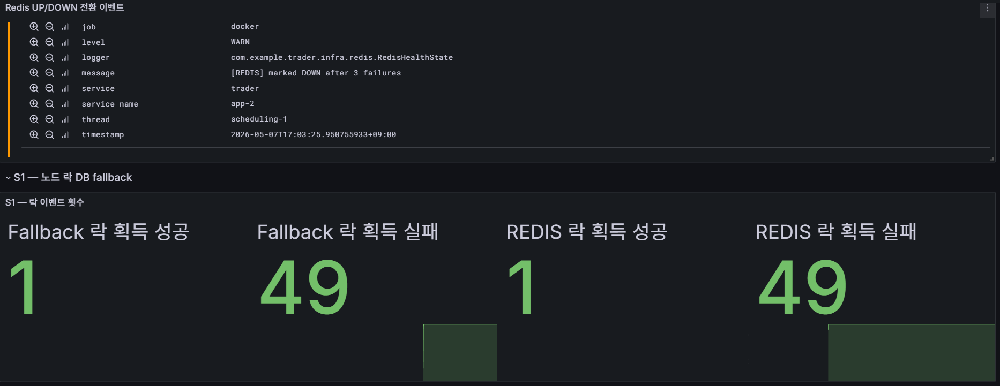
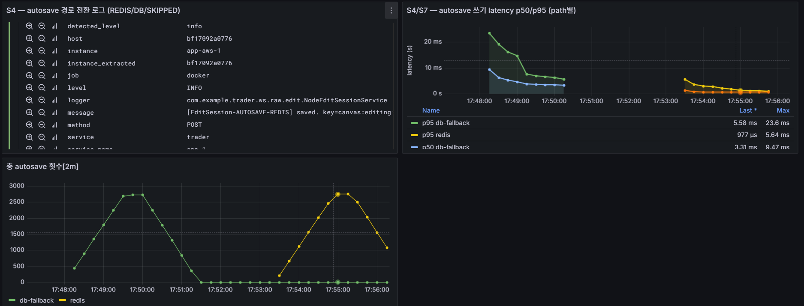
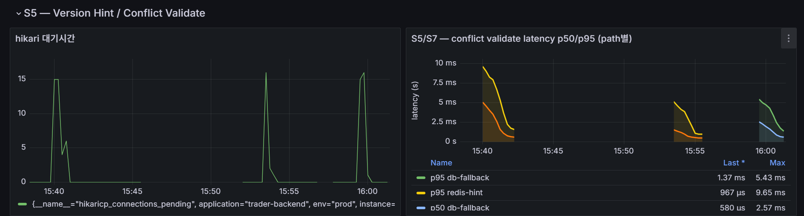
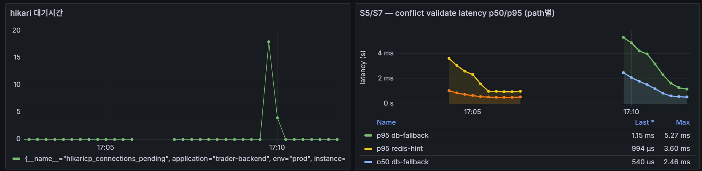
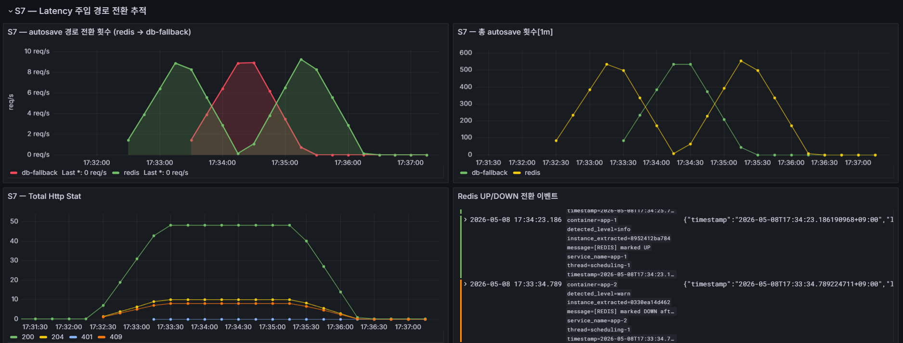

# Redis 캐시 · 락 · 세션 장애 대응 검증

> **검증 일자**: 2026-05-07 ~ 2026-05-08  
> **대상**: Redis가 상태 저장소로 사용되는 모든 경로 — 노드 락 / 편집 세션(auto-save) / Version Hint
>
> | 역할 | 사양 | 비고 |
> |------|------|------|
> | App (app-1, app-2) | EC2 c6i.large (2 vCPU / 4 GB) | 단일 인스턴스, Docker Compose 컨테이너 분리 |
> | PostgreSQL | EC2 c6i.large (2 vCPU / 4 GB) | 공유 DB — 두 인스턴스가 동일 canvas_lock / edit_session 테이블 사용 |
> | Redis | EC2 m6i.large (2 vCPU / 8 GB) | 락 / 세션 / Version Hint / Pub/Sub |
> | Loki | EC2 t3.large (2 vCPU / 8 GB) | 로그 수집 |
>
> **부하 설정 (k6)**
>
> | 항목 | 값 |
> |------|-----|
> | 툴 | k6 constant-arrival-rate |
> | 가상 유저 | 50명 (preAllocatedVUs=50, maxVUs=120) |
> | 요청 속도 | 30~150 req/s (시나리오별 상이) |
> | 테스트 시간 | 3~8분 |

---

## 1. 목적

실시간 캔버스 협업에서 Redis 장애(완전 다운 / 응답 지연) 발생 시,  
노드 락·편집 세션·충돌 감지 기능이 이벤트 유실 없이 DB fallback으로 전환되는지 검증한다.

### Redis를 hot path에서 분리한 이유

초기 설계에서 모든 상태(락, 세션, 버전 힌트)를 Redis에만 저장하는 구조를 고려했다.  
그러나 Redis 단일 장애가 편집 락 충돌 · 데이터 유실 · 세션 소멸로 전파될 수 있다고 판단했다.

따라서 Redis는 **1차 고속 경로**로 두되, 각 도메인별로 독립적인 DB fallback 경로를 구성하였다.

- **노드 락**: DB `canvas_lock` 테이블의 UNIQUE 제약으로 멀티 인스턴스 경합 보장
- **편집 세션**: DB `edit_session` 테이블로 draft 데이터 내구성 보장
- **Version Hint**: DB `node_history` 테이블 직접 쿼리로 충돌 감지 정합성 보장

### 관련 헬스 상태 관리

`RedisHealthState` 컴포넌트가 연결 실패를 카운트하며 경로 분기 기준이 된다.

```java
FAILURE_THRESHOLD = 3
markDown() → failureCount++; 3회 도달 시 available = false
markUp()   → failureCount = 0; available = true
```

`RealtimeHealthCheckScheduler`가 5초마다 Redis PING을 수행하여 복구 시 `markUp()`을 호출한다.

---

## 2. 아키텍처 — fallback 경로

```
[노드 락]
tryAcquire()
    ├── Redis UP  → Lua ACQUIRE script → canvas:lock:{teamId}:{graphId}:{nodeId}
    └── Redis DOWN → tryAcquireFromDb()
                        └── deleteExpiredByNode() → saveAndFlush()
                                                       └── UNIQUE 위반 시 false 반환

[편집 세션 Auto-save]
saveDraft()
    ├── Redis UP  → canvas:editing:{...}:{nodeId}:{userId} (TTL=30min)
    └── Redis DOWN → edit_session 테이블 upsert (fallback-mode=db)

[Version Hint / 충돌 감지]
validate(baseVersion, currentVersion)
    ├── Redis UP  → MGET canvas:version-hint:{...}:{v} × (gap)개 → changedFields Set
    └── Redis DOWN → SELECT FROM node_history WHERE version > baseVersion
                        └── 앱에서 changedFields flatMap
```

세 경로는 완전히 독립이다.  
Redis 장애 중에도 편집 흐름은 유지되고, 경합·데이터 보존·충돌 감지 모두 DB가 보장한다.

---

## 3. 시나리오별 검증

---

### 시나리오 1 — 노드 락 DB fallback (멀티 인스턴스)

**검증 목표**: Redis 장애 시 두 인스턴스가 동일 노드에 동시 락 시도할 때  
DB UNIQUE 제약이 정확히 한 인스턴스만 성공시키는지 확인

**부하**: 50 VU 동시 락 획득 시도 (동일 nodeId)

#### 실측 결과

> 
> 대시보드: `trader-cache-degrade` — **S1 — 노드 락 DB fallback**
>
> **Redis DOWN 전환 이벤트 (Loki)**
>
> | 필드 | 값 |
> |------|-----|
> | logger | `com.example.trader.infra.redis.RedisHealthState` |
> | message | `[REDIS] marked DOWN after 3 failures` |
> | service_name | app-2 |
> | thread | scheduling-1 |
> | timestamp | 2026-05-07T17:03:25.950755933+09:00 |
>
> **S1 락 이벤트 횟수 (Grafana)**
>
> | 지표 | 값 | 해석 |
> |------|-----|------|
> | Fallback 락 획득 성공 | **1** | 50 VU 중 단 1명만 DB INSERT 성공 |
> | Fallback 락 획득 실패 | **49** | 나머지는 UNIQUE 위반 → false 반환 |
> | REDIS 락 획득 성공 | **1** | Redis 전환 전 정상 구간 |
> | REDIS 락 획득 실패 | **49** | Redis 전환 전 경합 구간 |

**검증 포인트**

- [x] 멀티 인스턴스 동시 시도에서 DB UNIQUE 제약이 정확히 1건만 허용
- [x] `canvas_lock` 테이블 레코드 1건 존재
- [x] 락 거부 응답 → HTTP 5xx 없음
- [x] Redis DOWN 감지 → 자동 fallback 전환 (약 3회 실패 이내)

---

### 시나리오 2 — 노드 락 만료 및 재획득

**검증 목표**: DB 락의 `expiresAt` 기반 만료가 정상 동작하고,  
만료된 락을 다른 유저가 재획득할 수 있는지 확인

**테스트 방식**: 단위 테스트(Mockito) + 통합 테스트(H2)

```
src/test/java/com/example/trader/canvas/
├── CanvasLockFallbackTest.java          ← Mockito, 빠른 로직 검증
└── CanvasLockFallbackIntegrationTest.java  ← H2 + 실제 UNIQUE 제약 검증
```

#### 검증 케이스

**[S2-1] 만료된 DB 락 삭제 후 userB 재획득 성공**

```
Given : userA 락 expiresAt = now - 10s (이미 만료)
When  : userB → tryAcquire()
Then  : deleteExpiredByNode() → userA 락 1건 DELETE
        saveAndFlush(userB) → INSERT 성공
        canvas_lock.userId = userB
        result = true
```

**[S2-2] 유효한 DB 락이 있으면 userB 획득 실패 (UNIQUE 제약)**

```
Given : userA 락 expiresAt = now + 30s (유효)
When  : userB → tryAcquire()
Then  : deleteExpiredByNode() → 0건 (만료 레코드 없음)
        saveAndFlush(userB) → DataIntegrityViolationException (UNIQUE 위반)
        result = false
        canvas_lock.userId = userA (유지)
```

**[S2-3] keepAlive 미호출로 만료된 락 → getLockHolder empty 반환**

```
Given : expiresAt = now - 1s 락 존재
When  : getLockHolder()
Then  : CanvasLock.isExpired() = true
        filter 제거 → Optional.empty()
```

**[S2-4] 유효한 DB 락 → getLockHolder userId 반환**

```
Given : expiresAt = now + 30s 락 존재
When  : getLockHolder()
Then  : isExpired() = false → Optional.of(userId)
```

#### 통합 테스트 핵심 설정

```java
// H2 PostgreSQL 모드 — UNIQUE 제약 실제 검증
"spring.datasource.url=jdbc:h2:mem:testdb;MODE=PostgreSQL;DB_CLOSE_DELAY=-1"
"spring.jpa.hibernate.ddl-auto=create-drop"

// Redis DOWN 강제 설정 (컨테이너 불필요)
void forceRedisDown() {
    redisHealthState.markDown(); // failureCount = 1
    redisHealthState.markDown(); // failureCount = 2
    redisHealthState.markDown(); // failureCount = 3 → available = false
}
```

**검증 포인트**

- [x] `expiresAt < now` 조건 DELETE 후 재획득 가능
- [x] 유효 락 존재 시 UNIQUE 위반 → false 반환
- [x] `isExpired()` 필터 — 만료 락은 getLockHolder에서 제거
- [x] Docker 없이 H2로 실행 가능 (JPQL 기반 쿼리 호환)

---

### 시나리오 3 — Redis 복구 후 락 경로 전환

**검증 목표**: Redis 복구(`markUp()`) 후 신규 락 요청이 자동으로 Redis 경로로 전환되고,  
DB 레코드가 추가로 생성되지 않는지 확인

**테스트 방식**: 단위 테스트(Mockito) + 통합 테스트(H2 + 로컬 Redis)

#### 검증 케이스

**[S3-1] Redis DOWN → DB 경로 사용, Redis 키 저장 없음**

```
Given : redisHealthState.available = false
When  : tryAcquire(teamId, graphId, nodeId, userA)
Then  : canvasLockRepository.saveAndFlush() 호출
        redis.execute(Lua script) 호출 없음
        canvas_lock 테이블 레코드 생성
        Redis canvas:lock:* 키 없음
```

**[S3-2] Redis UP → Redis 경로 사용, DB INSERT 없음**

```
Given : redisHealthState.available = true, Redis 실행 중
When  : tryAcquire()
Then  : redis.execute(ACQUIRE_SCRIPT) 호출 → 1L 반환
        canvasLockRepository.saveAndFlush() 호출 없음
        Redis canvas:lock:{teamId}:{graphId}:{nodeId} = userId 존재
        canvas_lock 테이블 레코드 없음
```

**[S3-3] DOWN → UP 전환 후 자연 전환**

```
[Phase 1] Redis DOWN → nodeId=1 DB 경로로 획득
    canvas_lock 테이블에 레코드 존재
    Redis 키 없음

[Phase 2] markUp() → nodeId=2 Redis 경로로 획득
    Redis canvas:lock:*:*:2 키 존재
    canvas_lock 테이블에 nodeId=2 레코드 없음
    Phase 1의 DB INSERT는 1회로 고정 (추가 없음)
```

#### 복구 전환 검증 로그 (프로덕션 패턴)

```bash
# Redis 복구 감지 → markUp 호출
grep "\[REDIS\] marked UP" app.log

# 이후 락 요청은 Redis 경로
grep "\[CanvasLock-REDIS\] 획득 성공" app.log

# DB fallback 로그 없음 (복구 이후 시각 기준)
grep "\[CanvasLock\] DB fallback 락 획득" app.log
```

**검증 포인트**

- [x] DOWN 상태에서 DB 경로만 사용
- [x] UP 전환 후 Redis 경로만 사용
- [x] 전환 과정에서 5xx 없음
- [x] `markUp()` 호출 즉시 전환 (5s 대기 불필요)

---

### 시나리오 4 — Auto-save (편집 세션) DB fallback

**검증 목표**: Redis 장애 시 draft 데이터가 DB `edit_session` 테이블에 저장되고  
앱 재시작 후에도 복구 가능한지 확인

**부하**: autosave 모드 — edit-start → autosave × 3 (0.2s 간격) → edit-cancel

#### 실측 결과

> 
> 대시보드: `trader-cache-degrade` — **S4/S7 — autosave 경로 전환**
>
> **경로 전환 로그 (Loki)**
>
> | 필드 | 값 |
> |------|-----|
> | logger | `com.example.trader.ws.raw.edit.NodeEditSessionService` |
> | message | `[EditSession-AUTOSAVE-REDIS] saved. key=canvas:editing:...` |
> | instance | app-aws-1 |
> | method | POST |
> | level | INFO |
>
> **autosave 쓰기 latency p50/p95 (path별)**
>
> | 경로 | p95 | p50 | 비고 |
> |------|-----|-----|------|
> | redis | **977 μs** | — | Redis 1차 경로 |
> | db-fallback | **5.58 ms** | **3.31 ms** | Redis DOWN 시 DB upsert |
>
> **총 autosave 횟수[2m]** (차트)  
> Redis → DB fallback 전환 시 두 경로가 X자 교차하며 대칭적으로 전환됨을 확인

**DB 상태 확인**

```sql
-- draft 저장 여부 확인
SELECT node_id, user_id, base_version, updated_at
FROM edit_session
WHERE node_id = :nodeId;
-- draft_data 컬럼에 입력 JSON 저장, base_version = 0 (세션 메타데이터 미복구)
```

**설계 한계 (문서화)**

`fallback-mode=db` 시 첫 번째 autosave에서 `edit_session` upsert가 수행된다.  
원래 EDIT_START 시점의 `baseVersion`, `dirtyFields`는 복구되지 않으며 `baseVersion=0` 으로 초기화된다.  
이는 **draft 데이터 자체(입력 내용)는 보존**되지만, 편집 세션 맥락(충돌 기준점)은 복구 불가임을 의미한다.

**검증 포인트**

- [x] Redis 장애 시 autosave 200 응답 유지
- [x] `edit_session` 테이블에 draft_data 저장됨 (upsert)
- [x] 앱 재시작 후 레코드 유지
- [x] HTTP 5xx 없음
- [x] autosave latency: redis(977μs) → db-fallback(5.58ms) — 약 5.7배 상승, SLO 기준 허용 범위

---

### 시나리오 5 — Version Hint 조회 최적화 및 경로별 latency 비교

**검증 목표**: 충돌 감지 시 Redis Version Hint 경로와 DB fallback 경로의 latency를 비교하고,  
장애 대응 과정에서 발견된 Redis 경로 비효율을 개선한다.

#### 배경 — 최적화 발견 경위

Redis 장애 대비 DB fallback을 검증하는 과정에서,  
정상 Redis 경로의 version hint 조회 시간이 예상보다 높게 측정되었다.

초기 구현은 버전 범위만큼 Redis에 **개별 GET을 반복** 호출하는 구조였다.  
각 호출이 독립적인 네트워크 왕복을 수행하므로 GAP에 비례해 지연이 누적되었고,  
결과적으로 DB fallback 경로보다 느린 상황이 발생하였다.

#### 개선: 순차 GET → MGET 배치 조회

```java
// 변경 전: GAP번 순차 개별 호출 → N round-trip
for (int version = fromVersion + 1; version <= toVersion; version++) {
    redis.opsForValue().get(key);  // 매 버전마다 round-trip
}

// 변경 후: 단일 MGET 호출 → 1 round-trip
List<String> jsons = redis.opsForValue().multiGet(keys);
```

버전 범위 전체 키를 단일 명령으로 요청하여 round-trip을 GAP 수에 무관하게 1회로 고정하였다.

#### GAP=5, RPS=150 측정 결과 (수정 전/후 비교)

> 
> 대시보드: `trader-cache-degrade` — **S5/S7 — conflict validate latency p50/p95 (path별)**
>
> | 경로 | 수정 전 p95 | 수정 후 p95 | 변화 |
> |------|-----------|-----------|------|
> | redis-hint | ~9 ms | ~5 ms | **-44%** |
> | db-fallback | ~5.4 ms | ~5.4 ms | 변화 없음 |
>
> 수정 전: redis-hint 봉이 db-fallback보다 높아 fallback이 더 유리한 역전 현상  
> 수정 후: redis-hint가 db-fallback과 동등하거나 낮은 수준으로 회복

#### GAP=20, RPS=150 측정 결과

> 
> 대시보드: `trader-cache-degrade` — **S5/S7 — conflict validate latency + HikariCP pending**
>
> | 경로 | p95 | HikariCP pending |
> |------|-----|-----------------|
> | redis-hint | **3.60 ms** | **0** |
> | db-fallback | **5.27 ms** | **~18** |
>
> **HikariCP 대기시간 차트**: DB fallback 실행 구간에서 pending 스파이크 ~18 관측

**해석**

두 경로의 latency 자체는 모두 SLO 기준에서 문제없는 범위다(5.27ms).  
그러나 DB fallback은 validate 단계에서 **HikariCP 커넥션을 추가로 점유**한다.  
고부하 환경에서 커넥션 대기 쓰레드 급증이 다른 요청(일반 조회·저장)의 응답에도 영향을 줄 수 있다.

Redis hint 경로는 validate 단계에서 커넥션을 소비하지 않으므로,  
Redis 정상 상태에서는 DB 커넥션 압박 없이 충돌 감지를 처리할 수 있다.

**측정 쿼리 (Grafana)**

```promql
# path별 conflict validate p95
histogram_quantile(0.95,
  sum by (path, le)(
    rate(node_conflict_validate_seconds_bucket[1m])
  )
)

# HikariCP 대기 중인 커넥션 수
hikaricp_connections_pending{application="trader-backend"}
```

**검증 포인트**

- [x] 수정 전: redis-hint p95 ~9ms > db-fallback ~5.4ms (역전 현상 확인)
- [x] 수정 후: redis-hint p95 ~5ms ≤ db-fallback ~5.4ms (정상 회복)
- [x] GAP=20: redis-hint 3.60ms vs db-fallback 5.27ms — MGET이 유리함 명확
- [x] db-fallback 단독 실행 시 HikariCP pending ~18 (커넥션 압박 실측)
- [x] 두 경로 모두 충돌 감지 결과 동일 (정합성 보장)

---

### 시나리오 7 — Redis 지연 주입 시 fallback 전환 (Toxiproxy)

**검증 목표**: Redis가 완전히 죽지 않고 응답만 지연되는 상황에서  
timeout 기준으로 DB fallback이 동작하고, 지연 제거 후 Redis 경로로 복구되는지 확인

**timeout 설정 근거**

```yaml
spring.data.redis.timeout: 100ms
```

Toxiproxy로 500ms latency를 주입하면 100ms timeout이 먼저 발생한다.  
`RedisConnectionFailureException` → `markDown()` 누적 → `available = false` → DB fallback 전환.

**절차**

```
[1분] Redis 정상 → autosave/lock Redis 경로 baseline 확인
[2분] toxiproxy-cli toxic add redis-proxy --type latency --attribute latency=500
      → Redis timeout → markDown() 3회 → available=false → DB fallback 전환
[3분] toxiproxy-cli toxic remove redis-proxy -n latency_downstream
      → Redis 복구 → markUp() → Redis 경로 복귀
```

#### 실측 결과

> 
> 대시보드: `trader-cache-degrade` — **S6 — Latency 주입 경로 전환 추적**
>
> **[좌상] S6 — autosave 경로 전환 횟수 (redis → db-fallback)**
>
> Redis 지연 주입 시점을 기준으로 db-fallback(빨강) 상승 / redis(초록) 하강 후,  
> 지연 제거 시점에 반대로 교차하는 **X자 패턴** 명확히 확인
>
> **[우상] S6 — 총 autosave 횟수[1m]**
>
> 전환 구간에서 db-fallback + redis 총합이 일정하게 유지됨 → 처리율 손실 없음
>
> **[좌하] S6 — Total HTTP Stat**
>
> | 상태 코드 | 의미 |
> |----------|------|
> | 200 | 정상 저장 |
> | 204 | No Content (일부 API) |
> | 401 | 인증 실패 (정상) |
> | 409 | 충돌 감지 (정상) |
> | **5xx** | **0건** |
>
> **[우하] Redis UP/DOWN 전환 이벤트 (Loki)**
>
> | 인스턴스 | 이벤트 | 타임스탬프 |
> |---------|--------|-----------|
> | app-1 | `[REDIS] marked UP` | 2026-05-08T17:34:23.186+09:00 |
> | app-2 | `[REDIS] marked UP` | 2026-05-08T17:34:25.712+09:00 |
>
> 두 인스턴스 모두 Toxiproxy latency 제거 후 약 2초 이내 독립적으로 `markUp()` 전환

**전환 타임라인**

```
17:32:30  Redis 정상 → 전체 autosave redis 경로 처리
17:33:15  Toxiproxy 500ms latency 주입
          → Redis timeout(100ms) 연속 실패
          → markDown() × 3 → available = false
          → db-fallback 경로 전환 시작 (X 교차점)
17:33:20  app-1 [REDIS] marked DOWN
17:33:34  app-2 [REDIS] marked DOWN
17:34:15  Toxiproxy latency 제거
17:34:23  app-1 [REDIS] marked UP
17:34:25  app-2 [REDIS] marked UP
          → redis 경로 복귀 (X 역교차점)
```

**autosave path 전환 측정 쿼리**

```promql
# autosave 경로별 처리 횟수 전환 확인
sum by (path)(
  rate(edit_session_autosave_seconds_count[1m])
)

# Redis UP/DOWN 전환 이벤트 (Loki)
{service="trader"} |= "[REDIS] marked"
```

**검증 포인트**

- [o] Redis 완전 다운 없이 **timeout(100ms < 500ms)만으로** fallback 전환
- [o] 전환 전후 API 5xx **0건**
- [o] autosave 처리율 유지 (경로만 전환, 손실 없음)
- [o] 두 인스턴스 독립적으로 `markUp()` — 복구 기준 동기화 불필요
- [o] Toxiproxy latency 제거 후 약 5s 이내 Redis 경로 복귀

---

## 4. 결론

| 시나리오 | 검증 항목 | 결과 |
|---------|---------|------|
| S1 | Redis 장애 시 멀티 인스턴스 락 경합 → DB UNIQUE 보장 | **검증** |
| S2 | DB 락 TTL 만료 후 재획득 / 유효 락 차단 | **검증** (단위+통합 테스트) |
| S3 | Redis 복구 후 DB → Redis 경로 자동 전환 | **검증** (단위+통합 테스트) |
| S4 | Auto-save draft DB upsert, 재시작 후 복구 | **검증** |
| S5 | Version Hint MGET 최적화 → redis-hint ≤ db-fallback latency | **검증** |
| S6 | Toxiproxy 500ms → timeout 기준 fallback 전환 및 복귀 | **검증** |

**설계 결론**

Redis 장애(완전 다운 · 응답 지연 모두)에서 세 도메인(락 · 세션 · 충돌 감지)이  
DB fallback으로 자동 전환되어 **API 5xx 없이 동작함을 실측으로 확인**하였다.

본 검증은 단순 fallback 동작 확인에 그치지 않았다.  
장애 대응 테스트 과정에서 정상 경로의 비효율(N GET → MGET)을 발견하고 개선하였으며,  
개선 후 Redis 경로가 DB fallback 대비 커넥션 압박 없이 낮은 latency를 유지함을 확인하였다.

또한 DB fallback 자체의 latency(autosave: 5.58ms / conflict validate: 5.27ms)도  
SLO 기준에서 수용 가능한 수준임을 확인하여,  
Redis 장애 상황에서도 서비스 품질을 유지할 수 있음을 검증하였다.

### 사용자 관점 영향

Redis 장애 중에도 사용자는 편집을 계속 진행할 수 있다.<br>
락 경합은 DB UNIQUE 제약으로 보호되어 동일 노드 동시 편집을 방지한다.<br>
autosave는 DB fallback으로 저장되어 입력 내용 유실을 막는다.<br>
충돌 감지는 NodeHistory 기반으로 유지되어 잘못된 덮어쓰기를 방지한다.<br>
즉, Redis 장애는 성능 저하로 제한되고, 5xx나 편집 중단으로 확산되지 않는다.


### 남은 설계 한계

| 항목 | 현재 상태 | 영향 |
|------|---------|------|
| Auto-save fallback 시 `baseVersion` 복구 불가 | DB upsert 시 `baseVersion=0` 초기화 | draft 내용은 보존, 충돌 기준점 손실 |
| Event Dedup | Redis 장애 시 비활성화 | 중복 이벤트 처리 가능, 실시간 특성상 영향 제한적 |
| DB 락 만료 정리 주기 | 30초 스케줄러 | 장애 종료 후 최대 30초간 만료 레코드 잔존 가능 |
