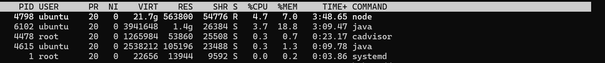
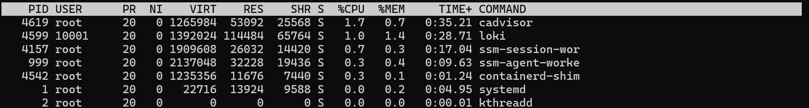
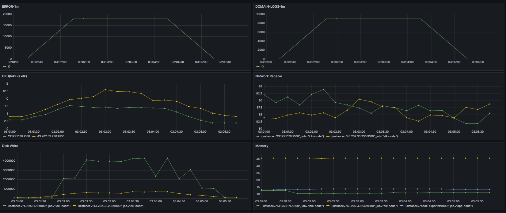
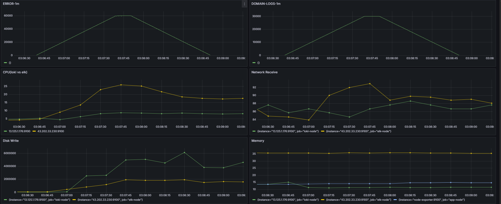
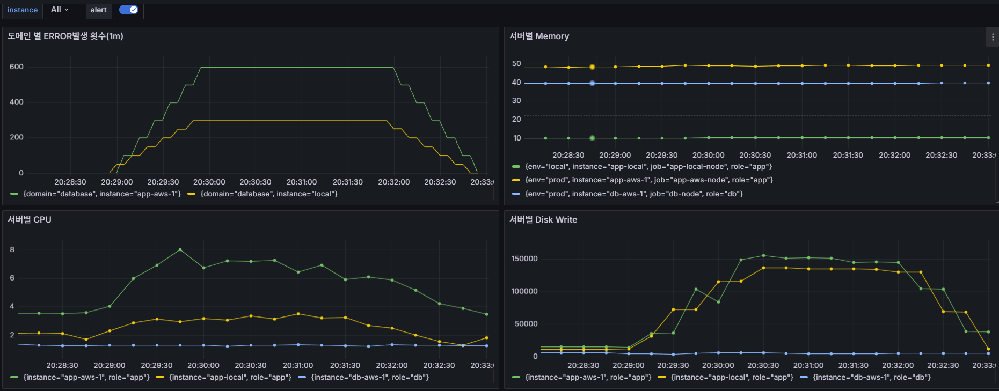
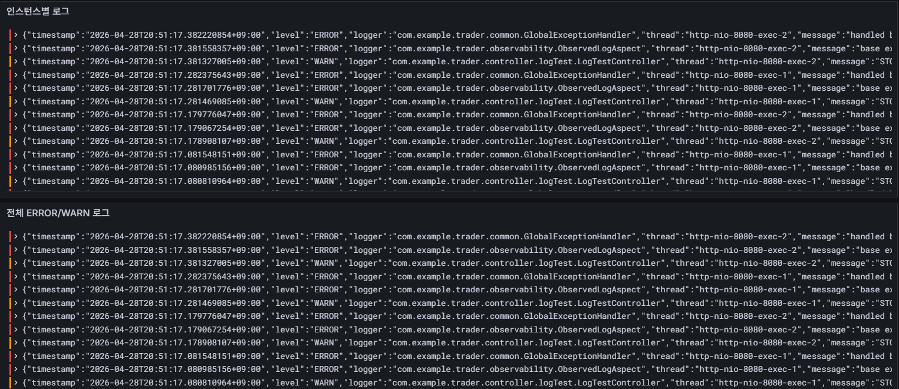
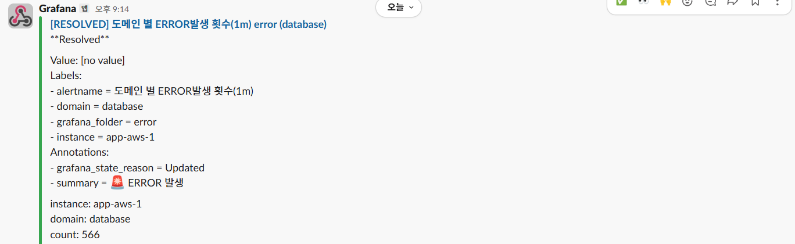

# 📊 Loki 기반 Observability 시스템 설계 및 ERROR Rate 알람 구축

---

## 🔥 요약

본 프로젝트는 단순 로그 수집을 넘어  
**실시간 장애 감지 및 운영 대응이 가능한 Observability 시스템 구축**을 목표로 진행되었다.

이를 위해:

- AOP 기반 구조화된 로깅 시스템 설계
- ELK vs Loki 비교 실험을 통한 기술 선택
- Loki + Promtail 기반 중앙 집중 로그 수집
- Grafana 기반 다중 인스턴스 관측 시스템 구축
- ERROR Count 및 ERROR Rate 기반 알람 설계 및 검증

을 수행하였다.

👉 최종적으로  
**로그 → 분석 → 알람 → 대응까지 연결되는 운영형 시스템**으로 확장하였다.

---

## 📚 목차

1. 앱 레벨 로깅 설계 (AOP 기반)
2. Observability Stack 비교 (ELK vs Loki)
3. Loki 기반 관측 아키텍처 설계
4. Grafana 대시보드 및 다중 인스턴스 관측
5. 알람 시스템 설계 (ERROR Count & ERROR Rate)
6. 결론

---

# 1. 앱 레벨 로깅 설계

## 1.1 설계 목표

운영 알람과 로그 분석에 활용하기 위해 단순 문자열 로그가 아니라,
요청 단위 추적이 가능한 구조화 로그를 설계하였다.

이를 위해 로깅 책임을 두 계층으로 분리하였다.

- Filter: 모든 HTTP 요청에 공통으로 필요한 컨텍스트 주입
- AOP: 특정 API 실행 결과, 성공/실패, 예외 정보를 기록

---

## 1.2 TraceIdFilter: 요청 공통 컨텍스트 주입

`TraceIdFilter`는 모든 HTTP 요청에 대해 공통 추적 정보를 MDC에 저장한다.

주요 역할:

- `traceId` 생성 또는 전달
- HTTP method / URI 저장
- clientIp 저장
- service / instance 정보 저장
- 응답 헤더에 `X-Trace-Id` 반환

```java
MDC.put("traceId", traceId);
MDC.put("method", httpRequest.getMethod());
MDC.put("uri", httpRequest.getRequestURI());
MDC.put("clientIp", getClientIp(httpRequest));
MDC.put("service", serviceName);
MDC.put("instance", instanceId);
MDC.put("host", hostName);
httpResponse.setHeader("X-Trace-Id", traceId);
````

이를 통해 장애 발생 시 동일 요청의 로그를 `traceId` 기준으로 추적할 수 있다.

---

## 1.3 ObservedLogAspect: API 실행 결과 로깅

`ObservedLogAspect`는 `@ObservedLog`가 붙은 API에 대해 성공/실패 결과를 구조화 로그로 남긴다.

성공 시:

```java
MDC.put("event", "API_SUCCESS");
MDC.put("elapsedMs", String.valueOf(elapsedMs));
log.info("api request success");
```

실패 시:

```java
MDC.put("event", "API_ERROR");
MDC.put("domain", status.getDomain());
MDC.put("errorCode", status.getErrorCode());
MDC.put("severity", status.getSeverity().name());
MDC.put("elapsedMs", String.valueOf(elapsedMs));
MDC.put("exception", ex.getClass().getSimpleName());
MDC.put("httpStatus", String.valueOf(status.getCode()));

log.error("base exception occurred", ex);
```

---

## 1.4 책임 분리 구조

| 구분                   | 역할                   |
| -------------------- | -------------------- |
| TraceIdFilter        | 요청 단위 공통 컨텍스트 생성     |
| ObservedLogAspect    | API 실행 결과 및 예외 정보 기록 |
| MDC                  | 로그 필드 전달 저장소         |
| Logback JSON Encoder | MDC 값을 JSON 로그로 출력   |

---

## 1.5 최종 로그 예시

```json
{
  "timestamp": "2026-04-28T20:43:51.600522209+09:00",
  "level": "ERROR",
  "logger": "com.example.trader.common.GlobalExceptionHandler",
  "thread": "http-nio-8080-exec-2",
  "message": "handled base exception",
  "traceId": "99a9a314-0d39-4d8c-a1b4-d36199199fae",
  "severity": "HIGH",
  "instance": "app-aws-1",
  "method": "GET",
  "service": "trader",
  "clientIp": "123.143.98.2",
  "domain": "database",
  "httpStatus": "500",
  "errorCode": "DATABASE_INSERT_ERROR",
  "event": "API_ERROR",
  "uri": "/internal/test/stock"
}
```

---

## 1.6 설계상 주의점

MDC는 ThreadLocal 기반이므로 요청 처리가 끝난 뒤 반드시 정리해야 한다.

```java
finally {
    MDC.clear();
}
```

또한 AOP 내부에서도 관측용 필드만 별도로 제거하여 다음 요청에 값이 섞이지 않도록 처리하였다.

```java
finally {
    clearObservationMdc();
}
```

---

## 1.7 정리

이 구조를 통해 애플리케이션 로그는 단순 문자열이 아니라,
운영 관측에 사용할 수 있는 이벤트 데이터가 되었다.

특히 다음 필드들이 이후 Loki 쿼리와 Grafana 알람의 기준이 되었다.

* `domain`
* `instance`
* `event`
* `level`
* `errorCode`
* `elapsedMs`
* `uri`


---

# 2. ⚖️ Observability Stack 비교 (ELK vs Loki)

## 2.1 후보

* ELK Stack (Elasticsearch + Filebeat + Kibana)
* Loki Stack (Loki + Promtail + Grafana)

---

## 2.2 비교 기준

* CPU 사용량
* Memory 사용량
* Disk Write
* 로그 처리 성능
* 운영 복잡도

---

## 2.3 실험 환경

### 📌 Baseline (Idle 상태)

- ELK : Idle 상태에서도 높은 CPU,Memory 사용량을 보여줌



- Loki : Idle 상태에서도 ELK보다 낮은 CPU,Memory 사용량을 보여줌




* 동일 로그 구조
* 동일 트래픽 (k6)
* 동일 인프라

트래픽:

* 50 RPS
* 150 RPS
* 500 RPS

---

## 2.4 실험 결과

- 그라파나 대쉬보드의 노란선(ELK), 초록선(Loki)

### 🔹 Loki vs ELK 비교 (150 RPS)



👉 Loki는 CPU/Memory 안정적 유지  
👉 ELK는 CPU 급증 발생

---

### 🔹 Loki vs ELK 비교 (500 RPS)




👉 ELK는 CPU 및 Memory 급격히 증가  
👉 Loki는 상대적으로 안정적

---

### Disk Write 분석

실험 결과 Loki는 트래픽 증가에 따라 Disk Write가 선형적으로 증가하는 특성을 보였다.

이는 Loki의 저장 방식 때문으로,  
로그를 별도의 인덱싱 과정 없이 chunk 단위로 압축하여 append 방식으로 저장하기 때문이다.

즉, 로그 유입량 증가 = 디스크 write 증가로 직접 연결된다.

반면 ELK의 Elasticsearch는 로그를 저장하기 전  
inverted index 생성 및 분석 과정을 수행한다.

이 과정에서:

- CPU 사용량 증가
- Memory 사용량 증가

가 발생하며, 디스크 write는 상대적으로 늦게 반영된다.

---

정리하자면

- Loki: Disk I/O 중심 (단순 append 구조)
- ELK: CPU/Memory 중심 (indexing 비용 발생)

따라서 실험에서는  
**Loki는 디스크 사용량 증가 대신 전체 시스템 리소스 안정성을 확보하는 방향**,  
ELK는 **검색 성능을 위해 높은 리소스를 사용하는 방향**으로 차이가 나타났다.


## 2.5 트레이드오프

| 항목     | Loki  | ELK |
| ------ | ----- | --- |
| CPU    | 낮음    | 높음  |
| Memory | 낮음    | 높음  |
| Disk   | 선형 증가 | 증가  |
| 검색 기능  | 제한적   | 강력  |
| 운영 난이도 | 낮음    | 높음  |

---

### 📌 Loki의 한계

Loki는 경량 로그 수집과 낮은 리소스 사용량을 강점으로 가지지만,  
다음과 같은 한계가 존재한다.

- Full-text 검색 기능이 Elasticsearch 대비 제한적
- 복잡한 로그 분석 및 집계 기능 부족
- 대규모 장기 로그 분석에는 부적합

따라서 Loki는 다음과 같은 목적에 적합하다:

- 실시간 장애 감지  
- 알람 기반 운영 대응  
- 단기 로그 조회 및 추적

반면,

- 장기 데이터 분석 / 복잡한 검색 / BI 목적에는 ELK가 더 적합하다.

---

- 해당 시스템은 “실시간 장애 감지”가 핵심 목적이므로  
Loki를 선택하는 것이 더 적합하다고 판단하였다.

---

## 2.6 결론

- 본 시스템은 “실시간 장애 감지” 목적

따라서

**Loki 선택**

이유:

* 낮은 리소스 사용량
* Grafana와 자연스러운 통합
* 빠른 구축 가능

---

# 3. 🏗️ Loki 기반 관측 아키텍처

## 3.1 구조


```text
[App Instance]
    ↓
[Docker Logs]
    ↓
[Promtail]
    ↓
[Loki Server]
    ↓
[Grafana]

+ Prometheus → 서버 리소스 수집
```

---

## 3.2 설계 포인트

* Promtail → 각 서버에서 로그 수집
* Loki → 중앙 집중 저장
* Grafana → 통합 시각화
* Prometheus → CPU / Memory / Disk 수집

### 📌 아키텍처 선정 이유

해당 시스템은 다음과 같은 대안을 고려하였다.

---

#### ❌ Kafka 기반 로그 수집

- 장점: 내구성, replay 가능
- 단점: 운영 복잡도 증가, 추가 인프라 필요

해당 프로젝트에서는
“실시간 알람 기반 장애 대응”이 목적이므로  
Kafka 수준의 로그 내구성은 필요하지 않다고 판단하였다.

---

#### ❌ OpenTelemetry 기반 통합 관측

- 장점: Trace + Metric + Log 통합
- 단점: 초기 구축 복잡도, 학습 비용 증가

해당 시스템에서는
로그 기반 ERROR 감지 및 알람이 핵심이므로  
OpenTelemetry 대신 Loki + Prometheus 조합을 선택하였다.

---

### ✔ 최종 선택

- 로그: Loki (경량, 빠른 구축, 낮은 리소스)
- 메트릭: Prometheus (표준, pull 기반 안정성)
- 시각화: Grafana (통합 대시보드)

- **운영 효율성과 목적 적합성** 기준으로 설계하였다.


---

## 3.3 장점

* 확장성 (멀티 인스턴스)
* 중앙 집중 관리
* 로그 + 메트릭 통합

---

# 4. 📊 Grafana 기반 관측 시스템

## 4.1 대시보드 구성





구성:

* ERROR 발생량
* 도메인별 로그
* CPU / Memory / Disk
* Network

---

## 4.2 다중 인스턴스 관측

```logql
sum by (domain, instance) (
  count_over_time({job="docker"} | json | level="ERROR" [1m])
)
```

👉 instance별 분리 관측 가능

---

## 4.3 결과

* 특정 서버 장애 즉시 식별 가능
* 트래픽 증가 시 리소스 변화 확인 가능

---

# 5. 🚨 알람 시스템 설계

## 5.1 ERROR Count 알람

### 쿼리

```logql
sum by (domain, instance) (
  count_over_time(
    {job="docker"}
    | json
    | __error__=""
    | level="ERROR"
    [1m]
  )
)
```

---

### 메시지

```text
🚨 ERROR 발생

instance: {{ $labels.instance }}
domain: {{ $labels.domain }}
count: {{ $values.B }}
```

---

## 5.2 ERROR Rate 알람 (핵심)

### 전체 요청

```logql
sum by (domain, instance) (
  count_over_time(
    {job="docker"} | json | __error__="" | uri!="" [1m]
  )
)
```

---

### ERROR

```logql
sum by (domain, instance) (
  count_over_time(
    {job="docker"} | json | __error__="" | level="ERROR" [1m]
  )
)
```

---

### 계산

```text
ERROR rate = ERROR / TOTAL * 100
```

---

### 알람 조건

```text
> 5%
```

---

## 5.3 알람 흐름

```text
로그 발생
→ Loki 수집
→ Grafana 분석
→ Alert Rule 평가
→ Slack 전송
```

---

## 5.4 검증

- aws instance alert


- local instance alert


* instance별 알람 정상 동작
* count 포함 메시지 전달
* resolved 상태 정상 복귀

---

# 6. 🚀 결론

본 시스템은 단순 로그 수집을 넘어

* 구조화된 로깅
* Observability 스택 비교 및 선택
* 중앙 집중 로그 시스템 구축
* 다중 인스턴스 관측
* ERROR 기반 알람 설계

까지 수행하였다.

---

## 🔥 핵심 성과

👉 **“모니터링 시스템” → “운영 대응 시스템”으로 확장**

---

## 💡 인사이트

* 로그는 저장이 아니라 목적에 따른 활용이 핵심이다.
* ERROR count는 노이즈 발생 가능
* ERROR rate 기반이 실제 장애 판단에 적합
* 기술 선택은 목적 기반으로 해야 한다.
