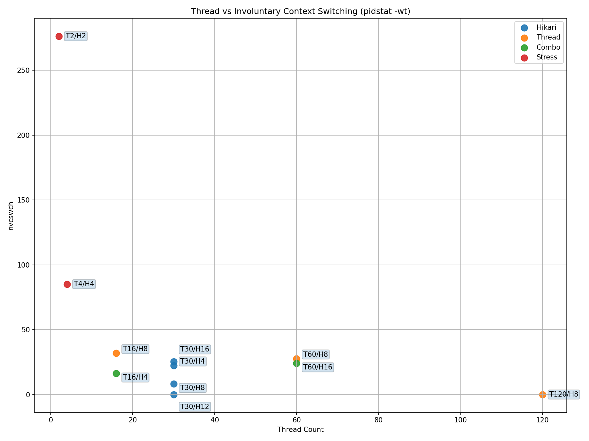
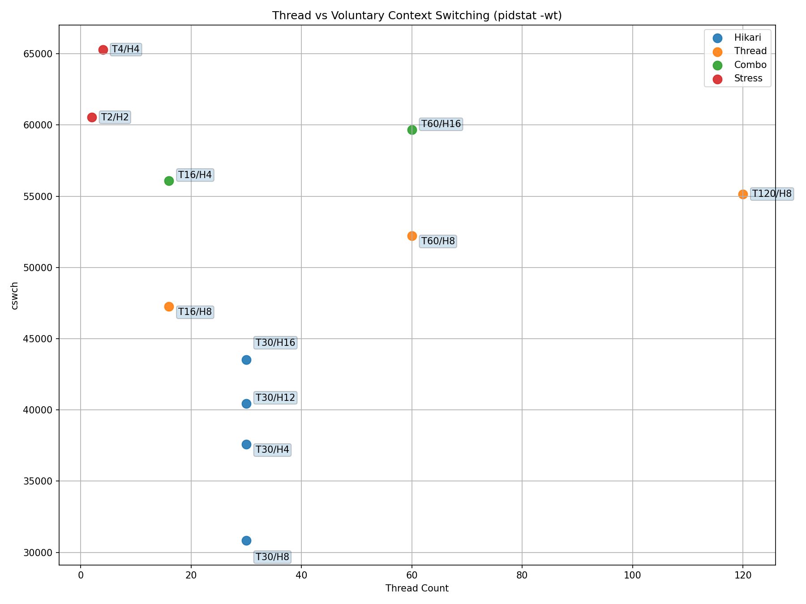
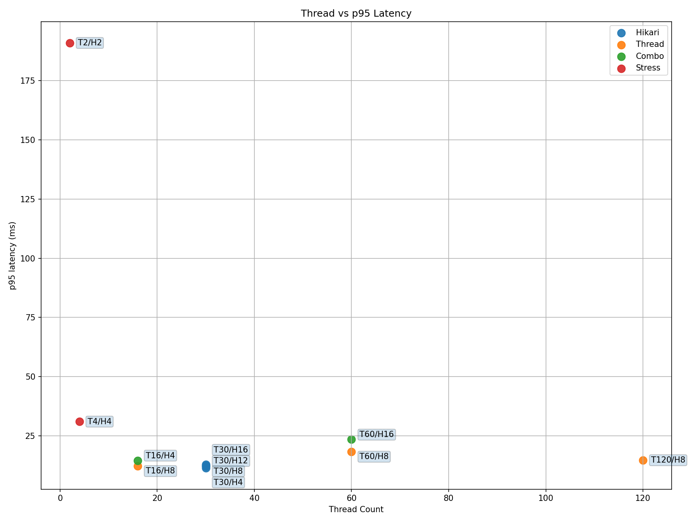
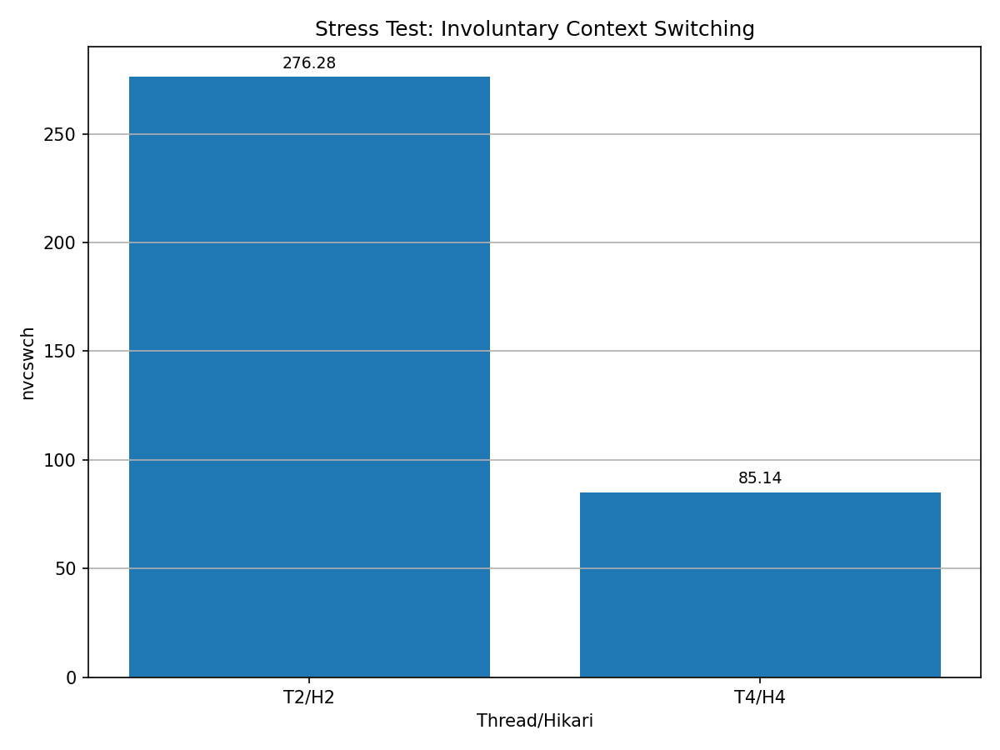

# 📄 Thread / Hikari 설정에 따른 Context Switching 및 Latency 분석


## 1. 실험 목적

본 실험은 다음을 검증하기 위해 수행하였다.

* Thread 수 증가가 CPU scheduling 및 context switching에 미치는 영향
* Hikari connection pool 크기 변화의 실질적 효과
* Context switching 증가가 실제 latency(p95)에 미치는 영향
* 자원 부족 상황에서 발생하는 saturation 지점 확인
* 현재 워크로드 기준 쓰레드, 히카리 풀의 최적의 설정을 결정
---

## 2. 실험 환경

* App Server: AWS EC2 (c6i.large/ 2 vCPU / 4GB)
* DB Server: PostgreSQL (c6i.large/ 2 vCPU / 4GB 분리된 프라이빗 서버)
* 부하 도구: k6 (constant-arrival-rate)
* 측정 도구:

  * `pidstat -wt` → context switching
  * `vmstat` → system 상태
* 주요 지표:

  * `pid_nvcswch` (involuntary context switching)
  * `pid_cswch` (voluntary context switching)
  * p95 latency

---

## 3. 실험 시나리오

### 기본 부하

* Warm-up: 40 RPS / 45s
* Main: 150 RPS / 90s

### 스트레스 부하(thread saturation측정용)

* Warm-up: 60 RPS / 45s
* Main: 300 RPS / 90s

### 비교 케이스

* Thread 변화: 16 / 30 / 60 / 120
* Hikari 변화: 4 / 8 / 12 / 16
* Stress-RPS 300 (2배): Thread:2/Hikari:2, Thread:4/Hikari:4

---

## 4. Thread vs Involuntary Context Switching




### 분석

* Thread 30 구간에서 **가장 안정적인 nvcswch 수준**
* Thread 16:

  * 처리 여유 부족 → context switching 증가
* Thread 60 이상:

  * 처리량 증가 없음
  * scheduling overhead 증가

👉 결론:

> Thread 수는 많을수록 좋은 것이 아니라 **적정 수준(≈30)이 존재**

---

## 5. Thread vs Voluntary Context Switching




### 분석

* Thread 증가 시 cswch 증가 경향
* 특히 60 이상에서 증가폭 확대

👉 의미:

> 불필요한 thread 증가 → **context switching 비용 증가**

---

## 6. Thread vs p95 Latency




### 분석

* Thread 30 → 가장 낮은 latency
* Thread 60 → latency 상승 시작
* Thread 2 → **p95 190ms 이상 급증**

👉 핵심 관계:

> Context Switching 증가 → Latency 증가

---

## 7. Stress Test (Saturation 구간)




### 분석

* 2/2 설정:

  * nvcswch 급증 (≈276)
  * latency 급증
* 4/4 설정:

  * 상대적으로 안정

👉 해석:

> Thread 부족 → runnable queue 경쟁 → **강제 context switching 증가 → 성능 붕괴**

---


## 8. Hikari 내부 동작 및 Context Switching 영향 분석

HikariCP는 단순한 커넥션 개수 관리가 아니라,
커넥션의 borrow/return 과정에서 **동시성 제어 구조**를 가지며
이 과정이 thread scheduling 및 context switching에 직접적인 영향을 준다.

본 실험에서는 DB 대기(pending) 없이도 Hikari 설정에 따라
context switching 수준이 달라지는 현상이 관찰되었다.

---

### 8.1 Pool Size에 따른 Context Switching 변화

#### 1️⃣ Pool Size가 작은 경우 (예: Hikari 4)

* 커넥션 수가 적어 동일 커넥션에 대한 접근 집중 발생
* borrow/return 과정에서 내부 조율 비용 증가
* thread 간 짧은 양보 및 재시도 발생

👉 결과:

* pending은 발생하지 않음 (커넥션 부족은 아님)
* 그러나 내부 경쟁으로 인해
  **voluntary context switching(cswch) 증가**

---

#### 2️⃣ Pool Size가 적절한 경우 (예: Hikari 8)

* 커넥션 선택이 분산되어 hotspot 감소
* borrow/return 과정이 안정적으로 수행됨
* thread 간 간섭 최소화

👉 결과:

* 불필요한 스케줄링 발생 감소
* **cswch 최소 수준 유지**

👉 해석:

> 커넥션 수와 thread 간 균형이 맞을 때
> context switching 비용이 가장 낮아짐

---

#### 3️⃣ Pool Size가 큰 경우 (예: Hikari 12~16)

* 커넥션 풀이 커질수록 동시에 활성화 가능한 thread 수 증가
* runnable 상태의 thread 수 증가 (특히 2 vCPU 환경에서 영향 큼)
* CPU 코어 수 대비 thread 수가 과도해지면서 스케줄링 부담 증가

👉 결과:

* thread 간 CPU 점유 경쟁 증가
* OS 스케줄러에 의해 thread 전환 빈도 증가
* **voluntary context switching(cswch) 증가**

> 이 경우 DB 대기보다는,
> 활성 thread 수 증가로 인한 **CPU scheduling overhead 증가**가 주요 원인으로 작용

---

### 8.2 실험 결과와의 연결

본 실험에서는 모든 Hikari 설정에서 다음이 공통적으로 관찰되었다.

* pending = 0
  → 커넥션 부족 상황은 아님
* active connection = 1~2 수준
  → DB 부하 여유 있음

그럼에도 불구하고:

* Hikari 4 → cswch 증가
* Hikari 8 → cswch 최소
* Hikari 12~16 → cswch 다시 증가

👉 이는 다음과 같이 해석할 수 있다.

```text
Hikari 4  → 내부 조율 비용 증가 → cswch 증가
Hikari 8  → 조율 비용 완화 → cswch 최소
Hikari 12+ → thread 활성 증가 → scheduling overhead 증가 → cswch 증가
```
→ 이는 DB 대기 없이도 커넥션 풀 크기에 따라 CPU scheduling 비용이 달라질 수 있음을 의미한다.

---

### 8.3 결론

Hikari pool size는 단순히 커넥션 부족 여부를 판단하는 설정이 아니라,
thread scheduling 및 context switching 비용과 밀접하게 연결된다.

* 너무 작으면 → 내부 contention 증가
* 너무 크면 → CPU scheduling overhead 증가

👉 따라서:

> Hikari는 "충분한 크기"가 아니라
> **context switching을 최소화하는 균형 지점이 중요**하다.

본 실험에서는:

> **T30/H8 설정에서 context switching이 가장 안정적인 수준으로 나타났다.**


---

## 9. 종합 분석

### 1️⃣ Thread

* 최적 구간: **≈30**
* 16 → 부족
* 60+ → 과잉

---

### 2️⃣ Hikari

* active connection: 1~2 수준으로 커넥션 부족 상황은 아님
* pool 크기에 따라 latency 차이는 크지 않았으나,
  context switching 측면에서는 유의미한 차이가 발생

👉 결론:

> Hikari는 직접적인 병목은 아니지만,
> pool 크기에 따라 내부 조율 비용 및 scheduling overhead에 영향을 주며,
> context switching 관점에서 최적 구간이 존재한다.

---

### 3️⃣ Context Switching

* 성능 저하의 핵심 원인
* 특히 `nvcswch` 증가가 치명적

---

### 4️⃣ Latency 관계

```text
Thread 부족 → nvcswch 증가 → CPU 경쟁 → p95 증가
Thread 과다 → cswch 증가 → 오버헤드 증가 → p95 증가
```

---

## 10. 최종 결론

> 본 실험을 통해 단순한 thread/connection 증가가 성능 향상으로 이어지지 않으며,<br>
> 오히려 context switching 비용 증가로 인해 latency 악화가 발생할 수 있음을 확인하였다.<br>
> 따라서 현재 워크로드 기준 최적 설정값은 <br>Max Thread Pool Size=30<br>Max HikariPool Size=8로 결정하였다.<br>

> 단, 해당 설정은 현재 워크로드와 시스템 자원(2 vCPU) 기준에서 도출된 값으로,<br>
> 트래픽 패턴, 비즈니스 로직, DB 처리량 변화에 따라 재조정이 필요할 수 있으며<br>
> 본 실험은 단일 서비스 기준에서 수행되었기에<br>
> 향후 멀티 인스턴스 환경 또는 트래픽 특성 변화에 따른 추가 검증이 필요하다.


### 핵심 요약

* Thread와 Hikari는 단순 확장이 아닌 **적정 수준에서 균형이 중요**
* Thread 부족 및 과다 모두 context switching 증가를 유발
* Hikari pool 역시 크기에 따라 내부 조율 비용(coordination overhead) 또는 스케줄링 오버헤드가 발생
* 특히 nvcswch(involuntary context switching) 증가가 latency 상승의 주요 원인
* saturation 구간에서는 CPU 경쟁으로 인해 context switching이 급증하며 성능이 급격히 붕괴

